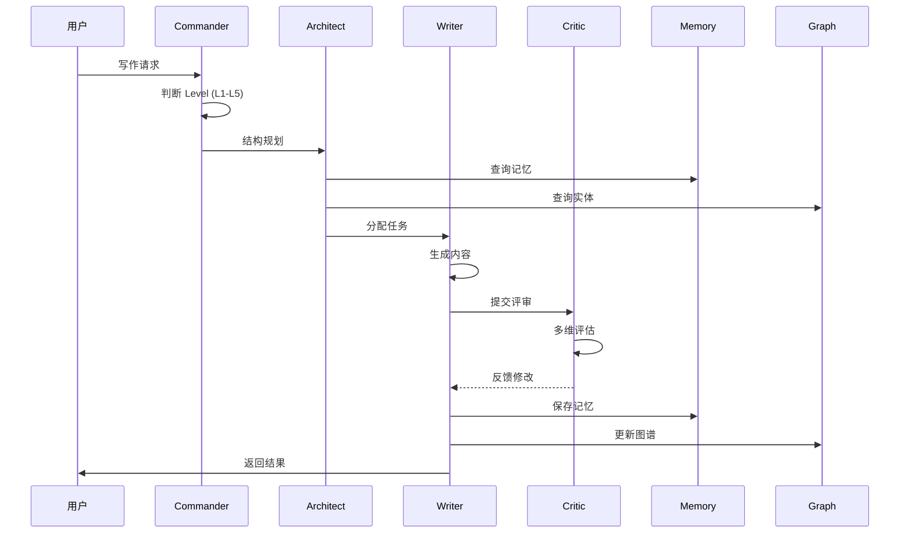
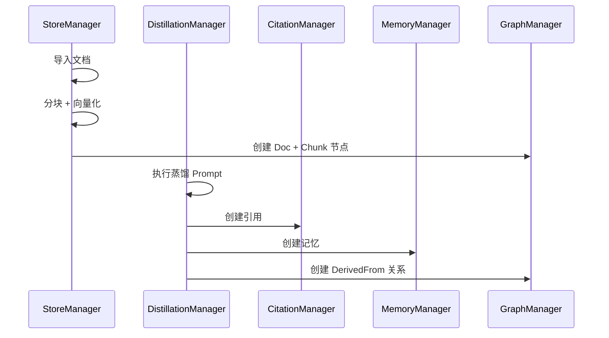

# AI Agent Platform - 架构设计文档

**版本**: 2.7 (Platform Edition)  
**更新日期**: 2026-01-26

> **状态说明（2026-04-14）**: 本文档保留为历史平台架构设计参考，包含大量 Python `src/*` / OpenKL 时代的结构示意，不代表当前 `desktop + src-ts` 交付路径的权威实现说明。当前运行与发布口径请以 `README.md`、`desktop/README.md`、`docs/release/RELEASE_NOTES.md` 与实际 `desktop/`、`src-ts/` 代码为准。

---

## 1. 系统定位

### 1.1 平台愿景

AI Agent Platform 是一个 **类 Cherry Studio / Claude-Code-Workflow 风格** 的本地优先 AI Agent 平台，具有以下特点：

- **本地优先**: 所有数据存储在本地，无需云服务
- **领域无关**: 核心平台支持多种领域适配器 (小说创作、代码开发、知识管理)
- **可扩展**: 模块化设计，易于添加新功能
- **自动化**: 支持 Jules 等 AI 代理自动开发

### 1.2 架构分层

```
┌─────────────────────────────────────────────────────────────────┐
│                     用户界面层 (UI Layer)                        │
│  CLI / Web UI / IDE Plugin                                      │
├─────────────────────────────────────────────────────────────────┤
│                     领域适配层 (Domain Adapters)                 │
│  ┌──────────┐ ┌──────────┐ ┌──────────┐ ┌──────────────────┐   │
│  │ 小说创作 │ │ 代码开发 │ │ 知识管理 │ │ 自定义领域...    │   │
│  │ (Novel)  │ │ (Code)   │ │ (KM)     │ │ (Custom)         │   │
│  └──────────┘ └──────────┘ └──────────┘ └──────────────────┘   │
├─────────────────────────────────────────────────────────────────┤
│                     核心平台层 (Platform Core)                   │
│  ┌────────────┐ ┌────────────┐ ┌────────────┐ ┌─────────────┐  │
│  │ Agent      │ │ Memory     │ │ Workflow   │ │ Knowledge   │  │
│  │ Framework  │ │ Layer      │ │ Engine     │ │ Graph       │  │
│  └────────────┘ └────────────┘ └────────────┘ └─────────────┘  │
├─────────────────────────────────────────────────────────────────┤
│                     基础设施层 (Infrastructure)                  │
│  ┌──────────┐ ┌──────────┐ ┌──────────┐ ┌──────────────────┐   │
│  │ Kùzu DB  │ │ FastEmbed│ │ File I/O │ │ LLM Providers    │   │
│  └──────────┘ └──────────┘ └──────────┘ └──────────────────┘   │
└─────────────────────────────────────────────────────────────────┘
```

---

## 2. 核心组件

### 2.1 Agent 框架

```
src/agents/
├── base.py           # BaseAgent 抽象类
├── commander.py      # 指挥官 (L1-L5 路由)
├── architect.py      # 架构师 (结构规划)
├── writer.py         # 写作者 (内容生成)
└── critic.py         # 批评家 (多维评估)
```

**职责**: 提供 Agent 抽象、Prompt 构建、工具调用

### 2.2 记忆层 (Memory Layer)

```
src/memory/
├── memory_manager.py       # 时序记忆 (OpenKL)
├── citation_manager.py     # 引用管理 (OpenKL)
├── distillation_manager.py # 知识蒸馏 (OpenKL)
├── core_memory_store.py    # 持久化记忆 (CCW)
└── session_cluster.py      # 会话聚类 (CCW)
```

**职责**: 记忆存储、引用追踪、知识蒸馏

### 2.3 工作流引擎 (Workflow Engine)

```
src/workflow/
├── graph.py                # LangGraph 状态图
├── state.py                # 工作流状态
├── levels/
│   ├── level1_rapid.py     # 快速模式
│   ├── level2_lite.py      # 轻量模式
│   ├── level3_standard.py  # 标准模式
│   ├── level4_brainstorm.py # 头脑风暴
│   └── level5_coordinator.py # 智能编排
└── session/
    ├── session_manager.py  # 会话管理
    └── resume_strategy.py  # 断点续传
```

**职责**: 工作流编排、会话生命周期、断点续传

### 2.4 知识图谱 (Knowledge Graph)

```
src/graph/
├── graph_manager.py    # Cypher 查询
├── schema.py           # Kùzu Schema DDL
└── kuzu_db.py          # 数据库连接
```

**职责**: 实体关系、向量索引、跨域查询

### 2.5 搜索服务 (Search Services)

```
src/search/
├── smart_search.py     # 智能搜索 (CCW)
└── vector_search.py    # 向量搜索 (OpenKL)
```

**职责**: 模糊搜索、语义搜索、RRF 融合

---

## 3. 数据流

### 3.1 写作流程



### 3.2 知识蒸馏流程



---

## 4. 存储设计

### 4.1 文件系统契约 (OpenKL)

```
.writing/
├── store/
│   ├── sources/              # 原始文件
│   └── normalized/           # 归一化 *.ok.md
├── memories/
│   ├── by_date/              # 时序: YYYY-MM/DD/<id>.md
│   └── topics/               # 主题软链接
├── sessions/
│   ├── active/               # 活跃会话
│   └── archived/             # 归档会话
├── citations/                # 引用 JSON
└── .ok/
    ├── kuzu/                 # Kùzu 数据库
    └── mapping.jsonl         # docID → path
```

### 4.2 Kùzu 图 Schema

| 类型 | 节点 | 用途 |
|------|------|------|
| 平台 | MemoryNote | 通用记忆 |
| 平台 | Doc, Chunk | 文档 + 块 |
| 平台 | Entity, Topic | 实体 + 主题 |
| 小说 | Character | 角色 |
| 小说 | Scene | 场景 |
| 小说 | Foreshadowing | 伏笔 |

---

## 5. 技术选型

| 组件 | 选择 | 理由 |
|------|------|------|
| 图数据库 | Kùzu DB | 嵌入式 + Cypher + HNSW |
| 向量嵌入 | FastEmbed | 本地 + 384维 |
| 工作流 | LangGraph | 状态机 + 条件路由 |
| 文件存储 | OpenKL Contract | grep-friendly |
| 会话管理 | CCW Pattern | 成熟方案 |

---

## 6. 扩展指南

### 6.1 添加新领域适配器

1. 创建 `src/adapters/<domain>/` 目录
2. 定义领域节点 (继承 Entity)
3. 定义领域关系
4. 注册到 GraphManager

### 6.2 添加新 Agent

1. 继承 `BaseAgent`
2. 实现 `construct_prompt()`
3. 注册到工作流图

---

*文档版本: 2.7 | 更新时间: 2026-01-26*
