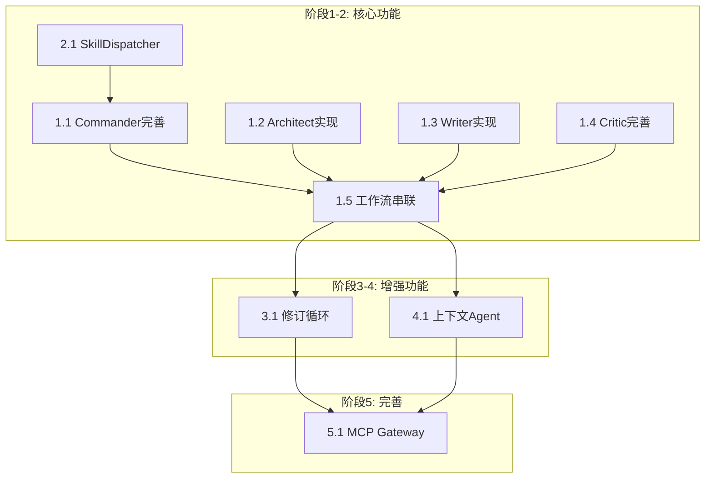

# Niko-Studio 实现目标

> **版本**: 2.0
> **日期**: 2026-02-03
> **状态**: ✅ 核心功能完成 (90%)

---

## 一、当前状态分析

### 1.1 已实现组件

| 模块 | 文件 | 完成度 | 说明 |
|------|------|--------|------|
| **Commander Agent** | `src/agents/commander.py` | ✅ 95% | 路由 + 任务分解 + 技能调度 + 结果整合 |
| **Architect Agent** | `src/agents/architect.py` | ✅ 90% | LOCK验证 + 两扇门结构 + SceneCard生成 |
| **Writer Agent** | `src/agents/writer.py` | ✅ 95% | 4链Prompt + 技能注入 + revise()修订 |
| **Critic Agent** | `src/agents/critic.py` | ✅ 95% | 8维度评估 + LOCK矩阵 + actionable_feedback |
| **Worldbuilding Agent** | `src/agents/worldbuilding.py` | ✅ 90% | 世界观查询 + 规则验证 + 氛围分析 |
| **Character Agent** | `src/agents/character.py` | ✅ 90% | 四个自我 + 关系动态 + 对话指南 |
| **Plot Agent** | `src/agents/plot.py` | ✅ 90% | 时间线 + 伏笔追踪 + 张力分析 |
| **Skill Router** | `src/agents/skill_router.py` | ✅ 100% | 9场景类型 → 40技能包映射 |
| **Revision Loop** | `src/workflow/revision_loop.py` | ✅ 100% | 修订循环 + 停滞检测 + 人工介入 |
| **Workflow Engine** | `src/workflow/adapters/novel_adapter.py` | ✅ 95% | LangGraph + Commander入口 + 条件路由 |
| **Memory Engine** | `src/memory/unified_memory.py` | ✅ 85% | 四层六维 + 时序追踪 + 冲突检测 |
| **Graph Engine** | `src/graph/graph_engine.py` | ✅ 80% | 实体/关系 + Cypher查询 + 伏笔追踪 |
| **MCP Gateway** | `src/mcp/gateway.py` | ✅ 95% | 7服务 / 31工具 |
| **技能包库** | `skills/` | ✅ 100% | 40 个写作技能完整 |
| **Desktop App** | `desktop/` | ✅ 80% | Tauri + React + TypeScript |

### 1.2 已实现流程

```
✅ 完整工作流已打通:

用户请求
    ↓
┌─────────────────────────────────────────────────────────┐
│                   Commander Agent                        │
│  route() → detect_scene_type() → dispatch_skills()      │
│  → dispatch_tasks() → integrate_results()               │
└────────────────────────┬────────────────────────────────┘
                         │
         ┌───────────────┼───────────────┐
         ↓               ↓               ↓
    [L1: 快速]     [L3: 标准]      [L5: 深度]
         │               │               │
         │         ┌─────┴─────┐   ┌─────┴─────┐
         │         │ Architect │   │ Context   │
         │         │ LOCK验证  │   │ Agents    │
         │         └─────┬─────┘   └─────┬─────┘
         │               └───────┬───────┘
         ↓                       ↓
    ┌─────────────────────────────────────┐
    │              Writer Agent            │
    │  4链Prompt + 技能注入 + 风格指南     │
    └────────────────────┬────────────────┘
                         ↓
    ┌─────────────────────────────────────┐
    │              Critic Agent            │
    │  8维度评估 + LOCK矩阵 + 决策路由     │
    └────────────────────┬────────────────┘
                         ↓
              ┌──────────┴──────────┐
              ↓                     ↓
         [APPROVED]            [REVISE]
              ↓                     ↓
         最终输出          RevisionLoop (≤3次)
                                    ↓
                           [停滞检测 → 人工介入]
```

---

## 二、目标状态定义

### 2.1 核心目标

| 目标 | 优先级 | 说明 |
|------|--------|------|
| **G1: Agent 链路贯通** | P0 | Commander → Architect → Writer → Critic 完整工作流 |
| **G2: 技能自动调度** | P0 | 根据场景类型自动匹配并注入技能 |
| **G3: 评估驱动修订** | P1 | Critic 反馈触发 Writer 修订循环 |
| **G4: 上下文 Agent 实现** | P1 | Worldbuilding/Character/Plot Agent 完整实现 |
| **G5: MCP Gateway 完善** | P2 | 所有服务端点可用 |
| **G6: 多模型并行** | P2 | 支持 Claude/Codex/Gemini 同时调用 |

### 2.2 目标架构

```
┌─────────────────────────────────────────────────────────────────────────┐
│                           MCP Gateway (HTTP)                             │
│  /memory  /graph  /skills  /search  /workflow  /critic                  │
└────────────────────────────────────┬────────────────────────────────────┘
                                     │
┌────────────────────────────────────┴────────────────────────────────────┐
│                          Commander Agent                                 │
│  • 请求解析 → 工作流路由 → 任务分解 → 技能调度 → 结果整合              │
└────────────────────────────────────┬────────────────────────────────────┘
                    ┌────────────────┼────────────────┐
                    ↓                ↓                ↓
           ┌───────────────┐ ┌───────────────┐ ┌───────────────┐
           │   Architect   │ │    Writer     │ │    Critic     │
           │  LOCK + 结构  │ │ 五感 + 对话   │ │ 8维度 + 爽点  │
           └───────────────┘ └───────────────┘ └───────────────┘
                    ↑                ↑                ↑
           ┌────────┴────────────────┴────────────────┴────────┐
           │              技能注入 (SkillDispatcher)            │
           │  40 个技能包按场景类型自动匹配                      │
           └────────────────────────────────────────────────────┘
                                     ↑
           ┌─────────────────────────┴─────────────────────────┐
           │              上下文 Agent 层                       │
           │  Worldbuilding │ Character │ Plot                 │
           └───────────────────────────────────────────────────┘
                                     ↑
           ┌─────────────────────────┴─────────────────────────┐
           │              存储层                                │
           │  Memory (SQLite) │ Graph (Kùzu) │ Vector (FastEmbed)│
           └───────────────────────────────────────────────────┘
```

---

## 三、实现路径

### 阶段 1: Agent 链路贯通 (P0)

**目标**: Commander → Architect → Writer → Critic 完整工作流可执行

#### 任务 1.1: 完善 Commander Agent

| 任务 | 文件 | 变更内容 |
|------|------|----------|
| 1.1.1 | `src/agents/commander.py` | 添加 `dispatch_tasks()` 方法 |
| 1.1.2 | `src/agents/commander.py` | 添加 `integrate_results()` 方法 |
| 1.1.3 | `src/agents/commander.py` | 实现技能调度逻辑 `dispatch_skills()` |

**接口定义**:
```python
class CommanderAgent:
    async def route(self, task: str) -> WorkflowLevel  # 已有
    async def dispatch_tasks(self, task: str, level: WorkflowLevel) -> List[TaskAssignment]  # 新增
    async def dispatch_skills(self, scene_type: str) -> List[str]  # 新增
    async def integrate_results(self, results: List[AgentOutput]) -> FinalOutput  # 新增
    async def run(self, input_data: CommanderInput) -> CommanderOutput  # 完善
```

#### 任务 1.2: 实现 Architect Agent

| 任务 | 文件 | 变更内容 |
|------|------|----------|
| 1.2.1 | `src/agents/architect.py` | 实现 LOCK 验证逻辑 |
| 1.2.2 | `src/agents/architect.py` | 实现两扇门结构检查 |
| 1.2.3 | `src/agents/architect.py` | 实现 SceneCard 生成 |

**输出 Schema**:
```python
class ArchitectOutput:
    lock_validation: LOCKValidation  # LOCK 评分
    story_core: StoryCore            # 故事核心
    structure_points: StructurePoints # 两扇门结构
    scene_cards: List[SceneCard]      # 场景卡片
```

#### 任务 1.3: 实现 Writer Agent

| 任务 | 文件 | 变更内容 |
|------|------|----------|
| 1.3.1 | `src/agents/writer.py` | 实现 Prompt Chaining (4链) |
| 1.3.2 | `src/agents/writer.py` | 集成技能包内容到风格指南 |
| 1.3.3 | `src/agents/writer.py` | 实现禁用词检查 |

**Prompt Chain**:
```
Chain1: Scene Setup (环境氛围) → 300字
Chain2: Character Entry (角色登场) → 500字
Chain3: Conflict Development (冲突展开) → 800字
Chain4: Resolution (场景结尾) → 400字
```

#### 任务 1.4: 完善 Critic Agent

| 任务 | 文件 | 变更内容 |
|------|------|----------|
| 1.4.1 | `src/agents/critic.py` | 集成 LOCK 评估矩阵 |
| 1.4.2 | `src/agents/critic.py` | 实现决策路由 (APPROVED/REVISE/REWRITE) |
| 1.4.3 | `src/agents/critic.py` | 生成可执行反馈 `actionable_feedback` |

**决策规则**:
```python
if total_score >= 80 and C_score >= 7:
    return "APPROVED"
elif total_score >= 70:
    return "HUMAN_REVIEW"
elif total_score >= 50:
    return "REVISE"
else:
    return "REWRITE"
```

#### 任务 1.5: 工作流串联

| 任务 | 文件 | 变更内容 |
|------|------|----------|
| 1.5.1 | `src/workflow/workflow_engine.py` | 实现 `_execute_step()` 真实逻辑 |
| 1.5.2 | `src/workflow/graph.py` | 创建 LangGraph 工作流图 |
| 1.5.3 | `src/workflow/levels/level3_standard.py` | L3 完整流程实现 |

---

### 阶段 2: 技能自动调度 (P0)

**目标**: 根据场景类型自动匹配并注入技能到 Writer

#### 任务 2.1: 创建 SkillDispatcher

| 任务 | 文件 | 变更内容 |
|------|------|----------|
| 2.1.1 | `src/agents/skill_router.py` | 完善场景-技能映射规则 |
| 2.1.2 | `src/agents/skill_router.py` | 实现 `match_skills(scene_type)` |
| 2.1.3 | `src/agents/skill_router.py` | 实现 `inject_to_prompt(skills, prompt)` |

**场景-技能映射**:
```yaml
scene_skill_mapping:
  opening: [opening-craft, tension-scene, character-forge]
  dialogue: [dialogue-system, psychology-craft, show-dont-tell]
  action: [action-craft, tension-scene, pov-system]
  climax: [conflict-escalation, tension-arc, emotion-arc]
  ending: [ending-craft, foreshadowing-craft, emotion-arc]
  transition: [transition-craft, timeline-craft]
  worldbuilding: [worldview-craft, setting-craft, environment-craft]
  character_focus: [character-forge, four-selves, psychology-craft]
  suspense: [suspense-craft, foreshadowing-craft, misdirection-twist]
```

#### 任务 2.2: 集成到 Commander

| 任务 | 文件 | 变更内容 |
|------|------|----------|
| 2.2.1 | `src/agents/commander.py` | 在 `dispatch_tasks()` 中调用 SkillDispatcher |
| 2.2.2 | `src/agents/commander.py` | 将技能列表附加到 TaskAssignment |

---

### 阶段 3: 评估驱动修订 (P1)

**目标**: Critic 评分低于阈值时自动触发 Writer 修订

#### 任务 3.1: 修订循环实现

| 任务 | 文件 | 变更内容 |
|------|------|----------|
| 3.1.1 | `src/workflow/levels/level3_standard.py` | 添加 Writer ↔ Critic 循环 |
| 3.1.2 | `src/agents/writer.py` | 添加 `revise(draft, feedback)` 方法 |
| 3.1.3 | `src/workflow/graph.py` | 添加条件边 (Critic → Writer if REVISE) |

**循环逻辑**:
```
最大循环次数: 3
退出条件:
  - Critic 返回 APPROVED
  - 循环次数达到上限 → 请求人工介入
```

---

### 阶段 4: 上下文 Agent 实现 (P1)

**目标**: Worldbuilding/Character/Plot Agent 完整可用

#### 任务 4.1: 创建上下文 Agent

| 任务 | 文件 | 变更内容 |
|------|------|----------|
| 4.1.1 | `src/agents/worldbuilding.py` | 新建，实现世界观查询 |
| 4.1.2 | `src/agents/character.py` | 新建，实现角色档案管理 |
| 4.1.3 | `src/agents/plot.py` | 新建，实现剧情大纲和伏笔追踪 |

**数据源**:
```
Worldbuilding: Memory + Graph (location, rule, culture)
Character: Graph (character nodes + relationships)
Plot: Memory (timeline events) + Graph (foreshadows)
```

---

### 阶段 5: MCP Gateway 完善 (P2)

**目标**: 所有 MCP 端点可用，支持多模型访问

#### 任务 5.1: 完善端点

| 端点 | 工具数 | 状态 |
|------|--------|------|
| `/memory` | 6 | 待完善 |
| `/graph` | 6 | 待完善 |
| `/skills` | 5 | 80% |
| `/search` | 3 | 待完善 |
| `/workflow` | 6 | 60% |
| `/critic` | 3 | 待完善 |

---

## 四、里程碑

| 里程碑 | 目标 | 验收标准 |
|--------|------|----------|
| **M1** | Agent 链路贯通 | L3 工作流可执行完整章节创作 |
| **M2** | 技能自动调度 | 场景类型自动匹配技能，注入成功率 > 90% |
| **M3** | 评估驱动修订 | Critic 反馈触发修订，通过率提升 > 20% |
| **M4** | 上下文 Agent | 角色一致性检查通过率 > 95% |
| **M5** | MCP Gateway | 所有端点可用，多模型可并行调用 |

---

## 五、依赖关系



---

## 六、技术决策

| 决策点 | 选项 | 决定 | 理由 |
|--------|------|------|------|
| Agent 框架 | LangChain / 原生 | LangChain | 已有基础设施 |
| 工作流编排 | LangGraph / 自研 | LangGraph | 支持条件边和循环 |
| 向量存储 | ChromaDB / FAISS / SQLite-VSS | SQLite-VSS | 统一存储，无额外依赖 |
| 技能注入方式 | 预加载 / 动态加载 | 动态加载 | 减少 Token 消耗 |
| 修订循环上限 | 3 / 5 / 无限 | 3 | 平衡质量与成本 |

---

## 七、文件清单

### 需要新建

| 文件 | 说明 |
|------|------|
| `src/agents/worldbuilding.py` | 世界观 Agent |
| `src/agents/character.py` | 角色 Agent |
| `src/agents/plot.py` | 剧情 Agent |
| `src/workflow/revision_loop.py` | 修订循环逻辑 |

### 需要完善

| 文件 | 变更 |
|------|------|
| `src/agents/commander.py` | 添加 dispatch_tasks, dispatch_skills, integrate_results |
| `src/agents/architect.py` | 实现 LOCK 验证、SceneCard 生成 |
| `src/agents/writer.py` | 实现 Prompt Chaining、技能注入 |
| `src/agents/critic.py` | 实现 LOCK 评估、决策路由 |
| `src/agents/skill_router.py` | 完善场景-技能映射 |
| `src/workflow/workflow_engine.py` | 实现真实执行逻辑 |
| `src/workflow/graph.py` | 添加 LangGraph 工作流图 |
| `src/mcp/gateway.py` | 完善所有端点 |

---

**文档结束**
