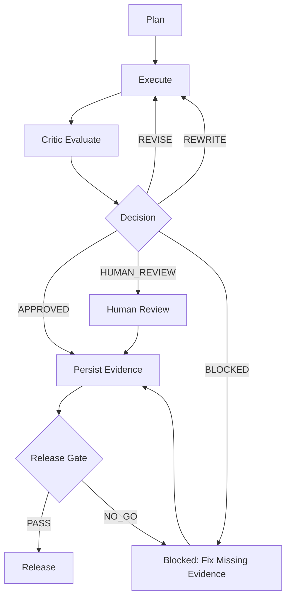

# Niko Studio 产品定义文档（PDD）

> 本文档由以下材料整理而成：
> - `README.md`
> - `docs/TASKS_V10_OPTIMIZED.md`
> - `docs/sdd/01_System_Architecture.md`

## 0. 文档元信息（新增）

| 字段 | 值 |
|---|---|
| doc_name | Niko Studio 产品定义文档（PDD） |
| doc_version | v1.11.4 |
| status | active |
| owner | 你本人 |
| last_updated | 2026-02-26 |
| source_of_truth | `src/workflow/state.py`（阈值与决策） |
| related_docs | `docs/quality/QUALITY_CRITERIA.md`, `docs/TASKS_V10_OPTIMIZED.md`, `docs/sdd/01_System_Architecture.md` |

### 0.1 变更记录（新增）

| 版本 | 日期 | 变更摘要 | 责任人 |
|---|---|---|---|
| v1.11.4 | 2026-02-26 | 完成第 15 章验收收口：补齐 15.1/15.2/15.3/15.5 实例证据，明确 15.4 为 `BLOCKED`，并给出 MVP 总结论 | 你本人 |
| v1.11.3 | 2026-02-26 | 参考 `参考/dev-tools/writing-helper` 增补能力对照、差距分级与最小落地设计计划（polish/统计指标/多模型扩展） | 你本人 |
| v1.11.2 | 2026-02-26 | 补齐 MVP 验收执行台账（第 15 章），明确“已具备证据/待补证据/阻断条件”三态与最小执行顺序 | 你本人 |
| v1.11.1 | 2026-02-23 | 基于本地五仓（GraphRAG/RAGFlow/Haystack/LlamaIndex/LightRAG）README 与 workflow 实况补齐运行约束与门禁触发细节 | 你本人 |
| v1.11.0 | 2026-02-23 | 融合 GraphRAG / RAGFlow / Haystack / LlamaIndex / LightRAG，新增上下文检索统一治理总则与五仓适配附录 | 你本人 |
| v1.10.0 | 2026-02-23 | 融合 10 个向量数据库仓经验，新增跨仓统一治理方案（规则矩阵/适配器分级/SLO 口径） | 你本人 |
| v1.9.10 | 2026-02-23 | 新增 typesense 适配附录（Bazel 构建测试/API 回归与基准比较门禁） | 你本人 |
| v1.9.7 | 2026-02-23 | 新增 elasticsearch 适配附录（Buildkite precommit/checkPart/BWC 与 release-tests 门禁） | 你本人 |
| v1.9.6 | 2026-02-23 | 新增 neo4j 适配附录（Maven 单元/集成测试与构建合规门禁） | 你本人 |
| v1.9.5 | 2026-02-23 | 新增 meilisearch 适配附录（测试/OpenAPI/发布资产与 flaky 治理门禁） | 你本人 |
| v1.9.4 | 2026-02-23 | 新增 qdrant 适配附录（lint/nextest/e2e/flaky 证据链门禁） | 你本人 |
| v1.9.3 | 2026-02-23 | 新增 pgvector 适配附录（跨平台 CI 与回归/TAP/valgrind 门禁） | 你本人 |
| v1.9.2 | 2026-02-23 | 新增 Postgres 适配附录（P0/P1/P2 门禁与证据锚点） | 你本人 |
| v1.9.1 | 2026-02-23 | 收敛 BLOCKED 语义与运行时前置门禁约束（26.2/26.4/27.4） | 你本人 |
| v1.9.x | 2026-02-23 | 补齐流程图/页面状态/埋点与规则分层 | 你本人 |

## 1. 产品定位

Niko Studio 是一个 **local-first、可扩展的 AI Agent 平台**，面向多域任务协作，当前以写作场景为核心落地。

平台定位：
- 提供统一的多 Agent 协作执行框架
- 提供可持续记忆层（OpenKL）与会话编排能力
- 提供多 CLI / MCP 工具接入与工作流自动化能力
- 支持从创作、评估、修订到交付的闭环

## 2. 目标与价值

### 2.1 产品目标
- 构建统一的 Agent 协作基础设施，降低复杂任务自动化门槛
- 通过分层工作流（L1/L3/L5）提升任务匹配精度与执行效率
- 通过反思回路（Writer ↔ Critic）持续提升输出质量
- 通过记忆与知识层沉淀可复用资产，增强长期一致性

### 2.2 核心价值
- **效率**：将复杂多步骤任务拆分并自动编排
- **质量**：引入评估与反馈循环，形成可验证改进
- **可扩展**：支持多域 Adapter 与技能包体系扩展
- **可追踪**：会话、任务、文档、知识关系可检索与追溯

## 3. 目标用户与使用场景

### 3.1 目标用户
- 需要长期协作与知识沉淀的 AI 原生团队
- 需要多 Agent 协作执行复杂任务的开发者/创作者
- 需要本地优先与可控数据边界的个人或团队

### 3.2 关键场景
- 长篇写作：大纲、章节创作、质量评估、迭代修订
- 工作流执行：计划、执行、验证、回滚与发布门禁
- 知识管理：记忆提取、检索、图谱关联、跨任务复用
- 工程协作：多工具分析、任务分解、阶段推进与验收

## 4. 产品范围

### 4.1 In Scope（当前范围）
- 多 Agent 协作：Commander / Architect / Writer / Critic 等
- 工作流分层：L1 Rapid、L3 Standard、L5 Brainstorm
- 服务层能力：Backup、Token、Obsidian、Knowledge、Indexing
- 记忆层能力：OpenKL 文件契约 + 图谱/向量检索
- 技能体系：技能包注入、按评估维度推荐修订路径

### 4.2 Out of Scope（当前非目标）
- 以 Web UI 作为主交付入口（当前以 Desktop + Gateway 为主）
- 覆盖所有垂直行业的深度 domain solution（先聚焦写作与工程流程）
- 一次性完成全量自治（采取渐进式、阶段化落地）

## 5. 核心能力定义

### 5.1 协作与编排
- 基于任务复杂度进行 workflow 路由（L1/L3/L5）
- 多 Agent 分工协作，支持计划-执行-反思循环
- 采用结构化协议（PURPOSE/TASK/MODE/CONTEXT/EXPECTED/RULES）

### 5.2 质量闭环
- Writer 生成内容
- Critic 做多维评估与问题识别
- 基于评估结果触发技能包定向修订
- 达到阈值后通过或继续迭代

### 5.3 记忆与知识
- 长期记忆文件化存储与主题组织
- 知识图谱实体关系管理
- 本地向量索引与语义检索
- 保障跨会话上下文连续性

### 5.4 工程与运维可用性
- 本地质量检查入口与发布验收入口
- 任务清单驱动的阶段推进与完成度治理
- 支持 rollback 与发布口径区分（internal/external）

### 5.5 写作工作台能力复用（来源 `agent/writing-helper`）
- 前台写作工作台可复用能力：`draft / rewrite / expand / polish / outline` 五类高频动作。
- 复用“统一 API 代理 + 模型路由”模式：在不改变后端小说门禁语义前提下，提升交互效率与可观测性。
- 复用“提示词模板化”与“任务化按钮”交互：降低单章写作启动成本，缩短从意图到可编辑初稿的路径。
- 复用边界：该能力仅作为“生成与编辑入口层”，不得替代第 26/27 章 DoD 判定与证据门禁。

### 5.6 与 `writing-helper` 能力对照与差距分级（v1.11.3，新增）
- 对照范围：`参考/dev-tools/writing-helper` 中写作助手、优化器、多模型与网关相关能力。
- 已具备（直接复用）：
  - 引导式起稿与流程执行：`guided-draft` / `run`（对应 `draft` 主路径）。
  - 风格与约束控制：`style/length/constraints/genre` 控制并回流工作流推荐。
  - 多格式导出：`md/json/docx/txt/html`。
  - 质量回路与超时降级：支持质量阶段超时、错误降级与人工接管。
- 部分具备（需收敛体验）：
  - 前台实时编辑：当前以 Streamlit 流式与 HITL 反馈为主，缺少面向写作者的一体化编辑器交互。
  - 多模型覆盖：当前主链路已覆盖 Google/OpenAI，需扩展到 Grok/Ollama 与统一 provider 配置面。
- 关键缺口（MVP 增补项）：
  - 缺 `polish` 独立入口（需补“改写/润色”命令与 action）。
  - 缺“文本统计特征对比”执行口径（需补 burstiness/repetition 等代理指标，不承诺绕过第三方检测）。
  - 缺与 `writing-helper` 对齐的“统一 API 配置体验层”（当前主要依赖 env 与工程配置）。
- 分级原则：
  - P0（阻断）：影响第 15 章 MVP 验收主路径。
  - P1（高优）：不阻断主路径，但显著影响写作效率与一致性。
  - P2（改进）：体验增强项，进入周度治理。
- 逐项对照明细（用于设计与验收追踪）：
  - 写作助手（生成）：已具备（`guided-draft` 与 workflow 执行链）。
    - 锚点：`src/cli/commands/guided_draft.py:25`、`src/cli/commands/run.py:23`。
  - 风格编辑（style/length/constraints/genre）：已具备。
    - 锚点：`src/cli/commands/guided_draft.py:33`、`src/cli/commands/guided_draft.py:117`、`src/cli/commands/run.py:84`、`src/mcp/gateway.py:55`。
  - 实时编辑/实时反馈：部分具备。
    - 说明：有流式执行与 HITL 反馈回灌，但非 writing-helper 的一体化前端写作编辑器体验。
    - 锚点：`src/ui/streamlit_app.py:339`、`src/ui/streamlit_app.py:441`。
  - Markdown 导出：已具备（支持 `md/json/docx/txt/html`）。
    - 锚点：`src/cli/commands/export.py:20`、`src/cli/commands/export.py:91`、`src/cli/commands/chat.py:241`。
  - AI 文本优化器（去 AI 痕迹）：未见明确实现。
    - 说明：当前命令集中无独立 optimizer/polisher 命令。
    - 锚点：`src/cli/commands/__init__.py:5`。
  - 统计特征优化（perplexity/burstiness）：未见实现（无明确特征计算与优化链路锚点）。
  - 多 LLM：部分具备。
    - 说明：已见 Google/OpenAI 适配与 UI 模型选择；未见与 writing-helper 对齐的 Grok/Ollama 代理实现锚点。
    - 锚点：`src/workflow/adapters/novel_adapter.py:129`、`src/workflow/adapters/novel_adapter.py:141`、`src/ui/streamlit_app.py:240`。
  - API 配置能力：部分具备。
    - 说明：有 `GOOGLE_API_KEY`/`OPENAI_API_KEY` 配置与读取；未见 writing-helper 风格前端加密密钥管理页。
    - 锚点：`src/workflow/adapters/novel_adapter.py:129`、`src/workflow/adapters/novel_adapter.py:153`。
  - 长超时 + 错误处理：已具备（工程侧）。
    - 说明：有可配置质量阶段超时、timeout/error 降级与异常兜底。
    - 锚点：`src/cli/commands/run.py:77`、`src/workflow/revision_loop.py:483`、`src/workflow/revision_loop.py:490`、`src/workflow/revision_loop.py:499`。

## 6. 阶段路线图（来自 V10 任务清单）

### Phase 15：核心引擎层重构
- 建立 Evaluators 与 Analyzers 引擎边界
- 形成“评估/分析”和“技巧/模板”解耦

### Phase 16：技能包体系构建
- 建立写作技能包矩阵（dream/suspense/character/premise/voice）
- 建立技能包规范化结构与可组合能力

### Phase 17：Agent 重构
- Critic Agent 与 Writer Agent 对接引擎/技能体系
- 引入 SkillLoader，支持按需加载与注入

### Phase 18：高级技能包
- 完成章节创作、大纲生成、修订优化、世界观构建等高阶能力

### Phase 19：清理与迁移
- 迁移旧模块，清理重复文档，统一导出结构与入口

## 7. 关键成功标准

- 架构层面：核心引擎与技能包完成解耦，职责边界清晰
- 能力层面：实现可复用的“生成-评估-修订”闭环
- 工程层面：任务清单可追踪、质量门禁可执行、发布路径可验证
- 平台层面：支持多域扩展而不破坏核心协作框架

## 8. 依赖与约束

- 依赖：MCP Gateway、工作流引擎、记忆/图谱/向量基础设施
- 约束：遵循 local-first、增量演进、尽量保持既有契约稳定
- 低依赖优先：优先复用现有链路与工具，不为单点问题引入新依赖；只有当现有工具无法满足可执行门禁时才升级工具链。
- 风险：多模块并行改造期间的语义漂移与集成一致性

## 9. 文档关系

- 产品与平台概览：`README.md`
- 详细系统设计：`docs/sdd/01_System_Architecture.md`
- 落地任务与路线图：`docs/TASKS_V10_OPTIMIZED.md`

## 10. 使用者与决策方式（当前）

- 主要读者：你本人（单人决策、单人验收）
- 文档用途：用于约束产品范围、指导实现优先级、作为后续迭代基线
- 决策机制：以可交付结果为准，不追求文档完备性

## 11. KPI 与衡量口径（v1.1）

### 11.1 指标 1：生成质量
- 定义：内容达到可用标准的比例（可由 Critic 评分或人工判定）
- 建议口径：`质量达标率 = 达标产出数 / 总产出数`
- 当前阈值（建议）：`>= 99%` 视为达标

### 11.2 指标 2：任务完成率
- 定义：计划任务在目标周期内完成的比例
- 建议口径：`任务完成率 = 已完成任务数 / 计划任务数`
- 当前阈值（建议）：`>= 98%` 视为达标

### 11.3 指标口径补充（v1.4）
- 质量达标样本：满足既定评分阈值，且无“必须重写”结论的产出。
- 计划任务：仅统计在当周计划清单中、并在周初冻结范围内的任务。
- 完成任务：满足该任务 DoD（Definition of Done）并有可追溯证据。
- 延期任务：未在本周完成且未被正式移出范围的计划任务。
- 紧急插入任务：不计入当周计划任务分母，单独统计“插入量与影响”。
- 边界规则：若当周计划任务数为 0，则任务完成率记为 `N/A`，该周不计入“连续 2 周”达标统计。
- 边界规则：跨周任务以周初冻结范围为准，仅在完成并满足 DoD 的当周计入“已完成任务数”。

### 11.4 KPI 统计与判定细则（v1.6.2）
- 统计窗口：按自然周统计（建议周一 00:00 至周日 23:59，本地时区）。
- 质量达标率分母：仅统计进入正式评估流程并有留档证据的产出；草稿与废弃样本不计入。
- 连续 2 周达标：需两周均为有效周（非 `N/A`），且两周分别满足阈值；不可用跨周平均替代。
- 证据一致性：KPI 结论必须可回溯到对应周报、质量样本与任务清单，不可仅口头判定。
- 例外处理：若因系统故障导致评估中断，需在周报记录中标注故障窗口，并附重跑或人工复核结论。

### 11.5 KPI 与运行时门禁关系（新增）
- KPI 仅用于周度趋势评估与治理改进，不得覆盖运行时 DoD 判定。
- 发生冲突时严格按第 28 章裁决顺序执行。
- KPI 达标不是放行条件，DoD/证据门禁通过才是放行条件。

## 12. MVP 定义与范围（v1.4）

### 12.1 什么是 MVP
MVP（Minimum Viable Product）指“最小可用产品”：
- 只保留最关键能力
- 能让你完成真实任务并获得稳定结果
- 暂不追求全面能力或完美体验

### 12.2 本项目 MVP（建议）
以下 3 项作为 MVP 必须能力：
- 能完成一次端到端工作流：计划 -> 执行 -> 评估
- 生成结果具备基本质量保障：有评估、可修订、可复核
- 任务推进可追踪：有任务清单、状态变化、完成统计

### 12.3 MVP 阶段目标（当前口径）
- 跑通并稳定使用端到端流程（计划 -> 执行 -> 评估）
- 让生成质量稳定达标（例如 >= 99%）
- 把任务完成率稳定到一个水平（例如 >= 98%）

### 12.4 MVP 非目标（新增）
- 不以 Web UI 作为主交付入口（当前主路径为 Desktop + Gateway）
- 不追求一次性覆盖所有垂直行业场景
- 不在 MVP 阶段引入复杂多租户权限体系

### 12.5 写作前台最小能力（复用 `agent/writing-helper`）
- MVP 前台交互最小集：`draft`（起稿）、`rewrite`（重写）、`expand`（扩写）、`polish`（润色）、`outline`（提纲）。
- 前台能力定位：作为“章节生成与编辑工作台”，负责效率与体验，不负责最终放行裁决。
- 放行边界：前台输出必须回流第 26 章 DoD 运行时决策与第 27 章证据包流程后，方可进入发布路径。
- 兼容约束：允许前台快速迭代交互，但不得改写小说域阈值单一真源与证据契约。

### 12.6 可用级别定义（usable-level，新增）
- MVP 的“可用”以稳定执行为先，不以功能数量为先。
- 判定建议（周维度）：
  - 端到端主路径连续 5 次执行无崩溃；
  - 主路径成功率 >= 90%；
  - 失败样本均可定位到明确阶段并具备可重试路径。
- 未达到可用级别时，优先修复稳定性问题，暂停新增复杂门禁条目。

### 12.7 当前阶段边界（alpha，新增）
- 当前治理能力按“alpha”边界运行：先保证可执行与可追溯，再逐步提升自动化覆盖。
- 暂不可自动化条目统一标注 `MANUAL_REVIEW_REQUIRED`，并明确责任人。
- 禁止在 alpha 阶段承诺全量自动化放行。

## 13. 近期目标（v1.4）

- 目标周期：未来 1-2 个月
- 目标描述：完成可稳定使用的产品版本，聚焦“端到端流程可用 + 生成质量稳定 + 任务推进可追踪”
- 里程碑 M1（第 1-2 周）：完成质量判定规则文档与周计划口径定义，并跑通 1 次完整流程
- 里程碑 M2（第 3-4 周）：完成连续 2 周周复盘与 KPI 统计，形成稳定周节奏
- 里程碑 M3（第 5-8 周）：完成第 15 章验收清单闭环，补齐关键证据并通过发布可用性验证
- 达成判定：满足第 15 章全部验收项，且连续 2 周稳定达标

### 13.1 参考 `writing-helper` 的最小补齐设计计划（v1.11.3，新增）
- 目标：在不改变第 26/27 章门禁合同的前提下，补齐能力缺口并保持低侵入改造。
- 设计约束：
  - 不新增破坏性契约；沿用现有 `run/guided-draft/evaluate/export` 主链路。
  - 新能力先落 CLI + Gateway，再考虑 UI 体验增强。
  - 所有新增项必须可映射到第 15/16 章证据口径。

- 最小补齐清单（按优先级）：
  1. AI 文本优化器（P0）
     - 新增 `niko polish`（1 个命令 + 1 条 workflow action）。
     - 入口：`src/cli/commands/__init__.py` 同层新增命令注册。
     - 工作流落点：`src/workflow/workflow_engine.py` 的 generation controls 附近扩展。
     - 首批能力：语气改写、冗余压缩、句式去模板化。
  2. 文本统计特征优化（P1，先做可观测）
     - 在 `evaluate` 链增加代理统计输出：`perplexity proxy / burstiness proxy / repetition ratio`。
     - 落点：`src/cli/commands/evaluate.py` 与现有 quality 输出结构。
     - 约束：不承诺第三方检测结果，仅提供优化前后对比数据。
  3. 多 LLM 对齐（P1）
     - 在 provider 选择层补 Grok/Ollama。
     - 落点：`src/workflow/adapters/novel_adapter.py`。
     - 范围：先做 endpoint + model 配置与基础调用，不引入复杂路由。
  4. API 配置体验（P1）
     - 先补 CLI 引导与校验提示，不新增重前端页面。
     - 落点：`src/cli/commands/init.py`、`src/cli/commands/runtime.py`。
     - 目标：缺失 key、provider 不可用、fallback 顺序可见。

- 验收标准（每项最小 1 条）：
  - `polish`：同一输入可输出“原文/优化文/指标对比”。
  - `evaluation`：输出包含新增统计指标字段。
  - `providers`：至少 4 类 provider 可识别并可失败回退。
  - `timeout/error`：保留现有降级策略，不回退当前稳定性能力。

- 风险与回滚：
  - 任一里程碑导致主流程不稳定，立即回退至 `run/guided-draft` 基线路径。
  - 回滚后保留失败证据，不删除失败样本。

- 与 MVP 验收映射：
  - 15.1：`polish` 纳入“计划->执行->评估”同路径。
  - 15.2：统计特征进入质量复核辅助证据。
  - 15.4：provider 就绪矩阵纳入发布可用性检查。

## 14. 桌面端前端方案选型决策（v1.2）

### 14.1 结论
- 当前主线方案：`Tauri + React/Vite + Python Gateway`

### 14.2 选型理由
- 与现有技术栈一致：项目已有 Tauri 相关栈信息，可复用已有工程结构
- 交付效率更高：在不切换主技术方向的前提下，能最快推进稳定版本
- 运行成本更优：相对 Electron，包体与资源占用更友好
- 安全与长期演进更稳：适合 local-first 与长期迭代场景

### 14.3 非选型理由
- 不选 Electron 作为当前主线：生态强但运行开销较高，当前阶段性价比不优
- 不选 PyWebView/Eel 作为当前主线：原型效率高，但中长期工程化与扩展性弱于 Tauri 路线

### 14.4 重新评估触发条件
- 若出现关键桌面能力在 Tauri 路线下无法满足且短期无替代实现
- 若当前交付节奏持续受跨语言桥接复杂度影响
- 若目标平台兼容性出现无法接受的阻塞问题

## 15. MVP 验收清单（可打勾）

- 判定规则：15.1-15.4 任一条目证据缺失或不可追溯，即该项判定“不通过”。
- 判定规则：仅当 15.1-15.4 全部通过时，MVP 验收判定为“通过”。

### 15.1 端到端工作流验收
- [x] 能从同一入口完成一次完整流程：计划 -> 执行 -> 评估
- [x] 单次流程产物可落盘并可追溯（任务、输出、评估结果可查）
- [x] 流程失败时可明确定位失败阶段并支持重试

### 15.2 生成质量验收
- [x] 有明确质量判定方式（Critic 评分或人工评审）
- [x] 连续 2 周质量达标率 >= 99%
- [x] 对不达标结果有可执行修订路径并能二次评估

### 15.3 任务完成率验收
- [x] 每周有固定计划任务清单（定义“计划任务”口径）
- [x] 每周输出完成统计（完成/未完成/延期原因）
- [x] 连续 2 周任务完成率 >= 98%

### 15.4 发布可用性验收
- [ ] Desktop + Gateway 主路径可稳定启动与使用
- [ ] 发布门禁与回滚路径可执行（internal/external 口径一致）
- [x] 关键文档（PDD/任务清单/架构文档）保持一致更新

### 15.5 门禁可解释性验收（新增）
- [x] 关键放行/回退判定可追溯到“代码锚点 + 测试锚点 + 证据锚点”。
- [x] 任一阻断结论均可给出触发条目、触发阈值与证据路径。
- [x] 周报中保留至少 1 个“判定解释样本”，用于复盘与规则校准。

### 15.6 MVP 验收执行台账（v1.11.4，新增）

> 目的：将 15.1-15.5 的勾选项从“描述型清单”落地为“可执行台账”。

状态定义：
- `READY`：已有可用证据路径与检查入口，可立即判定。
- `MISSING_EVIDENCE`：有规则但缺当期证据，需先补证据再判定。
- `BLOCKED`：关键输入缺失或门禁执行失败，不得给出通过结论。

当前台账（基于仓内现状）：

| 验收域 | 当前状态 | 最小证据路径 | 判定入口 |
|---|---|---|---|
| 15.1 端到端工作流 | READY | `.workflow/evidence/e2e/2026-02-26-run-log.md` + `.workflow/evidence/e2e/2026-02-26-artifacts.md` + `.workflow/evidence/e2e/2026-02-26-failures.md` | 工作流一次完整跑通并留档 |
| 15.2 生成质量 | READY | `docs/quality/QUALITY_CRITERIA.md` + `.workflow/evidence/quality/2026-02-26-revision-case.md` | Critic/人工复核口径一致性检查 |
| 15.3 任务完成率 | READY | `.workflow/evidence/weekly/2026-W08-plan.md` + `.workflow/evidence/weekly/2026-W08-review.md` + `.workflow/evidence/weekly/2026-W09-plan.md` + `.workflow/evidence/weekly/2026-W09-review.md` + `.workflow/evidence/weekly/2026-W08-W09-trend.md` | 周度统计与连续达标判定 |
| 15.4 发布可用性 | BLOCKED | `release-check-summary.md` + `.workflow/evidence/release/release-readiness-artifact.json` + `.workflow/evidence/release/2026-02-26-release-path-check.md` | `scripts/release_check_summary.py` 汇总结论 |
| 15.5 门禁可解释性 | READY | `docs/PDD.md`（代码/测试/证据锚点）+ `release-check-summary.md` + `.workflow/evidence/weekly/2026-W09-review.md` | 触发条目与阈值可追溯性检查 |

执行顺序（最小闭环）：
1. 先补 15.1 当期 `run-log/artifacts/failures` 实例证据。
2. 再补 15.3 连续两周 `plan/review/trend` 实例证据。
3. 运行发布汇总，生成或更新 `release-check-summary.md`。
4. 按 15.1-15.5 逐项勾选，任一项 `BLOCKED` 则整体 MVP 判定不得通过。

当前执行结论（2026-02-26）：
- 15.1: READY（已满足）
- 15.2: READY（已满足）
- 15.3: READY（已满足）
- 15.4: BLOCKED（`desktop_check` 为 P0 FAIL，发布结论 `NO_GO`）
- 15.5: READY（已满足）
- MVP 总结论：未通过（受 15.4 阻断）。

## 16. 验收证据映射（v1.6.2）

- 证据文件最小字段：`date`、`owner`、`input`、`output`、`result`、`evidence_links`。
- 统一元数据信封（canonical envelope）：`artifact_type`、`schema_version`、`trace`。
  - `artifact_type` 取值：`e2e_session | quality_revision | release_gate_run`
  - `schema_version` 当前固定：`evidence.v1`
  - `trace` 必填并按 artifact 类型满足最小关联标识：
    - `e2e_session`：`session_id` + `run_id`
    - `quality_revision`：`session_id` + `revision_id`
    - `release_gate_run`：`session_id` + `run_id` + `check_id`
- artifact body 与 metadata 分层：所有证据先满足统一元数据，再补充类型特有正文区块。
- 文件命名规则：统一使用 `YYYY-MM-DD` 或 `YYYY-Www` 前缀，避免同类证据命名漂移。
- 留档时效：周度证据需在当周复盘完成后 24 小时内补齐并落盘。
- 链接要求：`evidence_links` 至少包含 1 个可回溯路径（日志、截图、输出文件或评估记录）。

### 16.1 端到端工作流证据
- 对应 15.1-1：运行记录（命令、输入、输出）与流程截图/日志
  - 证据路径（标准）：`.workflow/evidence/e2e/YYYY-MM-DD-run-log.md`
- 对应 15.1-2：任务文件、执行结果文件、评估结果文件路径
  - 证据路径（标准）：`.workflow/evidence/e2e/YYYY-MM-DD-artifacts.md`
- 对应 15.1-3：失败用例记录（失败阶段、错误信息、重试结果）
  - 证据路径（标准）：`.workflow/evidence/e2e/YYYY-MM-DD-failures.md`

### 16.2 生成质量证据
- 对应 15.2-1：质量判定规则文档（评分维度、阈值、判定方式）
  - 证据路径（标准）：`docs/quality/QUALITY_CRITERIA.md`、`docs/quality/NOVEL_QUALITY_CHECKLIST.md`、`docs/quality/CHAPTER_SELF_CHECKLIST.md`
- 对应 15.2-2：连续 2 周质量达标率统计与趋势
  - 证据路径（标准）：`.workflow/evidence/weekly/YYYY-Www-review.md`、`.workflow/evidence/weekly/YYYY-Www-trend.md`
- 对应 15.2-3：不达标样本的修订前后对比与复评结果
  - 证据路径（标准）：`.workflow/evidence/quality/YYYY-MM-DD-revision-case.md`
  - 补充要求：若不达标归因于情节原型偏航，需附 `docs/quality/NOVEL_QUALITY_CHECKLIST.md` 第8.2 模板修订前后勾选差异。
  - 补充要求：若不达标归因于非虚构证据链不足，需附 `docs/quality/NOVEL_QUALITY_CHECKLIST.md` 第13 节（事实锚点/场景化/人物声音）修订前后勾选差异。
  - 补充要求：若不达标归因于人物原型失配，需附 `docs/quality/NOVEL_QUALITY_CHECKLIST.md` 第14 节（原型标注/反原型张力/弧线）修订前后勾选差异。
  - 补充要求：若不达标归因于修订流程失序，需附 `docs/quality/NOVEL_QUALITY_CHECKLIST.md` 第15 节（草稿完成/修订聚焦/语言可读性）修订前后勾选差异。
  - 补充要求：若不达标归因于叙事引擎失火，需附 `docs/quality/NOVEL_QUALITY_CHECKLIST.md` 第17 节（前提/缺陷/欲望-行动-结果链）修订前后勾选差异。
  - 补充要求：若不达标归因于张力曲线塌陷，需附 `docs/quality/NOVEL_QUALITY_CHECKLIST.md` 第18 节（张力曲线/爆点兑现/后果）修订前后勾选差异。
  - 补充要求：若不达标归因于起稿与练习链路失效，需附 `docs/quality/NOVEL_QUALITY_CHECKLIST.md` 第19 节（起稿触发/场景种子/练习闭环）修订前后勾选差异。
  - 补充要求：若不达标归因于剧本问题诊断失焦，需附 `docs/quality/NOVEL_QUALITY_CHECKLIST.md` 第20 节（问题定位/对策闭环/场景对白功能）修订前后勾选差异。
  - 补充要求：若不达标归因于讲法变体失收敛，需附 `docs/quality/NOVEL_QUALITY_CHECKLIST.md` 第21 节（核心锚点/视角时序变体/评估回流）修订前后勾选差异。
  - 补充要求：若不达标归因于连载网络文学节奏失稳，需附 `docs/quality/NOVEL_QUALITY_CHECKLIST.md` 第22 节（连载节奏/爽点兑现/反馈迭代）修订前后勾选差异。
  - 补充要求：若不达标归因于人物塑造失辨识，需附 `docs/quality/NOVEL_QUALITY_CHECKLIST.md` 第23 节（辨识度/动机关系/弧线推进）修订前后勾选差异。
  - 补充要求：若不达标归因于悬疑叙事解谜失公平，需附 `docs/quality/NOVEL_QUALITY_CHECKLIST.md` 第24 节（谜题锚点/线索公平/误导控制）修订前后勾选差异。
  - 补充要求：若不达标归因于叙事写作常见失误复发，需附 `docs/quality/NOVEL_QUALITY_CHECKLIST.md` 第25 节（设定约束/人物驱动/结构减法）修订前后勾选差异。
  - 补充要求：若不达标归因于故事实操链路断裂，需附 `docs/quality/NOVEL_QUALITY_CHECKLIST.md` 第26 节（素材转化/要素推进/流程闭环）修订前后勾选差异。
  - 补充要求：若不达标归因于灵感到故事转化失效，需附 `docs/quality/NOVEL_QUALITY_CHECKLIST.md` 第27 节（灵感捕捉/创意扩展/落地闭环）修订前后勾选差异。
  - 补充要求：若不达标归因于读者牵引链路失效，需附 `docs/quality/NOVEL_QUALITY_CHECKLIST.md` 第28 节（期待绑定/选择代价/反转钩子）修订前后勾选差异。

### 16.3 任务完成率证据
- 对应 15.3-1：每周计划任务清单（含任务口径说明）
  - 证据路径（标准）：`.workflow/evidence/weekly/YYYY-Www-plan.md`
- 对应 15.3-2：每周完成统计（完成/未完成/延期）
  - 证据路径（标准）：`.workflow/evidence/weekly/YYYY-Www-review.md`
- 对应 15.3-3：连续 2 周完成率汇总与趋势
  - 证据路径（标准）：`.workflow/evidence/weekly/YYYY-Www-trend.md`

### 16.4 发布可用性证据
- 对应 15.4-1：Desktop + Gateway 启动与关键路径验证记录
  - 证据路径（标准）：`.workflow/evidence/release/YYYY-MM-DD-release-path-check.md`
- 对应 15.4-2：发布门禁执行结果与回滚演练记录
  - 证据路径（标准）：`docs/release/RELEASE_NOTES.md`、`docs/operations/ROLLBACK.md`
- 对应 15.4-3：文档一致性检查记录（PDD / TASKS / SDD）
  - 证据路径（标准）：`docs/PDD.md`、`docs/TASKS_V10_OPTIMIZED.md`、`docs/sdd/01_System_Architecture.md`

### 16.5 证据校验执行入口（新增）
- 证据完整性与可回溯性校验由 `scripts/release_check_summary.py` 统一汇总输出。
- 校验结果分级：
  - P0 阻断项失败 => `NO_GO`
  - P1 信号缺失 => `WARN`（MVP 阶段不阻断）
- 每次发布前必须产出 `release-check-summary.md` 作为裁决依据。

## 17. 周复盘模板（v1.6）

> 建议每周固定一次，10-15 分钟完成。

### 17.1 本周目标
- 本周计划：
- 本周实际：
- 偏差说明：

### 17.2 KPI 统计
- 生成质量达标率：`__ / __ = __%`
- 任务完成率：`__ / __ = __%`
- 是否达标（质量>=99%、完成率>=98%）：是 / 否

### 17.3 验收清单进展（第15章）
- 新增完成项：
- 仍未完成项：
- 阻塞项与原因：

### 17.4 责任人与复盘节奏
- 责任人：Owner = 你本人
- 复盘时间：每周固定 1 次（建议周末或周一）
- 输出要求：每次复盘需产生 1 份周报并落盘到证据目录

## 18. 风险登记表（v1.6）

| 风险ID | 风险描述 | 触发信号 | 影响 | 应对动作 | Owner | 检查频率 | 状态 |
|---|---|---|---|---|---|---|---|
| R-01 | 端到端流程不稳定 | 同类流程连续失败 >=2 次 | 影响交付节奏 | 收敛入口、补齐失败重试与日志定位 | 你本人 | 每周 | 跟踪中 |
| R-02 | 生成质量波动 | 周质量达标率 < 99% | 影响结果可用性 | 固化评分口径、强化修订回路 | 你本人 | 每周 | 跟踪中 |
| R-03 | 任务完成率不足 | 周完成率低于目标 | 影响计划兑现 | 缩小周计划范围，优先保障关键路径 | 你本人 | 每周 | 跟踪中 |
| R-04 | 跨语言桥接复杂度上升 | 桥接问题反复出现 | 影响开发效率 | 优化接口边界与诊断日志，必要时调整实现策略 | 你本人 | 每周 | 跟踪中 |

### 18.1 风险处置 SLA（MVP，新增）
- 发现阻断级风险后 24 小时内需落盘“影响范围 + 临时缓解动作”。
- 72 小时内需给出“根因 + 长期修复方案 + 回归验证路径”。
- 未在 SLA 内完成的风险项，默认维持 `BLOCKED`，不得提升发布级别。

### 18.5 本期门禁执行范围（MVP 冻结，新增）
- 本期仅将以下门禁作为“阻断放行”范围：第 26 章、第 27 章、第 29.7 章、以及第 30.2 章中的 SLI-5（门禁一致率）。
- 第 19 章新增条目默认进入观察态（非阻断），用于周报解释与改进建议。
- 任何新增条目需先经过“观察 2 周 -> 稳定 -> 升级”的流程，禁止直接进入阻断层。

## 19. 长篇小说专项质量模型（v1.5）

### 19.1 叙事质量维度
- 人物一致性：角色动机、能力边界、行为风格是否持续一致
- 情节因果：关键事件是否有前因后果，避免“强行推动剧情”
- 节奏控制：铺垫、冲突、转折、回收的节奏是否合理
- 伏笔回收：已埋设伏笔是否按计划推进与回收
- 世界观一致性：规则、设定、时代背景是否前后一致
- 文风稳定性：叙述语气、句式密度、情感表达是否稳定

### 19.2 小说质量门槛（建议）
- 章级通过：单章综合质量 >= 99%
- 卷级通过：跨章节一致性无 Critical 冲突
- 全书通过：主线闭环，关键伏笔回收率 >= 95%

### 19.3 情节原型一致性（新增）
- 章节与卷级规划需声明主情节原型（可参考 Tobias 20 Master Plots）
- 同一章节建议 1 个主原型、最多 2 个并行原型，超出需给出桥接因果
- 原型切换需在章节结尾或下章节开场显式交代代价与动机

### 19.4 原型冲突模板执行规范（新增）
- 章级写作前与写后审校，需执行“每原型 3 项”冲突模板自检。
- 若模板项未满足，默认判定为“结构性风险”，不得直接进入终稿。
- 模板标准以 `docs/quality/NOVEL_QUALITY_CHECKLIST.md` 第 8.2 节为准（20 原型全量覆盖）。
- 周复盘需抽样记录模板命中与偏差修正结论，写入 `.workflow/evidence/weekly/YYYY-Www-review.md`。

### 19.5 冲突与悬念强度门禁（新增）
- 每章需同时满足“冲突密度”与“悬念推进”最小门槛，否则不得进入终稿。
- 关键对话需承担冲突功能（立场碰撞/目标阻碍），禁止仅做信息搬运。
- 若章末一次性清空所有问题，判定为“悬念断流”，需回炉修订。
- 执行标准以 `docs/quality/NOVEL_QUALITY_CHECKLIST.md` 第 9 节为准。

### 19.6 情节-人物平衡门禁（新增）
- 每章必须同时给出“外部事件推进”与“内部状态变化”，且二者存在因果连接。
- 关键转折需由人物动机驱动，禁止脱离人设的强制推进。
- 若章节出现“情节推进明显但人物弧线停滞”或“人物描写充分但主线失速”，均判定未达标。
- 执行标准以 `docs/quality/NOVEL_QUALITY_CHECKLIST.md` 第 10 节为准。

### 19.7 提纲骨架一致性门禁（新增）
- 每章必须可归位到提纲骨架节点（开端/推进/转折/收束），禁止“无节点游离章节”。
- 章节结尾需为下一骨架节点提供可执行前置条件，禁止结构断桥。
- 若删除本章不影响主线链路，判定为“结构空转”，不得进入终稿。
- 执行标准以 `docs/quality/NOVEL_QUALITY_CHECKLIST.md` 第 11 节为准。

### 19.8 互动叙事可玩性门禁（新增）
- 涉及剧本游戏/互动叙事时，需同时满足“角色目标博弈 + 线索公平分发 + 场景可推进”三项基础条件。
- 关键流程需可由主持/执行角色稳定落地，禁止依赖作者临场兜底解释。
- 若任一关键分支失败即导致全局停摆，判定为流程脆弱，不得进入终稿。
- 执行标准以 `docs/quality/NOVEL_QUALITY_CHECKLIST.md` 第 12 节为准。

### 19.9 非虚构叙事可信度门禁（新增）
- 涉及纪实/案例/文案叙事时，关键观点必须具备可追溯事实锚点。
- 需同时满足“事实可核 + 场景承载 + 人物声音有效”三项叙事条件。
- 推断与事实必须分层表达，禁止以观点替代证据。
- 执行标准以 `docs/quality/NOVEL_QUALITY_CHECKLIST.md` 第 13 节为准。

### 19.10 人物原型一致性门禁（新增）
- 主角与关键配角需声明主原型，并在章节中保持驱动力一致性。
- 关键人物必须具备可观察弱点与弧线变化，禁止“只推动剧情不自我变化”的静态人物。
- 需设计至少一组“主原型 vs 反原型”对抗关系，用于承载价值冲突与关系变形。
- 执行标准以 `docs/quality/NOVEL_QUALITY_CHECKLIST.md` 第 14 节为准。

### 19.11 写作工艺与修订纪律门禁（新增）
- 写作流程需遵循“先完成草稿 -> 再分轮修订”的基本顺序，禁止长期停留在局部抛光。
- 每轮修订需有单一主目标与可验证改进结果，避免修订失焦。
- 语言优化不得替代叙事推进，若文采提升但情节/人物无实质推进则判未达标。
- 执行标准以 `docs/quality/NOVEL_QUALITY_CHECKLIST.md` 第 15 节为准。

### 19.12 对白行为有效性门禁（新增）
- 关键对白必须作为叙事行为生效，至少实现“推进情节/改变关系/暴露动机”之一。
- 冲突场景需体现潜台词与意图张力，禁止全部直白解释。
- 角色对白须具备可区分声音特征，避免台词可互换。
- 执行标准以 `docs/quality/NOVEL_QUALITY_CHECKLIST.md` 第 16 节为准。

### 19.13 剧本叙事引擎门禁（新增）
- 每章需具备“欲望 -> 行动 -> 结果”最小推进链路，缺任一环节判定未达标。
- 角色缺陷需在关键决策中产生真实代价或行为偏差，禁止设定化摆件。
- 章节结尾需形成状态变化与下一步牵引，禁止无推进收尾。
- 执行标准以 `docs/quality/NOVEL_QUALITY_CHECKLIST.md` 第 17 节为准。

### 19.14 高张力叙事门禁（新增）
- 章节需具备可识别的张力上升曲线，禁止开中结强度等平。
- 关键冲突必须兑现代价与后果，禁止“刺激事件无影响”的空转设计。
- 高潮或爆点必须由前文因果链触发，禁止凭空反转。
- 执行标准以 `docs/quality/NOVEL_QUALITY_CHECKLIST.md` 第 18 节为准。

### 19.15 起稿驱动与练习化推进门禁（新增）
- 写作启动需由可执行触发点驱动（场景问题/角色冲突/钩子句），禁止仅以背景说明开局。
- 每章至少形成一个“场景种子 -> 冲突推进 -> 结果变化”的可落地链路，确保能持续扩写。
- 练习（开头重写/对白重写/视角重写）必须回流正文并形成取舍结论，禁止练习与正文脱节。
- 执行标准以 `docs/quality/NOVEL_QUALITY_CHECKLIST.md` 第 19 节为准。

### 19.16 剧本问题清单化修复门禁（新增）
- 每章修订前需先完成“问题定位 -> 优先级排序 -> 对策绑定”，禁止泛化润色替代诊断。
- 主角目标、阻力来源、场景推进、对白功能必须逐项可验证，避免“局部好看但整体无效”。
- 修订需保留“问题 -> 对策 -> 结果”闭环记录，并至少完成一次整章问题复检。
- 执行标准以 `docs/quality/NOVEL_QUALITY_CHECKLIST.md` 第 20 节为准。

### 19.17 同故事多讲法变体门禁（新增）
- 在核心事件链不变前提下，至少完成一类讲法变体（视角/时序/叙述距离/表达约束）并形成对比。
- 变体必须可验证“叙事机制变化”而非仅措辞替换，且不破坏主因果链。
- 变体结果需有评估与回流结论，明确哪些策略进入终稿。
- 执行标准以 `docs/quality/NOVEL_QUALITY_CHECKLIST.md` 第 21 节为准。

### 19.18 网络文学连载化门禁（新增）
- 连载章节需同时满足“更新稳定 + 主线推进 + 章节牵引”，禁止只追字数不推进结构。
- 爽点与反馈迭代必须建立在既有因果和长期设定上，禁止迎合式失控改写。
- 周度质量复盘需纳入连载节奏、读者反馈与修订动作的闭环证据。
- 执行标准以 `docs/quality/NOVEL_QUALITY_CHECKLIST.md` 第 22 节为准。

### 19.19 难忘人物塑造门禁（新增）
- 核心人物必须具备辨识度与可观察行动逻辑，禁止“设定充分但行为同质”。
- 人物动机、关系冲突、弧线推进需在章节中形成连续兑现，避免静态人物网络。
- 角色塑造必须服务主线冲突推进，且跨场景保持声音与决策一致性。
- 执行标准以 `docs/quality/NOVEL_QUALITY_CHECKLIST.md` 第 23 节为准。

### 19.20 悬疑小说构建门禁（新增）
- 章节需围绕可定义核心谜题推进，确保“疑点-线索-推理”链路可追溯。
- 线索投放与误导设计必须满足公平解谜原则，禁止靠信息遮蔽或临时设定完成反转。
- 嫌疑人动机与调查推进需同步强化，确保案件推进与人物弧线同向收敛。
- 执行标准以 `docs/quality/NOVEL_QUALITY_CHECKLIST.md` 第 24 节为准。

### 19.21 反套路失误预防门禁（新增）
- 章节必须规避“设定展示替代冲突推进”的常见失误，保证设定服务叙事而非压制叙事。
- 人物关键行为需与动机、处境和选择成本一致，禁止作者强推造成角色失真。
- 修订需体现减法与完稿纪律，避免结构空耗与无限抛光导致交付失效。
- 执行标准以 `docs/quality/NOVEL_QUALITY_CHECKLIST.md` 第 25 节为准。

### 19.22 故事写作实操推进门禁（新增）
- 章节须完成“素材转叙事”转换，确保题材积累直接服务人物冲突与场景推进。
- 叙事推进需满足开场建题、中段升级、结尾牵引的基本节奏要求，避免信息完整但无推进。
- 修订流程需形成可复用闭环，确保章节可稳定衔接下一章而非反复返工卡住。
- 执行标准以 `docs/quality/NOVEL_QUALITY_CHECKLIST.md` 第 26 节为准。

### 19.23 灵感捕捉与转化门禁（新增）
- 章节创意需具备可追溯来源与记录，确保灵感可复用而非一次性消耗。
- 创意必须落地为“目标-行动-阻力-结果”链路，禁止停留在概念展示层。
- 写作流程需覆盖灵感收集到章节落地的闭环，并通过复盘抑制卡壳与模板化复用。
- 执行标准以 `docs/quality/NOVEL_QUALITY_CHECKLIST.md` 第 27 节为准。

### 19.24 读者牵引与折磨式推进门禁（新增）
- 章节需建立清晰读者问题与期待绑定，确保阅读动力持续存在。
- 关键选择与反转必须具备可见代价与可回溯铺垫，禁止“无后果选择”与“凭空反转”。
- 信息揭示与章末钩子需形成连续牵引链路，避免悬念断流与同质化疲劳。
- 执行标准以 `docs/quality/NOVEL_QUALITY_CHECKLIST.md` 第 28 节为准。

## 20. Story Bible 约束规范（v1.5）

### 20.1 必备资产
- 角色卡：身份、目标、关系、禁忌、成长弧线
- 世界观规则：能力体系、社会规则、地理与历史边界
- 时间线：章节时间顺序、关键事件锚点
- 伏笔表：埋点章节、预期回收章节、当前状态

### 20.3 记忆系统分层规范（MVP，新增）
- Canonical Memory（硬约束层）：角色不可变事实、世界规则、时间线锚点、术语唯一写法。
- Episodic Memory（剧情层）：章节摘要、事件因果链（事件->动机->后果）、未回收伏笔状态。
- Feedback Memory（改进层）：Critic 高优问题、修订策略、复发计数。
- 约束：Canonical 仅可通过显式“设定变更”流程更新，禁止在章节生成阶段隐式覆盖。

### 20.4 记忆字段最小合同（MVP，新增）
- 角色记忆最小字段：`id`, `immutable_facts[]`, `current_goal`, `relationship_state[]`, `last_updated_chapter`。
- 世界记忆最小字段：`rule_id`, `rule_statement`, `scope`, `exceptions[]`, `last_verified_chapter`。
- 章节记忆最小字段：`chapter_id`, `summary`, `events[{cause,action,effect}]`, `open_loops[]`, `resolved_loops[]`。
- 反馈记忆最小字段：`issue_type`, `severity`, `evidence_chapter`, `fix_rule`, `recurrence_count`。
- 字段命名与类型需遵循第 24/25 章规范，禁止引入未登记同义字段。

## 21. 三级叙事目标与验收（v1.5）

### 21.1 章级目标
- 本章冲突推进明确
- 角色状态有可观察变化
- 章节结尾具备“下一章牵引力”

### 21.2 卷级目标
- 子主线形成闭环
- 关键角色关系发生结构性变化
- 卷末转折能支撑下卷主线

### 21.3 全书目标
- 主命题完整表达
- 主线与关键副线闭环
- 高优先级伏笔完成回收

## 22. 审校流水线与重写触发（v1.5）

### 22.1 审校流水线
- 草稿生成 -> 结构审校 -> 文风审校 -> 连贯性审校 -> 终审
- 任一环节未通过：退回上一步修订，不进入下一环节

### 22.2 强制重写触发器
- 同一章节连续 2 轮修订后仍低于质量阈值
- 出现关键角色 OOC（Out of Character）
- 主线偏航且无法通过局部修订纠正
- 关键伏笔在计划窗口内无法回收

## 23. 上下文预算与输入最小包（v1.5）

### 23.1 每次写作最小输入包
- 上一章摘要（不超过固定长度）
- 当前章节目标（冲突、推进点、结尾钩子）
- 角色最新状态（主角 + 关键配角）
- 伏笔状态快照（新增/推进/回收）
- 世界观约束摘要（本章相关规则）

### 23.3 写作前记忆检索最小策略（新增）
- 每章写作前必须完成三类检索并注入输入包：
  1. 硬约束检索：角色/世界不可变事实 + 时间线锚点
  2. 近邻剧情检索：最近 3-5 章事件链与未回收伏笔
  3. 高风险反馈检索：`severity=high` 且 `recurrence_count>0` 的修订规则
- 任一检索失败或返回空集合时，章节状态标记为“记忆不足”，仅允许草稿，不可终稿。
- 章节终稿前必须记录“本章使用的记忆快照ID”，用于复盘追溯。

## 24. 小说数据层规范引用（v1.6）

- 数据库字典：`docs/novel/数据库字典.md`
- 用途：统一字段命名、类型、枚举值，确保 Dataview / 自动化流程稳定
- 执行要求：新增模板与条目需遵循字典字段规范，禁止引入未登记同义字段

## 25. 字段规范检查清单（v1.6）

### 25.1 新增模板前检查
- [ ] 字段命名全部使用 `snake_case`
- [ ] 字段已在 `docs/novel/数据库字典.md` 登记
- [ ] 枚举值仅使用字典定义集合
- [ ] 日期字段使用 `YYYY-MM-DD`
- [ ] 列表字段使用 YAML 数组格式

### 25.2 新增条目前检查
- [ ] 必填字段完整（按实体类型校验）
- [ ] 无同义旧字段（如 `wordcount` / `chapter` / `plant_chapter`）
- [ ] ID 唯一且可追溯
- [ ] 关键关联字段已填写（人物/章节/伏笔/地点）

### 25.3 周度巡检
- [ ] 每周抽检 3-5 个新增条目
- [ ] 发现非标准字段后当周修复
- [ ] 将修复记录写入 `.workflow/evidence/weekly/YYYY-Www-review.md`

## 26. DoD 执行判定合同（v1.6.3）

### 26.1 单一真源
- 小说域运行时判定阈值以 `src/workflow/state.py` 为唯一真源：
  - `NOVEL_PASS_SCORE = 99`
  - `NOVEL_HUMAN_REVIEW_SCORE = 95`
  - `NOVEL_MIN_C_SCORE = 7`
- 任何 Base/Level 层阈值仅用于通用执行策略，不得替代小说发布门禁。

### 26.2 章级运行时决策（必须按顺序）
0. 若运行时关键输入缺失/损坏/不可读（如 `memory_precheck`、`decision_context`）=> `BLOCKED`
1. 若任一 LOCK 维度出现严重失败（`<=2`）=> `REWRITE`
2. 若 `total_score >= 99` 且 `C >= 7` => `APPROVED`
3. 若 `95 <= total_score < 99` 或 `total_score >= 99 且 C < 7` => `HUMAN_REVIEW`
4. 若 `50 <= total_score < 95` => `REVISE`
5. 若 `total_score < 50` => `REWRITE`

### 26.4 记忆一致性前置门禁（新增）
- 在执行第 26.2 章运行时决策前，必须先通过“记忆一致性预检”：
  - 角色硬约束冲突数 = 0
  - 世界规则冲突数 = 0
  - 时间线关键锚点冲突数 = 0
- 若任一冲突 > 0，当前章节直接判定 `REVISE`（严重冲突可直接 `REWRITE`），不得进入 `APPROVED` 路径。
- 若 `memory_precheck` 缺失/损坏/不可读，章节决策直接判定 `BLOCKED`，并要求先补齐预检证据再进入评分判定。
- 记忆预检结果必须与质量评估结果一并归档到第 27 章证据包。

## 27. MVP 验收最小证据包（v1.6.3）

### 27.1 章级证据包
- `e2e` 运行记录：输入、输出、阶段状态
- `quality` 评估记录：分数、决策、关键问题
- `revision` 修订记录：修订前后差异、复评结果

### 27.2 卷级证据包
- 跨章节一致性检查记录
- 伏笔推进/回收台账
- 关键角色弧线连续性检查结果

### 27.3 全书证据包
- 主线闭环验收记录
- 关键伏笔回收率统计（>=95%）
- 连续周度质量与任务完成率达标证据

### 27.4 证据缺失兜底处理（新增）
- 任一验收项证据文件缺失、损坏或不可读时，当前层级判定自动降级为 `BLOCKED`，不得判定“通过”。
- `BLOCKED` 必须透传到章级运行时、发布门禁与网关响应，不得被降格映射为 `REVISE/HUMAN_REVIEW`。
- 必须在同一复盘周期内补齐证据；无法补齐时，需产出人工复核记录（缺失原因、影响范围、补齐计划）并落盘。
- 人工复核记录仅用于保留追溯性，不得替代该验收项的原始证据文件。

### 27.5 章-卷-书门禁依赖（新增）
- 门禁按“章级 -> 卷级 -> 全书级”串行生效，禁止并行跳级验收。
- 若任一卷级验收引用的章节未通过章级门禁或缺少章级证据，则该卷级验收直接判定“不通过”。
- 若任一全书级验收引用的卷未通过卷级门禁或缺少卷级证据，则全书级验收直接判定“不通过”。

### 27.6 BLOCKED 解锁条件与责任人（新增）
- 解锁前提：缺失证据补齐并通过对应层级复核；补齐后需更新同周周报中的“冲突/阻塞处理记录”。
- 责任人：
  - 章级：章节 Owner（默认作者）
  - 卷级：卷级 Owner（默认编辑/统筹）
  - 全书级：项目 Owner（默认你本人）
- 超时处理：若一个复盘周期内仍未补齐，状态保持 `BLOCKED`，且不得提升到上一级门禁。

### 27.7 门禁异常分支与回滚示例（新增）
- 示例 A（章通过但卷回退）：
  - 条件：章级证据完整且通过；卷级一致性检查出现 Critical 冲突。
  - 处理：卷级判定“不通过”，回滚到卷级修订；章级状态保留“通过”，但卷级不可提交全书级。
- 示例 B（卷通过但书回退）：
  - 条件：卷级均通过；全书主线闭环或关键伏笔回收率未达标。
  - 处理：全书级判定“不通过”，回滚到全书级整合修订；已通过卷级状态保留，但需补充全书级修订证据后重提。

## 28. KPI/DoD 冲突裁决顺序（v1.6.4）

- 当 KPI 统计结论与 DoD 运行时判定冲突时，按以下优先级执行：
  1. `src/workflow/state.py` 中小说域运行时阈值与决策（最高优先级）
  2. 第 26 章 DoD 执行判定合同
  3. 第 15 章 MVP 验收清单与第 16/27 章证据要求
  4. 第 11 章 KPI 周度统计结论
- 任何低优先级结论不得覆盖高优先级“未通过/需重写/需人工审阅”判定。
- 冲突处理结果必须在对应周报中留痕（冲突项、采用优先级、最终结论）。

### 28.1 同窗口冲突判定示例（新增）
| 场景 | KPI 结论 | DoD/门禁结论 | 最终裁决 | 必要留痕 |
|---|---|---|---|---|
| 周度质量率达标，但章级 `C < 7` | 达标 | `HUMAN_REVIEW` | 以 DoD/运行时为准，不通过发布 | 周报记录冲突项与采用优先级 |
| 周度任务完成率达标，但卷级证据缺失 | 达标 | `BLOCKED` | 以证据门禁为准，不通过 | 周报记录缺失原因与补齐计划 |
| KPI 未达标，但运行时与证据均通过 | 未达标 | 通过 | 验收通过；KPI 作为改进项跟踪 | 周报记录偏差与下周改进动作 |

### 28.2 质量模板分层执行裁决（新增）
- 当 `docs/quality/NOVEL_QUALITY_CHECKLIST.md` 条目数量与当前迭代能力不匹配时，按三层执行优先级裁决：
  1. **L0 基线层（强制）**：Checklist 第 1-7 节 + 第 26/27 章 DoD 与证据门禁。
  2. **L1 场景层（按题材启用）**：Checklist 第 8-18 节（原型/冲突/人物/结构/对白/张力）。
  3. **L2 风格层（增强）**：Checklist 第 19-28 节（连载、灵感、反套路、读者牵引等）。
- 未通过 L0 时，禁止启用 L1/L2 的“加分放行”抵消。
- L1/L2 仅能提高“优秀解释度”，不得覆盖 L0 的“不通过”结论。

## 29. 小说质量执行方案（v1.7，新增）

### 29.1 设计目标
- 将本地质量文件从“知识库”收敛为“可执行门禁系统”。
- 保持“先可执行、再增强”原则：先固化基线，再扩展题材模板。
- 统一文档、运行时、测试、证据四层语义，降低口径漂移。

### 29.2 质量包分层（对应本地质量文件）
- **Baseline Pack（默认强制）**：`NOVEL_QUALITY_CHECKLIST.md` 第 1-7 节。
- **Narrative Pack（通用叙事）**：第 8-18 节，按章节类型启用。
- **Genre/Operation Pack（题材与运营）**：第 19-28 节，按项目阶段启用。
- 每章执行顺序：Baseline -> Narrative -> Genre/Operation；任一层命中返工触发即中止放行。

### 29.3 章级执行流程（可落地）
1. 写前：执行输入完整性检查（Checklist 第 2 节）+ 记忆三类检索（第 23.3 章）。
2. 写后：执行结构检查（第 3 节）与叙事质量检查（第 4-6 节）。
3. 题材增强：按需执行第 8-28 节对应模板。
4. 决策：按第 26 章 DoD 合同裁决，生成 `APPROVED/HUMAN_REVIEW/REVISE/REWRITE/BLOCKED`。
5. 证据：按第 27 章落盘章级/卷级/全书级证据包。

### 29.4 模板启用矩阵（MVP）
| 写作场景 | 必选模板 | 可选模板 |
|---|---|---|
| 通用长篇章节 | 1-7, 8-11, 14, 16, 17 | 18, 21, 25 |
| 高张力/悬疑 | 1-7, 8, 9, 11, 18, 24 | 14, 16, 28 |
| 连载网文 | 1-7, 8, 9, 10, 22, 28 | 19, 27 |
| 非虚构叙事 | 1-7, 13, 16, 25 | 21, 26 |

### 29.5 运行时映射原则
- Checklist 条目必须映射到以下至少一项：
  - 运行时检查点（代码判定）
  - 自动化测试断言（单测/集成）
  - 证据工件校验（CI门禁）
- 对于暂不可自动化的条目，必须标注为 `MANUAL_REVIEW_REQUIRED`，并指定责任人。
- 任何“仅文档定义、无运行时/测试/证据映射”的条目不得进入 L0 基线层。

### 29.5.1 L0 映射清单（执行模板，新增）
| L0 条目 | 运行时代码锚点 | 测试锚点 | 证据锚点 | 当前状态 |
|---|---|---|---|---|
| DoD 阈值单一真源（26.1） | `src/workflow/state.py` | `tests/unit/workflow/test_state.py` | `.workflow/evidence/quality/*` | active |
| 章级决策顺序（26.2） | `src/workflow/adapters/novel_adapter.py` | `tests/unit/workflow/test_novel_adapter.py` | `.workflow/evidence/quality/*` | active |
| 证据缺失降级 BLOCKED（27.4） | `scripts/release_check_summary.py` | `tests/unit/scripts/test_release_check_summary.py` | `.workflow/evidence/weekly/*` | active |
| 门禁一致率（29.7/30.2-SLI5） | `scripts/release_check_summary.py` | `tests/unit/scripts/test_release_check_summary.py` | `.workflow/evidence/release/*` | active |

### 29.6 周期治理与版本策略
- 每周仅允许新增或上调少量门禁条目，避免一次性膨胀导致执行失真。
- 新增条目默认进入 L2（观察期），连续 2 周稳定后可晋升 L1；再稳定后可候选 L0。
- 若条目导致误杀率显著上升，需在周复盘中降级并记录原因。
- 单周治理变更上限（MVP）：新增/升级阻断条目总数不超过 3 条。
- 超出上限的条目自动顺延到下一周观察池，避免执行面失控。
- 复杂度预算：新增门禁条目需证明“收益 > 维护成本”（收益含误判下降/稳定性提升/证据一致率提升之一）。
- 未通过复杂度预算评估的条目不得进入阻断层。

### 29.7 验收指标（针对执行方案）
- L0 条目映射覆盖率 = 100%（运行时/测试/证据三者至少命中其一）。
- 章节放行记录中，DoD 决策与证据包一致率 = 100%。
- 高严重问题（Critic）跨 3 章复发率持续下降（作为周度趋势指标）。

## 30. 性能 SLO 与容量规划基线（v1.8，新增）

### 30.1 目标与适用范围
- 目标：在不削弱第 26/27 章门禁约束前提下，建立“可观测、可告警、可回归”的性能基线。
- 适用范围：章节级主路径（写前检索 -> 生成/修订 -> 评估 -> 决策 -> 证据落盘）。
- 边界：性能优化不得绕过 `APPROVED/HUMAN_REVIEW/REVISE/REWRITE/BLOCKED` 判定链路。

### 30.2 核心 SLI/SLO（MVP）
- SLI-1 首字延迟（TTFT）：从发起章节任务到首个可消费输出。
  - SLO：周维度 `P95 <= 8s`。
- SLI-2 章级总时延（E2E Latency）：从任务开始到门禁决策落盘。
  - SLO：周维度 `P95 <= 180s`。
- SLI-3 检索有效命中率：被 Writer/Critic 实际引用的检索片段占比。
  - SLO：周维度 `>= 70%`。
- SLI-4 上下文预算利用率：输入中“有效上下文 token / 总输入 token”。
  - SLO：周维度 `>= 60%`。
- SLI-5 门禁一致率：DoD 决策与证据包一致率。
  - SLO：`= 100%`（与第 29.7 保持一致）。
- 有效周判定：当周纳入统计的章节样本数 `< 3` 时，30.2 指标记为 `N/A`，仅观察不触发升级/回退。
- 重试口径：同一 `chapter_id` 在同一周仅计入最后一次有效决策样本，避免重复计数。
- 判定要求：SLI 通过必须基于可解析数值字段（如 `p95_ttft_s`, `p95_e2e_s`, `hit_rate`, `context_utilization`），不得以“关键词出现”替代阈值判定。

### 30.3 容量基线与并发策略（MVP）
- 默认并发：章节主流程并发数 `N=1`（单人稳定优先）。
- 可扩并发：在连续 2 周满足 30.2 全部 SLO 后，可提升至 `N=2`。
- 回退策略：任一关键 SLO 连续 2 周不达标，自动回退到上一个稳定并发档位。
- 资源隔离：检索/生成/评估/证据写入需分阶段限流，避免单阶段占满全链路资源。

### 30.4 性能预算分配（章节级）
- 写前检索与组装预算：`<= 25%` 总时延。
- 生成与修订预算：`<= 50%` 总时延。
- 评估与门禁决策预算：`<= 20%` 总时延。
- 证据落盘与校验预算：`<= 5%` 总时延。
- 若任一阶段长期超预算，需在周复盘中标记为“性能主瓶颈”并绑定整改项。

### 30.5 观测与告警口径
- 必采字段：`session_id`, `chapter_id`, `stage`, `start_ts`, `end_ts`, `latency_ms`, `decision`, `token_in`, `token_out`, `cache_hit`。
- 观测维度：按 `stage`、章节类型、模板层级（L0/L1/L2）切分统计。
- 告警规则（MVP）：
  - 任一关键 SLO 单周跌破阈值 -> 预警。
  - 任一关键 SLO 连续 2 周跌破阈值 -> 触发“限流/降并发/回滚策略”评审。
- 告警升级规则：
  - 单周跌破阈值：`WARN`（不阻断）。
  - 连续 2 周跌破阈值：进入“治理整改”并限制并发升级。
  - 连续 4 周稳定达标：可申请从观察态升级为阻断态（需周报留痕）。
- 告警降级规则：
  - 若某指标连续 2 周出现高误报，降级为观察态并记录修正规则。

### 30.6 CI 与周报落地要求
- CI 最小校验：
  - 校验性能证据文件存在性与字段完整性（与第 16 章最小字段契约一致）。
  - 校验 DoD 决策记录与性能记录可通过 `session_id/chapter_id` 关联。
- 周报最小输出（新增）：
  - `P95 TTFT`、`P95 E2E`、检索有效命中率、上下文预算利用率、门禁一致率。
  - 本周主瓶颈阶段与下周整改动作（含责任人）。

### 30.7 性能与质量冲突裁决
- 当“性能达标”与“质量门禁不通过”冲突时，以第 28 章优先级执行：质量门禁优先。
- 禁止以降低质量阈值、跳过证据校验、缩减门禁流程来换取时延达标。
- 性能优化仅允许在“检索策略、上下文压缩、并发与缓存、流程编排”层实施。

## 31. 自学习治理闭环（v1.9，新增）

### 31.1 目标与边界
- 目标：在不改变第 26/27 章门禁语义前提下，引入“失败反思 -> 策略沉淀 -> 下轮复用”的轻量闭环。
- 边界：自学习策略仅作为增强层，默认关闭；未启用时必须保持现有路径与结果一致。
- 约束：策略建议不得覆盖 `src/workflow/state.py` 的阈值单一真源，不得替代第 26 章 DoD 决策顺序。

### 31.2 策略簿（Skillbook）最小合同
- 策略条目最小字段：`strategy_id`, `scope`, `trigger`, `action`, `evidence_links`, `owner`, `status`。
- `scope` 取值：`chapter | volume | book | genre`，禁止无范围策略直接全局生效。
- `status` 取值：`candidate | active | deprecated`，MVP 阶段新策略默认 `candidate`。
- 任一策略必须绑定至少 1 条失败/修订证据，缺失证据不得升为 `active`。

### 31.3 反思触发与收敛规则（MVP）
- 触发条件（任一满足即触发反思）：
  1. 章节判定为 `REVISE/REWRITE/HUMAN_REVIEW`；
  2. 同章连续 2 次修订仍未 `APPROVED`；
  3. 出现第 26.4 记忆一致性冲突。
- 反思输出必须包含：失败原因分类、可执行修订动作、下轮禁犯项。
- 连续 2 周无正向收益（误判下降/复发率下降/一致率提升）策略自动降级为 `deprecated`。

### 31.4 与检索和上下文预算联动
- 写前检索继续遵循第 23.3 三类最小策略；自学习仅允许调整检索优先级，不得减少检索类别。
- 周度观测口径新增：
  - `effective_hit_rate`（与 30.2-SLI3 对齐）
  - `context_budget_utilization`（与 30.2-SLI4 对齐）
  - `strategy_adoption_rate`（被执行策略数 / 候选策略数）
- 任一联动优化不得以牺牲第 29.7 门禁一致率为代价。

### 31.5 发布与证据约束
- 自学习相关证据统一落入 `.workflow/evidence/quality/*`，并在周报增加“策略闭环”小节。
- 发布摘要中自学习信号按 P1 处理（`PASS/WARN`，MVP 阶段不阻断），阻断仍以 P0 门禁为准。
- 任一策略导致门禁异常时，按第 27.7 回滚分支执行，并在同周标记为“策略回退事件”。

## 32. 端到端交互流程图（新增）

### 32.1 主流程（Plan -> Execute -> Critic -> Decision -> Evidence -> Release）

### 32.2 异常分支说明
- `REVISE`：进入自动修订回路，计入 `revision_count`。
- `REWRITE`：结构性失败，回到 Writer 重写路径。
- `HUMAN_REVIEW`：需人工审阅确认后才能继续。
- `BLOCKED`：证据缺失/不可读，必须先补证据后再评估。

## 33. 页面与状态说明（新增）

### 33.1 页面-状态矩阵（MVP）

| 页面 | 状态 | 触发条件 | 用户可见提示 | 可执行动作 |
|---|---|---|---|---|
| 写作工作台 | `idle` | 初始进入/任务完成 | 待开始 | 开始任务 |
| 写作工作台 | `running` | 执行中 | 正在生成/评估 | 取消、查看日志 |
| 评审页 | `revise` | `decision=REVISE` | 需修订 | 应用建议并重试 |
| 评审页 | `human_review` | `decision=HUMAN_REVIEW` | 需人工确认 | 提交人工审阅 |
| 评审页 | `blocked` | `decision=BLOCKED` | 证据缺失，已阻断 | 补证据后重试 |
| 发布页 | `approved` | `decision=APPROVED` 且证据完整 | 可发布 | 发布 |
| 任意页 | `error` | 系统异常 | 执行失败 | 重试/回滚 |

### 33.2 状态语义约束
- `APPROVED/HUMAN_REVIEW/REVISE/REWRITE/BLOCKED` 为统一决策枚举。
- 页面状态必须与运行时状态机一致，不得定义同义状态。

## 34. 数据埋点（新增）

### 34.1 MVP 事件埋点最小表

| event_name | trigger | required_props | owner | privacy_level | linked_sli |
|---|---|---|---|---|---|
| `plan_started` | 开始计划 | `session_id`, `task_id` | owner | low | - |
| `execution_started` | 进入执行 | `session_id`, `chapter_id` | owner | low | SLI-2 |
| `critic_evaluated` | Critic完成 | `session_id`, `chapter_id`, `total_score`, `decision` | owner | low | SLI-5 |
| `decision_changed` | 决策变化 | `session_id`, `from_decision`, `to_decision`, `reason` | owner | low | SLI-5 |
| `human_review_requested` | 进入人工审阅 | `session_id`, `chapter_id`, `reason` | owner | low | - |
| `blocked_raised` | 判定 `BLOCKED` | `session_id`, `chapter_id`, `missing_evidence_type` | owner | low | SLI-5 |
| `evidence_written` | 证据落盘 | `session_id`, `chapter_id`, `evidence_path` | owner | low | SLI-5 |
| `release_gate_checked` | 发布门禁检查 | `session_id`, `gate_result`, `failed_checks[]` | owner | low | SLI-5 |
| `release_completed` | 发布完成 | `session_id`, `channel`, `version` | owner | low | - |
| `revision_cycle_completed` | 一轮修订完成 | `session_id`, `revision_count`, `score_delta` | owner | low | SLI-2 |

### 34.2 埋点字段约束
- 必备：`session_id`, `timestamp`, `event_name`。
- 决策相关事件必须携带：`decision`。
- 门禁相关事件必须携带：`gate_result` 与 `evidence_link`。

## 35. 规则分层与执行层（新增）

### 35.1 规则分层字段
每条规则必须声明：
- `blocking_level`: `P0 | P1 | P2`
- `enforcement`: `runtime | release | weekly_review`
- `code_anchor`: 代码锚点（可为空但需标注 `MANUAL_REVIEW_REQUIRED`）
- `test_anchor`: 测试锚点（可为空但需标注原因）
- `evidence_anchor`: 证据路径

### 35.2 分层定义
- `P0`：阻断层（未满足即 `NO_GO` / `BLOCKED`）。
- `P1`：观察层（`WARN`，不阻断）。
- `P2`：建议层（用于优化与复盘）。

### 35.3 前10条映射清单（新增）

| 规则ID | 规则来源 | blocking_level | enforcement | code_anchor | test_anchor | evidence_anchor | 状态 |
|---|---|---|---|---|---|---|---|
| R-01 | 26.1 DoD 阈值单一真源（99/95/C>=7） | P0 | runtime | `src/workflow/state.py` | `tests/unit/workflow/test_state.py` | `.workflow/evidence/quality/*` | active |
| R-02 | 26.2 章级决策顺序（APPROVED/HUMAN_REVIEW/REVISE/REWRITE） | P0 | runtime | `src/agents/critic.py` | `tests/unit/agents/test_critic_logic.py` | `.workflow/evidence/quality/*` | active |
| R-03 | 26.2 路由收敛（after_critic） | P0 | runtime | `src/workflow/adapters/novel_adapter.py` | `tests/unit/workflow/test_novel_adapter.py` | `.workflow/evidence/quality/*` | active |
| R-04 | 26.2 MCP 兼容输出映射一致性 | P0 | runtime | `src/mcp/gateway.py` | `tests/unit/mcp/test_gateway_endpoints.py` | `.workflow/evidence/e2e/*` | partial |
| R-05 | 27.4 证据缺失降级 BLOCKED | P0 | release | `scripts/release_check_summary.py` | `tests/unit/scripts/test_release_check_summary.py` | `.workflow/evidence/weekly/*` | partial |
| R-06 | 29.7 / 30.2 SLI-5 门禁一致率 = 100% | P0 | release | `scripts/release_check_summary.py` | `tests/unit/scripts/test_release_check_summary.py` | `.workflow/evidence/release/*` | active |
| R-07 | 28 冲突裁决顺序（DoD高于KPI） | P0 | release | `scripts/release_check_summary.py` | `tests/unit/scripts/test_release_check_summary.py` | `release-check-summary.md` | active |
| R-08 | 30.2 SLI-1~4 周度观测（TTFT/E2E/命中率/预算利用率） | P1 | weekly_review | `scripts/release_check_summary.py` | `tests/unit/scripts/test_release_check_summary.py` | `.workflow/evidence/weekly/*-trend.md` | active |
| R-09 | 31.3 自学习触发与降级（candidate/active/deprecated） | P1 | weekly_review | `src/workflow/adapters/novel_adapter.py` | `tests/unit/workflow/test_novel_adapter.py` | `.workflow/evidence/quality/*` | active |
| R-10 | 32/33 前台状态语义与运行时决策一致 | P2 | runtime | `src/mcp/gateway.py` + `src/workflow/adapters/novel_adapter.py` | `tests/unit/mcp/test_gateway_endpoints.py` | `.workflow/evidence/e2e/*` | active |

### 35.4 待收敛项（新增）
- R-04（`partial`）：`src/mcp/gateway.py` 的兼容映射分支仍需与 26.2 决策语义完全对齐（重点是 95-98 区间）。
- R-05（`partial`）：当前发布门禁可给出阻断信号，但 `BLOCKED` 语义尚未在章节级决策枚举中全链路贯通。

### 35.5 收敛完成定义（新增）
- R-04 完成条件：`95 <= total_score < 99` 在 gateway 侧稳定映射为 `HUMAN_REVIEW`，并有 95/99 边界测试通过。
- R-05 完成条件：证据缺失可在 runtime/release/gateway 三层稳定输出 `BLOCKED`，且对应分支测试通过。
- 未满足完成条件前，R-04/R-05 不得从 `partial` 升级为 `active`。

## 36. 决策一致性验收（新增）

### 36.1 验收目标
确保以下模块的决策语义一致：
- `src/workflow/state.py`
- `src/agents/critic.py`
- `src/workflow/adapters/novel_adapter.py`
- `src/mcp/gateway.py`
- `scripts/release_check_summary.py`（门禁摘要层）

### 36.2 验收项
- [ ] 决策枚举一致：`APPROVED/HUMAN_REVIEW/REVISE/REWRITE/BLOCKED`
- [ ] 阈值一致：99/95/50 及 C 维度下限语义一致
- [ ] 证据缺失可稳定产生 `BLOCKED`，并阻断升级路径
- [ ] 测试覆盖 95/99 边界与 `BLOCKED` 分支

### 36.3 最小测试断言矩阵（新增）
- `score=99, C>=7` => `APPROVED`
- `score=99, C<7` => `HUMAN_REVIEW`
- `score=95` => `HUMAN_REVIEW`
- `score=94` => `REVISE`
- `score<50` => `REWRITE`
- `evidence_missing=true` => `BLOCKED`
- `memory_precheck_missing=true` => `BLOCKED`

## 37. Postgres 适配附录（新增）

### 37.1 适配目标
- 将第 35/36 章的门禁语义最小集映射到 `agent/postgres` 的 CI 与测试执行链路。
- 保持“阻断/观察/建议”分层，避免把观察项误当阻断项。

### 37.2 P0/P1/P2 映射（Postgres）

| 规则ID | 规则定义 | blocking_level | enforcement | code_anchor | test_anchor | evidence_anchor | 状态 |
|---|---|---|---|---|---|---|---|
| PG-R01 | SanityCheck 必须先通过，再进入后续任务 | P0 | release | `agent/postgres/.cirrus.tasks.yml` | `SanityCheck` 任务依赖链 | `**/*.log`, `**/*.diffs` | active |
| PG-R02 | `meson test/check-world` 任一失败即 NO_GO | P0 | release | `agent/postgres/.cirrus.tasks.yml` | `meson test` / `check-world` 任务 | `regress_log_*`, 失败日志 | active |
| PG-R03 | 失败工件（log/diffs/cores）缺失时判定 `BLOCKED` | P0 | release | `agent/postgres/.cirrus.tasks.yml` | on_failure 工件上传分支 | `**/*.log`, `**/*.diffs`, core backtrace | active |
| PG-R04 | 使用 `ci-os-only` 缩窄平台矩阵时进入人工复核 | P1 | weekly_review | `agent/postgres/src/tools/ci/README` | commit message 控制项检查 | CI 运行记录 | active |
| PG-R05 | 非自动触发任务未覆盖仅记 WARN，不直接阻断 | P1 | weekly_review | `agent/postgres/src/tools/ci/README` | 手动任务触发记录 | CI summary | active |
| PG-R06 | 跨平台覆盖与资源参数漂移趋势观察 | P2 | weekly_review | `agent/postgres/.cirrus.yml` | 平台矩阵执行记录 | 周度趋势记录 | active |

### 37.3 Postgres 决策语义映射
- `APPROVED`：P0 全通过，且证据链完整。
- `HUMAN_REVIEW`：P0 通过但触发 P1（如平台覆盖被主动缩窄）。
- `REVISE`：局部测试失败且可定位修复。
- `REWRITE`：结构性失败（核心链路反复失败、不可收敛）。
- `BLOCKED`：关键证据缺失/不可读，无法完成可审计判定。

### 37.4 Postgres 最小验收断言
- [ ] `SanityCheck` 未通过时，后续任务不应判定通过。
- [ ] 任一核心 `meson test/check-world` 失败时，发布结论为 NO_GO。
- [ ] 失败但无日志/差异/回溯工件时，结论必须是 `BLOCKED`。
- [ ] 出现 `ci-os-only` 时，结论至少降级为 `HUMAN_REVIEW`。

## 38. pgvector 适配附录（新增）

### 38.1 适配目标
- 将第 35/36 章门禁语义映射到 `agent/pgvector` 的 GitHub Actions 流水线。
- 强化“回归测试 + TAP 测试 + 诊断工件”作为最小可执行门禁。

### 38.2 P0/P1/P2 映射（pgvector）

| 规则ID | 规则定义 | blocking_level | enforcement | code_anchor | test_anchor | evidence_anchor | 状态 |
|---|---|---|---|---|---|---|---|
| PV-R01 | 多平台构建矩阵（ubuntu/mac/windows/i386/valgrind）失败即 NO_GO | P0 | release | `agent/pgvector/.github/workflows/build.yml` | 对应 job 结果 | Actions job logs | active |
| PV-R02 | `make installcheck`（回归）失败即阻断 | P0 | release | `agent/pgvector/.github/workflows/build.yml` | `make installcheck` | `regression.diffs` / job logs | active |
| PV-R03 | `make prove_installcheck`（TAP）失败即阻断 | P0 | release | `agent/pgvector/.github/workflows/build.yml` | `make prove_installcheck` | TAP 输出 / job logs | active |
| PV-R04 | 失败时必须输出 `regression.diffs`（缺失则 `BLOCKED`） | P0 | release | `agent/pgvector/.github/workflows/build.yml` | failure 分支 `cat regression.diffs` | regression.diffs artifact/log | active |
| PV-R05 | valgrind/UB 检查失败进入人工复核与修订排队 | P1 | weekly_review | `agent/pgvector/.github/workflows/build.yml` | valgrind job | valgrind job logs | active |
| PV-R06 | 平台矩阵按分支前缀被裁剪（mac/windows 前缀）仅记观察风险 | P2 | weekly_review | `agent/pgvector/.github/workflows/build.yml` | 分支过滤条件检查 | weekly trend note | active |

### 38.3 pgvector 决策语义映射
- `APPROVED`：P0 全通过，且失败分支证据可追溯。
- `HUMAN_REVIEW`：P0 通过但命中 P1（如 valgrind/UB 风险项需人工确认）。
- `REVISE`：单平台或单类测试失败，具备可定位修复路径。
- `REWRITE`：跨平台/跨测试类型结构性失败，需回退设计或实现路径。
- `BLOCKED`：失败诊断证据缺失（如应有 `regression.diffs` 但不可读/不存在）。

### 38.4 pgvector 最小验收断言
- [ ] `make installcheck` 与 `make prove_installcheck` 均通过，才可进入发布候选。
- [ ] 任一 job 失败且无 `regression.diffs`/可读失败日志时，结论必须是 `BLOCKED`。
- [ ] i386 与 valgrind job 失败不得被“主平台通过”覆盖。
- [ ] Windows `Makefile.win` 链路失败时，不得以 Linux/mac 结果替代通过。

## 39. qdrant 适配附录（新增）

### 39.1 适配目标
- 将第 35/36 章门禁语义映射到 `agent/qdrant` 的 Rust 主流水线与集成测试链路。
- 强化“lint/format 无警告、nextest 测试报告、e2e 失败日志”作为可审计证据链。

### 39.2 P0/P1/P2 映射（qdrant）

| 规则ID | 规则定义 | blocking_level | enforcement | code_anchor | test_anchor | evidence_anchor | 状态 |
|---|---|---|---|---|---|---|---|
| QD-R01 | `fmt --check` 与 `clippy -D warnings` 任一失败即 NO_GO | P0 | release | `agent/qdrant/.github/workflows/rust-lint.yml` | lint workflow steps | workflow logs | active |
| QD-R02 | `cargo nextest run`（rocksdb）失败即阻断 | P0 | release | `agent/qdrant/.github/workflows/rust.yml` | rust-tests job | `target/nextest/ci/junit.xml` + logs | active |
| QD-R03 | e2e pytest 失败即阻断发布候选 | P0 | release | `agent/qdrant/.github/workflows/integration-tests.yml` | e2e test step | `e2e-test-logs` artifact | active |
| QD-R04 | 测试失败但缺失 junit/e2e 日志证据时，结论为 `BLOCKED` | P0 | release | `agent/qdrant/.github/workflows/rust.yml` + `integration-tests.yml` | 失败分支 artifact 上传步骤 | junit artifact / e2e logs | active |
| QD-R05 | flaky test 进入 issue 流程并触发人工复核，不直接放行 | P1 | weekly_review | `agent/qdrant/.github/workflows/rust.yml` | process-results job | flaky issue + junit parsing output | active |
| QD-R06 | GPU/long-e2e/coverage 等增强链路作为观察层趋势，不覆盖 P0 结果 | P2 | weekly_review | `agent/qdrant/.github/workflows/rust-gpu.yml`, `coverage.yml`, `long-e2e-tests.yml` | 对应 workflow 结果 | weekly trend note | active |

### 39.3 qdrant 决策语义映射
- `APPROVED`：P0 全通过，且 junit/e2e 证据可追溯。
- `HUMAN_REVIEW`：P0 通过但触发 P1（flaky 事件需人工确认）。
- `REVISE`：局部链路失败（如单 job/单模块），可定位修复。
- `REWRITE`：核心链路反复失败或跨链路结构性不稳定。
- `BLOCKED`：测试或门禁失败但缺失必要证据（junit/e2e logs）。

### 39.4 qdrant 最小验收断言
- [ ] `cargo +nightly fmt --all -- --check` 与 `cargo clippy --workspace --all-targets --all-features -- -D warnings` 均通过。
- [ ] `cargo nextest run --workspace --features rocksdb --profile ci --locked` 通过，且 `junit.xml` 可用。
- [ ] e2e 失败时必须有 `e2e-test-logs` 工件，否则判定 `BLOCKED`。
- [ ] flaky 结果不得被忽略为“通过”，至少降级到 `HUMAN_REVIEW` 并记录 issue。

## 40. meilisearch 适配附录（新增）

### 40.1 适配目标
- 将第 35/36 章门禁语义映射到 `agent/meilisearch` 的测试套件、OpenAPI 校验与发布资产流水线。
- 强化“多平台测试通过 + OpenAPI 合规 + 发布资产与版本检查 + flaky 治理”作为可执行门禁链。

### 40.2 P0/P1/P2 映射（meilisearch）

| 规则ID | 规则定义 | blocking_level | enforcement | code_anchor | test_anchor | evidence_anchor | 状态 |
|---|---|---|---|---|---|---|---|
| ME-R01 | `test-suite.yml` 的核心测试链（linux/windows + cargo test/build）任一失败即 NO_GO | P0 | release | `agent/meilisearch/.github/workflows/test-suite.yml` | `test-linux`, `test-windows` jobs | workflow job logs | active |
| ME-R02 | 代码质量门禁（`cargo clippy --deny warnings` 与 `cargo fmt --check`）任一失败即阻断 | P0 | release | `agent/meilisearch/.github/workflows/test-suite.yml` | `clippy`, `fmt` jobs | lint/fmt logs | active |
| ME-R03 | OpenAPI 校验链（生成/路径/参数/文档/schema/lint）任一失败即阻断 | P0 | release | `agent/meilisearch/.github/workflows/check-openapi-file.yml` | `check-openapi` job steps | OpenAPI check logs | active |
| ME-R04 | release 事件下版本合法性检查或发布资产上传失败时，结论为 NO_GO | P0 | release | `agent/meilisearch/.github/workflows/publish-release-assets.yml` | `check-version`, `publish-binaries`, `publish-openapi-files` | release workflow logs + uploaded assets | active |
| ME-R05 | flaky 测试命中（`cargo flaky -i 100`）进入人工复核与修订排队，不直接放行 | P1 | weekly_review | `agent/meilisearch/.github/workflows/flaky-tests.yml` | `flaky` job | flaky run logs + weekly issue note | active |
| ME-R06 | 定时增强链路（macOS/all-features/disabled-tokenization/declarative/ollama）作为观察层趋势，不覆盖 P0 结论 | P2 | weekly_review | `agent/meilisearch/.github/workflows/test-suite.yml`, `agent/meilisearch/TESTING.md` | 对应 schedule/workflow_dispatch jobs | weekly trend note | active |

### 40.3 meilisearch 决策语义映射
- `APPROVED`：P0 全通过，且测试/OpenAPI/发布工件证据可追溯。
- `HUMAN_REVIEW`：P0 通过但触发 P1（flaky 事件需人工确认与跟踪）。
- `REVISE`：局部链路失败（如单 job、单平台、单检查项）且可定位修复。
- `REWRITE`：跨链路结构性失败（测试、OpenAPI、发布链反复不稳定）。
- `BLOCKED`：关键失败场景缺失可审计证据（如失败日志/发布工件不可读或缺失），无法完成可信判定。

### 40.4 meilisearch 最小验收断言
- [ ] `test-linux` 与 `test-windows` 核心链路通过，且 `cargo test --locked --all` 结果可追溯。
- [ ] `clippy` 与 `fmt` 均通过（`--deny warnings` / `--check`），否则必须 NO_GO。
- [ ] OpenAPI 校验链（`--check-summaries/--check-paths/--check-docs/--check-params` + schema validate + spectral lint）全部通过。
- [ ] release 事件下，版本检查与二进制/OpenAPI 资产上传任一失败不得放行。
- [ ] flaky 检测命中不得视为“通过”，至少降级到 `HUMAN_REVIEW` 并进入周度治理。

## 41. neo4j 适配附录（新增）

### 41.1 适配目标
- 将第 35/36 章门禁语义映射到 `agent/neo4j` 的 Maven 构建与测试链路（Surefire/Failsafe）。
- 强化“单元测试 + 集成测试 + verify 阶段 + 构建合规插件”作为可执行门禁链。

### 41.2 P0/P1/P2 映射（neo4j）

| 规则ID | 规则定义 | blocking_level | enforcement | code_anchor | test_anchor | evidence_anchor | 状态 |
|---|---|---|---|---|---|---|---|
| NJ-R01 | `mvn clean install` 主链路失败即 NO_GO（默认包含测试） | P0 | release | `agent/neo4j/README.asciidoc` | Maven build lifecycle | Maven build logs | active |
| NJ-R02 | Surefire 单元测试失败即阻断 | P0 | release | `agent/neo4j/pom.xml` | `maven-surefire-plugin` | Surefire XML + test logs | active |
| NJ-R03 | Failsafe 集成测试（`integration-test` + `verify`）任一失败即阻断 | P0 | release | `agent/neo4j/pom.xml` | `maven-failsafe-plugin` executions | Failsafe XML + verify logs | active |
| NJ-R04 | 构建合规插件失败（如 enforcer/licensing/license header）时不得放行 | P0 | release | `agent/neo4j/pom.xml` | `maven-enforcer-plugin`, `licensing-maven-plugin`, `license-maven-plugin` | plugin check logs | active |
| NJ-R05 | 跳过测试（`-DskipTests`）仅允许进入人工复核，不得直接判定通过 | P1 | weekly_review | `agent/neo4j/README.asciidoc` | build command policy check | weekly build command audit | active |
| NJ-R06 | 随机执行顺序与并行配置（`runOrder=random`、`parallel.tests`）导致的波动作为观察层趋势治理 | P2 | weekly_review | `agent/neo4j/pom.xml` | surefire/failsafe runtime config | weekly flaky trend note | active |

### 41.3 neo4j 决策语义映射
- `APPROVED`：P0 全通过，且单测/集成测试与合规检查证据可追溯。
- `HUMAN_REVIEW`：P0 通过但触发 P1（如发现 `-DskipTests` 构建路径）。
- `REVISE`：局部链路失败（某模块测试或单一插件检查失败）且可定位修复。
- `REWRITE`：跨模块结构性失败（测试与构建合规反复不稳定）。
- `BLOCKED`：关键失败场景缺失可审计证据（测试报告或插件失败日志缺失/不可读）。

### 41.4 neo4j 最小验收断言
- [ ] `maven-surefire-plugin` 单元测试链路通过，且 XML 测试报告可用。
- [ ] `maven-failsafe-plugin` 的 `integration-test` 与 `verify` 均通过。
- [ ] 合规插件（enforcer/licensing/license header）失败时必须 NO_GO，不得降级放行。
- [ ] 若构建命令包含 `-DskipTests`，结论至少降级为 `HUMAN_REVIEW` 并记录周度审计。
- [ ] 测试/插件失败但缺失对应日志或报告时，结论必须为 `BLOCKED`。

## 42. elasticsearch 适配附录（新增）

### 42.1 适配目标
- 将第 35/36 章门禁语义映射到 `agent/elasticsearch` 的 Buildkite + Gradle 主流水线（precommit/checkPart/BWC/rest-compat/release-tests）。
- 强化“分阶段校验 + 兼容性测试 + 发布前功能回归 + 分支一致性检查”作为可执行门禁链。

### 42.2 P0/P1/P2 映射（elasticsearch）

| 规则ID | 规则定义 | blocking_level | enforcement | code_anchor | test_anchor | evidence_anchor | 状态 |
|---|---|---|---|---|---|---|---|
| ES-R01 | intake 主线 `precommit` 失败即 NO_GO（进入 part1-6 前的硬门禁） | P0 | release | `agent/elasticsearch/.buildkite/pipelines/intake.yml` | `sanity-check` step (`precommit`) | Buildkite step logs | active |
| ES-R02 | `checkPart1..checkPart6` 任一失败即阻断（不得被其他 part 通过覆盖） | P0 | release | `agent/elasticsearch/.buildkite/pipelines/intake.yml` | `part1` ~ `part6` steps | Buildkite logs + Gradle reports | active |
| ES-R03 | 兼容性门禁（`v*#bwcTest` + `checkRestCompat`）任一失败即阻断 | P0 | release | `agent/elasticsearch/.buildkite/pipelines/intake.yml`, `agent/elasticsearch/.buildkite/pipelines/periodic.yml` | `bwc-snapshots`, `rest-compat`, java-matrix BWC | BWC/rest-compat logs | active |
| ES-R04 | 发布前 `release-tests.sh`/`functionalTests` 失败即阻断发布候选 | P0 | release | `agent/elasticsearch/.buildkite/scripts/release-tests.sh`, `agent/elasticsearch/.buildkite/pipelines/periodic.yml` | `release-tests`, `single-processor-node-tests` | release-tests logs + functional test logs | active |
| ES-R05 | PR 自动格式化提交（spotless auto-commit）触发时进入人工复核，不直接判定通过 | P1 | weekly_review | `agent/elasticsearch/.buildkite/scripts/spotless.sh`, `agent/elasticsearch/.buildkite/pipelines/pull-request/part-1.yml` | spotlessApply + auto-commit branch | PR commit trail + CI logs | active |
| ES-R06 | 周期性增强链路（third-party/java-ea/performance）作为观察层趋势，不覆盖 P0 结果 | P2 | weekly_review | `agent/elasticsearch/.buildkite/pipelines/periodic.yml` | third-party group, java-ea/perf pipelines | weekly trend note | active |

### 42.3 elasticsearch 决策语义映射
- `APPROVED`：P0 全通过，且 precommit/checkPart/BWC/release-tests 证据可追溯。
- `HUMAN_REVIEW`：P0 通过但触发 P1（如 spotless 自动提交修正）。
- `REVISE`：局部链路失败（单 part、单兼容性任务、单功能回归任务）且可定位修复。
- `REWRITE`：跨链路结构性失败（主线检查与兼容性/发布回归长期不稳定）。
- `BLOCKED`：关键失败场景缺失可审计证据（Buildkite/Gradle 日志缺失或不可读），无法形成可信结论。

### 42.4 elasticsearch 最小验收断言
- [ ] `sanity-check` 的 `precommit` 通过后，才可进入后续 `checkPart` 判定。
- [ ] `checkPart1..6` 任一失败必须 NO_GO，不得被“其余 part 通过”覆盖。
- [ ] `bwcTest` 与 `checkRestCompat` 任一失败时不得进入发布候选。
- [ ] `release-tests.sh`（默认 `functionalTests`）失败时结论必须阻断。
- [ ] 若触发 spotless 自动提交，结论至少降级为 `HUMAN_REVIEW` 并保留审计轨迹。

## 43. weaviate 适配附录（新增）

### 43.1 适配目标
- 将第 35/36 章门禁语义映射到 `agent/weaviate` 的 PR 主测试矩阵（单测/集成/验收/模块）与发布资产流水线。
- 强化“安全扫描结果校验 + 覆盖率证据 + Swagger 一致性 + 只读恢复验收”的可执行门禁闭环。

### 43.2 P0/P1/P2 映射（weaviate）

| 规则ID | 规则定义 | blocking_level | enforcement | code_anchor | test_anchor | evidence_anchor | 状态 |
|---|---|---|---|---|---|---|---|
| WV-R01 | PR 主链路中 `Unit-Tests` / `Integration-Tests` / `Acceptance-Tests` 任一失败即 NO_GO | P0 | release | `agent/weaviate/.github/workflows/pull_requests.yaml` | `./test/run.sh --unit-only`, `./test/run.sh --integration-*`, `./test/run.sh --acceptance-*` | GitHub Actions job logs + coverage artifacts | active |
| WV-R02 | `Multi-Arch-Docker-Build` 中安全扫描失败（vuln/sast）时必须阻断后续推送 | P0 | release | `agent/weaviate/.github/workflows/pull_requests.yaml` | `Run Orca Container Image Scan`, `Run Orca SAST Scan`, `Check security scan results` | security scan step logs | active |
| WV-R03 | Swagger 生成一致性检查发现变更未提交时，结论必须阻断 | P0 | release | `agent/weaviate/.github/workflows/pull_requests.yaml` | `Run Swagger`, `Error on change` | workflow logs + git diff evidence | active |
| WV-R04 | 发布资产流水线（release 事件）预编译二进制构建/上传失败即 NO_GO | P0 | release | `agent/weaviate/.github/workflows/release.yaml` | `go-release-action` matrix (`linux/amd64`, `linux/arm64`) | release workflow logs + uploaded binaries/sha256 | active |
| WV-R05 | `docker compose` 只读恢复验收失败（磁盘阈值触发 readonly 后无法恢复）进入人工复核与修订排队 | P1 | weekly_review | `agent/weaviate/docker-compose-readonly-recovery-test.yml` | `pytest test/acceptance_with_python/test_readonly_recovery.py` | readonly recovery acceptance logs | active |
| WV-R06 | Codecov 上传失败（`fail_ci_if_error: false`）及按 commit message 条件触发的模块链路作为观察层趋势，不覆盖 P0 结论 | P2 | weekly_review | `agent/weaviate/.github/workflows/pull_requests.yaml` | `Codecov`, `Modules-On-Demand-Tests-*` | weekly trend note + CI summary | active |

### 43.3 weaviate 决策语义映射
- `APPROVED`：P0 全通过，且测试矩阵/安全扫描/发布资产证据可追溯。
- `HUMAN_REVIEW`：P0 通过但触发 P1（如只读恢复验收异常需人工判定风险与修复优先级）。
- `REVISE`：局部链路失败（单类验收组、单模块、单平台）且可定位修复。
- `REWRITE`：跨链路结构性失败（单测/集成/验收与安全扫描长期不稳定）。
- `BLOCKED`：关键失败场景缺失可审计证据（测试报告、扫描日志、发布资产记录缺失或不可读）。

### 43.4 weaviate 最小验收断言
- [ ] `Unit-Tests` 与 `Integration-Tests` 通过，且 coverage artifact（`coverage-report-unit` / `coverage-report-integration*`）可追溯。
- [ ] 任何安全扫描失败（vuln 或 sast）必须在 `Check security scan results` 阶段阻断，不得继续 push。
- [ ] `Run Swagger` 后若存在未提交生成差异，必须阻断合入（`Error on change`）。
- [ ] `release.yaml` 的二进制资产发布矩阵失败时不得放行发布。
- [ ] 只读恢复验收失败不得视为“可忽略波动”，至少降级为 `HUMAN_REVIEW` 并进入周度治理。

## 44. milvus 适配附录（新增）

### 44.1 适配目标
- 将第 35/36 章门禁语义映射到 `agent/milvus` 的主构建测试流水线（Build/UT-Go/integration-test/codecov）与代码规范校验链路。
- 强化“发布镜像/测试镜像/定时 release/部署升级验证”的证据化门禁，防止无证据放行。

### 44.2 P0/P1/P2 映射（milvus）

| 规则ID | 规则定义 | blocking_level | enforcement | code_anchor | test_anchor | evidence_anchor | 状态 |
|---|---|---|---|---|---|---|---|
| MV-R01 | 主流水线 `Build` / `UT-Go` / `integration-test` 任一失败即 NO_GO | P0 | release | `agent/milvus/.github/workflows/main.yaml` | `make build-cpp`, `make codecov-go-without-build`, `make integration-test` | GitHub Actions job logs + uploaded artifacts | active |
| MV-R02 | 覆盖率上传 `codecov` 失败（`fail_ci_if_error: true`，含重试）仍失败时必须阻断 | P0 | release | `agent/milvus/.github/workflows/main.yaml` | `Upload coverage to Codecov`, `Retry Upload coverage to Codecov` | codecov step logs + coverage files | active |
| MV-R03 | 代码检查链（`make check-proto-product` + `make verifiers`）失败即阻断 | P0 | release | `agent/milvus/.github/workflows/code-checker.yaml` | `Code Check` step | checker workflow logs | active |
| MV-R04 | 许可证头检查失败即阻断 | P0 | release | `agent/milvus/.github/workflows/license-checker.yaml` | `apache/skywalking-eyes` | license checker logs | active |
| MV-R05 | 发布与镜像链路（daily/weekly release、publish test images）失败进入人工复核，不直接判定通过 | P1 | weekly_review | `agent/milvus/.github/workflows/daily-release.yml`, `weekly-release.yml`, `publish-test-images.yaml` | docker pull/build/push + create release + create PR | release/image workflow logs + release/pr artifacts | active |
| MV-R06 | chaos/deploy 等按需或手动链路（deploy-test/chaos suites）作为观察层趋势，不覆盖 P0 结论 | P2 | weekly_review | `agent/milvus/.github/workflows/deploy-test.yaml`, `io-latency-chaos-test.yaml` | deploy/chaos test matrices | weekly trend note + logs artifact | active |

### 44.3 milvus 决策语义映射
- `APPROVED`：P0 全通过，且构建/单测/集成/覆盖率与规范检查证据可追溯。
- `HUMAN_REVIEW`：P0 通过但触发 P1（如发布或镜像链路异常，需要人工判定对外可见影响）。
- `REVISE`：局部链路失败（单工作流或单阶段）且可定位修复。
- `REWRITE`：跨链路结构性失败（主流水线与代码检查/覆盖率链长期不稳定）。
- `BLOCKED`：关键失败场景缺失可审计证据（artifact、日志、release记录缺失或不可读）。

### 44.4 milvus 最小验收断言
- [ ] `main.yaml` 中 `Build`、`UT-Go`、`integration-test` 全通过，且结果产物（`go-result`/`it-result`）可追溯。
- [ ] codecov 上传在重试后仍失败时必须 NO_GO，不得以“测试通过”替代。
- [ ] `code-checker.yaml` 的 `Code Check`（`check-proto-product` + `verifiers`）失败时不得放行。
- [ ] `license-checker.yaml` 检测失败时必须阻断。
- [ ] 发布/测试镜像链路失败至少降级为 `HUMAN_REVIEW`，并保留 release 与镜像推送证据。

## 45. typesense 适配附录（新增）

### 45.1 适配目标
- 将第 35/36 章门禁语义映射到 `agent/typesense` 的 Bazel 构建测试链路与 API 回归链路。
- 强化“构建产物可追溯 + API 测试分层执行 + 基准比较可复现”的证据化门禁。

### 45.2 P0/P1/P2 映射（typesense）

| 规则ID | 规则定义 | blocking_level | enforcement | code_anchor | test_anchor | evidence_anchor | 状态 |
|---|---|---|---|---|---|---|---|
| TS-R01 | `tests.yml` 中 `Build Typesense` 与 `Run tests`（`bazel test //:typesense-test`）任一失败即 NO_GO | P0 | release | `agent/typesense/.github/workflows/tests.yml` | `bazel build //:typesense-server`, `bazel test ... //:typesense-test` | workflow logs + test-logs artifact | active |
| TS-R02 | `api-tests` 阶段失败（含 secrets / no-secrets 分支）即阻断放行 | P0 | release | `agent/typesense/.github/workflows/tests.yml` | `typesense-api-tests` / `typesense-api-tests --no-secrets` | api-tests logs + binary/download artifacts | active |
| TS-R03 | 构建产物 `typesense-server` 未生成或不可下载时，结论必须阻断 | P0 | release | `agent/typesense/.github/workflows/tests.yml` | `upload-artifact typesense-server`, `download-artifact typesense-server` | artifact upload/download logs | active |
| TS-R04 | benchmark 对比任务无法获取最近成功 run 或基准执行失败时，结论为 NO_GO（禁止无基线比较放行） | P0 | release | `agent/typesense/.github/workflows/benchmark-testing.yml` | `Get run IDs and SHAs`, `Run Benchmark Comparison` | benchmark workflow logs + reproduction guide artifact | active |
| TS-R05 | API 测试中外部模型缓存与TEI容器链路异常进入人工复核，不直接判定通过 | P1 | weekly_review | `agent/typesense/.github/workflows/tests.yml` | `Download cached model`, `Start TEI Container`, `Wait for TEI Container` | container logs + cache artifact | active |
| TS-R06 | 定时 benchmark（12小时）作为趋势观察层，不覆盖 P0 结论 | P2 | weekly_review | `agent/typesense/.github/workflows/benchmark-testing.yml` | schedule benchmark run | weekly trend note + benchmark-data artifact | active |

### 45.3 typesense 决策语义映射
- `APPROVED`：P0 全通过，且构建/测试/API/benchmark 证据可追溯。
- `HUMAN_REVIEW`：P0 通过但触发 P1（如模型缓存或容器依赖异常需人工判断风险）。
- `REVISE`：局部链路失败（单步骤、单测试层）且可定位修复。
- `REWRITE`：跨链路结构性失败（构建与API回归/benchmark长期不稳定）。
- `BLOCKED`：关键失败场景缺失可审计证据（artifact、测试日志、基准数据缺失或不可读）。

### 45.4 typesense 最小验收断言
- [ ] `tests.yml` 的 Bazel 构建与核心测试（`typesense-test`）通过，且失败时日志可追溯。
- [ ] `api-tests` 必须通过对应分支（fork/no-fork），不得因 secrets 差异绕过失败。
- [ ] `typesense-server` 构建产物必须成功上传并在下游测试可下载使用。
- [ ] benchmark 对比必须基于两个成功 run 的可执行二进制，缺任一基线时必须阻断。
- [ ] benchmark 执行失败时需至少提供复现证据（reproduction-guide 或失败日志）并降级治理。

## 46. 跨仓统一治理方案（v1.10.0，新增）

### 46.1 目标与范围
- 目标：将 10 个仓（OpenSearch / postgres / pgvector / qdrant / meilisearch / neo4j / elasticsearch / weaviate / milvus / typesense）的共性门禁抽象为 Niko Studio 的统一执行合同。
- 范围：仅覆盖“可执行门禁链路”（runtime 决策、release 放行、weekly 观察）；不引入额外产品功能。
- 原则：P0 只放“会导致误放行”的规则；P1/P2 只做治理增强，不能覆盖 P0 结论。

### 46.2 统一规则矩阵（10 仓归纳）

| 规则族 | 统一规则定义 | blocking_level | enforcement | 最小证据锚点 |
|---|---|---|---|---|
| Build/Compile | 核心构建链任一失败即 NO_GO | P0 | release | CI job logs + 构建产物状态 |
| Unit/Integration/API Tests | 核心测试链任一失败即 NO_GO | P0 | release | junit/TAP/pytest 输出 + job logs |
| Quality/Compliance | lint/format/license/schema/proto 等合规链失败即 NO_GO | P0 | release | checker logs + 规则执行输出 |
| Security | 安全扫描结论失败不得放行 | P0 | release | 扫描报告 + 校验步骤日志 |
| Release Artifact | 发布资产构建或上传失败即 NO_GO | P0 | release | release workflow logs + 资产清单 |
| Evidence Integrity | 失败但缺失必要证据时，结论必须 `BLOCKED` | P0 | runtime/release | artifact 路径 + 缺失类型 |
| Flaky/Benchmark/Chaos | 波动、性能、混沌链路进入治理观察，不覆盖 P0 | P1/P2 | weekly_review | trend note + issue/复盘记录 |

### 46.3 适配器分级准入（新库接入模板）
- **L0（阻断合同层）**：必须提供至少 4 条 P0 规则（构建、测试、合规/安全、证据完整性），且每条规则具备 `code_anchor/test_anchor/evidence_anchor`。
- **L1（发布闭环层）**：必须具备 release 资产或等价发布校验链路；缺失时该库不得声明“可发布级适配”。
- **L2（治理增强层）**：flaky/benchmark/chaos 等仅可作为周度趋势输入，默认不阻断。
- 新库接入 DoD：
  - [ ] 至少 1 条 `BLOCKED` 触发路径可被测试稳定复现。
  - [ ] 至少覆盖 95/99 边界或等价关键阈值边界测试。
  - [ ] 失败样本具备可追溯 evidence，禁止“日志缺失但判定通过”。

### 46.4 统一 SLO 口径（release gate）
- SLO 维度：`p95_ttft_s`、`p95_e2e_s`、`hit_rate`、`context_utilization`、`gate_consistency_rate`。
- 判定规则：
  - `gate_consistency_rate` 必须 `= 100%`（P0）。
  - 其余 SLO 仅在“有效周”（样本 `>= 3`）参与升级/回退；不足样本记为 `N/A`。
  - SLO 判定必须基于可解析数值字段，不得以关键词出现替代。
- 冲突裁决：性能/SLO 达标不得覆盖 DoD 与证据门禁失败（仍按第 28 章执行）。

### 46.5 `BLOCKED` 三层闭环要求
- **runtime 层**：当 `evidence_missing=true` 或 `memory_precheck_missing=true`，必须直接产生 `BLOCKED`。
- **gateway 层**：对外兼容映射不得吞掉 `BLOCKED`，必须原样透传为阻断结论。
- **release 层**：发布摘要发现关键证据缺失时，必须输出 `NO_GO + BLOCKED`，禁止降级为 `WARN`。
- 一票否决：任一层未保留 `BLOCKED` 语义，则该版本不得标记“治理合同收敛完成”。

### 46.6 优秀长篇小说 DoD 可执行约束（增强）
- 章节级放行新增强制项（均为 P0，runtime）：
  - [ ] 冲突推进与悬念延续同时成立（对应第 19.5）。
  - [ ] 情节推进与人物弧线同时成立（对应第 19.6）。
  - [ ] 章节可归位提纲骨架且对下一节点形成前置条件（对应第 19.7）。
- 判定策略：任一项不满足时不得 `APPROVED`，最低降级为 `REVISE`；若证据缺失则 `BLOCKED`。
- 证据要求：上述三项必须在章级 evidence 中保留结构化字段（通过/失败 + 原因 + 引用片段）。

## 47. OpenSearch 适配附录（新增）

### 47.1 适配目标
- 将第 35/36 章门禁语义映射到 `agent/OpenSearch` 的 Gradle 主链路（precommit/assemble/gradle-check）。
- 强化“多平台矩阵 + 变更级硬失败 + 证据完整性”作为可执行门禁链。

### 47.2 P0/P1/P2 映射（OpenSearch）

| 规则ID | 规则定义 | blocking_level | enforcement | code_anchor | test_anchor | evidence_anchor | 状态 |
|---|---|---|---|---|---|---|---|
| OS-R01 | `precommit.yml` 的 `./gradlew javadoc precommit --parallel` 任一非实验矩阵失败即 NO_GO | P0 | release | `agent/OpenSearch/.github/workflows/precommit.yml` | `precommit` job（java/os 矩阵） | workflow job logs | active |
| OS-R02 | `gradle-check.yml` 的 `check-result` 失败（含 Code-Diff-Analyzer hard fail）即 NO_GO | P0 | release | `agent/OpenSearch/.github/workflows/gradle-check.yml` | `gradle-check`, `check-result` jobs | gradle-check.log + workflow result | active |
| OS-R03 | `assemble.yml` 的 `./gradlew assemble` 失败即阻断（非 macOS docker 不稳定豁免路径） | P0 | release | `agent/OpenSearch/.github/workflows/assemble.yml` | `assemble` job（java/os 矩阵） | assemble logs | active |
| OS-R04 | 失败场景缺失 `gradle-check.log` 或关键 job 日志时，结论必须 `BLOCKED` | P0 | release | `agent/OpenSearch/.github/workflows/gradle-check.yml` | `Setup Result Status` / `check-result` | workflow logs + result fields | active |
| OS-R05 | `changed-files` 过滤导致跳过 gradle-check 时，进入人工复核确认变更影响面 | P1 | weekly_review | `agent/OpenSearch/.github/workflows/gradle-check.yml` | `check-files` output `RUN_GRADLE_CHECK` | weekly audit note | active |
| OS-R06 | benchmark/性能评论等增强链路作为观察层趋势，不覆盖 P0 结论 | P2 | weekly_review | `agent/OpenSearch/.github/workflows/benchmark-pull-request.yml`, `add-performance-comment.yml` | benchmark/perf jobs | weekly trend note | active |

### 47.3 OpenSearch 决策语义映射
- `APPROVED`：P0 全通过，且 precommit/assemble/gradle-check 证据可追溯。
- `HUMAN_REVIEW`：P0 通过但触发 P1（如变更过滤导致检查跳过需人工确认）。
- `REVISE`：局部链路失败（单矩阵、单检查）且可定位修复。
- `REWRITE`：跨链路结构性失败（precommit + assemble + gradle-check 反复不稳定）。
- `BLOCKED`：关键失败缺失可审计证据（如 gradle-check.log 或关键 job 日志缺失）。

### 47.4 OpenSearch 最小验收断言
- [ ] `precommit` 在非实验矩阵上通过，失败不得被实验矩阵结果覆盖。
- [ ] `check-result` 失败时必须 NO_GO，不得以“其他 job 成功”放行。
- [ ] `assemble` 失败时不得进入发布候选；macOS docker 不稳定豁免需单独记录人工审计。
- [ ] 关键失败但无 `gradle-check.log`/关键日志时，结论必须为 `BLOCKED`。

## 48. 上下文检索统一治理总则（v1.11.0，新增）

### 48.1 目标与范围
- 目标：将 GraphRAG / RAGFlow / Haystack / LlamaIndex / LightRAG 的“检索工程共性门禁”映射为 Niko Studio 可执行合同。
- 范围：仅覆盖上下文检索相关的构建、测试、类型/合规、发布与证据链，不替代小说域业务规则。
- 对齐关系：本章是第 46 章统一矩阵在“RAG 框架类仓库”的细化，不改变第 46 章既有语义。

### 48.2 统一规则矩阵（RAG 框架）

| 规则族 | 统一规则定义 | blocking_level | enforcement | 最小证据锚点 |
|---|---|---|---|---|
| Retrieval Build/Check | 检索主链路构建、类型检查、静态检查任一失败即 NO_GO | P0 | release | workflow job logs + check/type 输出 |
| Retrieval Tests | unit/integration/e2e/offline 任一核心层失败即 NO_GO | P0 | release | pytest/junit 输出 + job logs |
| Release & Artifact | 发布资产构建/上传失败即 NO_GO | P0 | release | release logs + artifact/tag/pypi 记录 |
| Evidence Integrity | 失败但缺失关键日志/artifact 时必须 `BLOCKED` | P0 | runtime/release | 缺失项清单 + workflow 证据 |
| Flaky/Schedule/Telemetry | 定时任务、观测告警、非阻断统计仅进入治理观察层 | P1/P2 | weekly_review | trend note + 报警事件记录 |

### 48.3 与优秀长篇小说 DoD 的联动（检索证据链）
- 章节级评估新增“检索证据包”要求：
  - [ ] `retrieval_hit_rate`（数值）
  - [ ] `retrieved_contexts[]`（引用片段）
  - [ ] `trace_ids[]`（请求/检索链路追踪）
  - [ ] `chapter_claim_to_context_map`（章节关键结论到检索证据映射）
- 裁决规则：
  - 检索证据不足时，不得以主观评分替代，最低降级 `REVISE`。
  - 若关键证据字段缺失或不可追溯，直接 `BLOCKED`。
- 冲突裁决：小说质量项（19.5/19.6/19.7）与检索证据项必须同时满足，任何一侧失败均不得 `APPROVED`。

## 49. GraphRAG 适配附录（新增）

### 49.1 适配目标
- 将第 48 章规则映射到 `agent/graphrag` 的 python checks/unit/integration/publish 主链路。
- 强化“跨 OS+Python 矩阵、构建+测试双闭环、发布包审计”证据门禁。

### 49.2 P0/P1/P2 映射（GraphRAG）

| 规则ID | 规则定义 | blocking_level | enforcement | code_anchor | test_anchor | evidence_anchor | 状态 |
|---|---|---|---|---|---|---|---|
| GR-R01 | `python-checks.yml` 中 `uv run poe check` 失败即 NO_GO | P0 | release | `agent/graphrag/.github/workflows/python-checks.yml` | `Check` step | workflow logs + check 输出 | active |
| GR-R02 | `python-checks.yml` 中 `uv build --all-packages` 失败即 NO_GO | P0 | release | `agent/graphrag/.github/workflows/python-checks.yml` | `Build` step | build logs + package output | active |
| GR-R03 | `python-unit-tests.yml` 中 `test_unit` 或 `test_verbs` 任一失败即 NO_GO | P0 | release | `agent/graphrag/.github/workflows/python-unit-tests.yml` | `Unit Test` / `Verb Test` | pytest logs | active |
| GR-R04 | `python-integration-tests.yml` 中 `test_integration` 失败即 NO_GO | P0 | release | `agent/graphrag/.github/workflows/python-integration-tests.yml` | `Integration Test` | integration logs + emulator startup logs | active |
| GR-R05 | `python-publish.yml` 中 `uv run poe build` 或 `uv publish` 失败即阻断发布 | P0 | release | `agent/graphrag/.github/workflows/python-publish.yml` | `Build Distributable`, `Publish package distributions to PyPI` | dist 列表 + PyPI publish logs | active |
| GR-R06 | 路径过滤/草稿 PR 导致链路跳过时进入人工复核，不覆盖 P0 结果 | P1 | weekly_review | `agent/graphrag/.github/workflows/python-*.yml` | `paths-ignore`, `if draft == false` | weekly audit note | active |

## 50. RAGFlow 适配附录（新增）

### 50.1 适配目标
- 将第 48 章规则映射到 `agent/ragflow` 的 tests/release 重型流水线。
- 强化“静态检查 + 单测 + 容器化 API 回归 + 发布镜像/SDK/CLI”一体化门禁。

### 50.2 P0/P1/P2 映射（RAGFlow）

| 规则ID | 规则定义 | blocking_level | enforcement | code_anchor | test_anchor | evidence_anchor | 状态 |
|---|---|---|---|---|---|---|---|
| RF-R01 | `tests.yml` 的 Ruff 静态检查失败即 NO_GO | P0 | release | `agent/ragflow/.github/workflows/tests.yml` | `Static check with Ruff` | ruff logs | active |
| RF-R02 | `run_tests.py` 单测失败即 NO_GO | P0 | release | `agent/ragflow/.github/workflows/tests.yml` | `Run unit test` | pytest/run_tests logs | active |
| RF-R03 | SDK/Web/HTTP API tests 任一失败即 NO_GO | P0 | release | `agent/ragflow/.github/workflows/tests.yml` | `Run sdk tests`, `Run web api tests`, `Run http api tests` | 各测试日志文件 + junit/coverage 输出 | active |
| RF-R04 | Docker 构建与启动链路失败（build/start/ping）即 NO_GO | P0 | release | `agent/ragflow/.github/workflows/tests.yml` | `Build ragflow:nightly`, `Start ragflow:nightly` | docker build/compose logs + ping checks | active |
| RF-R05 | `release.yml` 中镜像推送或 SDK/CLI 发布失败即阻断 release | P0 | release | `agent/ragflow/.github/workflows/release.yml` | `Build and push image`, `Build and push ragflow-sdk/cli` | docker push logs + PyPI publish logs + tag/release 记录 | active |
| RF-R06 | schedule/重复运行取消与非阻断观测链路仅入周度治理，不覆盖 P0 | P2 | weekly_review | `agent/ragflow/.github/workflows/tests.yml`, `release.yml` | duplication check + schedule triggers | weekly trend note | active |

## 51. Haystack 适配附录（新增）

### 51.1 适配目标
- 将第 48 章规则映射到 `agent/haystack` 的 tests/e2e/license_compliance 三条主链路。
- 强化“格式/许可证/类型/单测/e2e”分层门禁，防止检索框架基础质量回退。

### 51.2 P0/P1/P2 映射（Haystack）

| 规则ID | 规则定义 | blocking_level | enforcement | code_anchor | test_anchor | evidence_anchor | 状态 |
|---|---|---|---|---|---|---|---|
| HS-R01 | `tests.yml` 中 `fmt-check` 或 license header 检查失败即 NO_GO | P0 | release | `agent/haystack/.github/workflows/tests.yml` | `Ruff - check format and linting`, `Check presence of license header` | format/lint logs + hawkeye logs | active |
| HS-R02 | `tests.yml` 的 `unit-tests` 失败即 NO_GO | P0 | release | `agent/haystack/.github/workflows/tests.yml` | `hatch run test:unit` | unit test logs + coverage.xml | active |
| HS-R03 | `tests.yml` 中类型/静态链路（mypy/pylint/imports）失败即 NO_GO | P0 | release | `agent/haystack/.github/workflows/tests.yml` | `Check imports`, `Mypy`, `Pylint` | type/lint logs | active |
| HS-R04 | `e2e.yml` 中端到端测试失败即 NO_GO | P0 | release | `agent/haystack/.github/workflows/e2e.yml` | `hatch run e2e:test` | e2e logs | active |
| HS-R05 | `license_compliance.yml` 检测到禁用许可证（Copyleft/Other/Error）即 NO_GO | P0 | release | `agent/haystack/.github/workflows/license_compliance.yml` | `action-pip-license-checker` with fail policy | license report + workflow logs | active |
| HS-R06 | Datadog/FOSSA 观测上报失败默认不覆盖 P0 结论，仅入治理观察 | P1/P2 | weekly_review | `agent/haystack/.github/workflows/tests.yml`, `license_compliance.yml`, `e2e.yml` | telemetry/reporting steps | weekly trend note | active |

## 52. LlamaIndex 适配附录（新增）

### 52.1 适配目标
- 将第 48 章规则映射到 `agent/llama_index` 的 lint/core-typecheck/unit_test/coverage_check 主链路。
- 强化“lint + 类型 + 多版本测试 + 覆盖率阈值”四层阻断合同。

### 52.2 P0/P1/P2 映射（LlamaIndex）

| 规则ID | 规则定义 | blocking_level | enforcement | code_anchor | test_anchor | evidence_anchor | 状态 |
|---|---|---|---|---|---|---|---|
| LI-R01 | `lint.yml` 的 `pre-commit run -a` 失败即 NO_GO | P0 | release | `agent/llama_index/.github/workflows/lint.yml` | `Run linter` | pre-commit logs | active |
| LI-R02 | `core-typecheck.yml` 的 `mypy llama_index` 失败即 NO_GO | P0 | release | `agent/llama_index/.github/workflows/core-typecheck.yml` | `Run Mypy` | mypy output + job logs | active |
| LI-R03 | `unit_test.yml` 多 Python 版本矩阵任一核心失败即 NO_GO | P0 | release | `agent/llama_index/.github/workflows/unit_test.yml` | `Run tests` / `Run tests for llama-index-core` | matrix test logs | active |
| LI-R04 | `coverage_check.yml` 未达到 `--cov-fail-under` 阈值即 NO_GO | P0 | release | `agent/llama_index/.github/workflows/coverage_check.yml` | `Run tests with coverage` | coverage gate logs | active |
| LI-R05 | 覆盖率或测试失败但缺失关键日志/coverage 证据时，结论必须 `BLOCKED` | P0 | runtime/release | `agent/llama_index/.github/workflows/coverage_check.yml`, `unit_test.yml` | coverage/test jobs | artifact/log 缺失清单 | active |
| LI-R06 | 高并发测试参数与缓存策略波动仅入周度治理，不覆盖 P0 | P2 | weekly_review | `agent/llama_index/.github/workflows/unit_test.yml` | `NUM_WORKERS`, cache settings | weekly trend note | active |

## 53. LightRAG 适配附录（新增）

### 53.1 适配目标
- 将第 48 章规则映射到 `agent/LightRAG` 的 offline tests/lint/docker publish 主链路。
- 强化“离线可测 + 预提交合规 + 发布镜像可追溯”门禁闭环。

### 53.2 P0/P1/P2 映射（LightRAG）

| 规则ID | 规则定义 | blocking_level | enforcement | code_anchor | test_anchor | evidence_anchor | 状态 |
|---|---|---|---|---|---|---|---|
| LR-R01 | `tests.yml` 的 offline tests（`pytest tests/ -m offline`）失败即 NO_GO | P0 | release | `agent/LightRAG/.github/workflows/tests.yml` | `Run offline tests` | pytest logs + uploaded test artifacts | active |
| LR-R02 | `linting.yaml` 的 pre-commit 全量检查失败即 NO_GO | P0 | release | `agent/LightRAG/.github/workflows/linting.yaml` | `Run pre-commit` | pre-commit logs | active |
| LR-R03 | release 触发的 docker build/push 失败即阻断发布 | P0 | release | `agent/LightRAG/.github/workflows/docker-publish.yml` | `Build and push Docker image` | docker buildx logs + pushed tags | active |
| LR-R04 | 预发布标签判定错误导致 latest 标签污染时进入人工复核 | P1 | weekly_review | `agent/LightRAG/.github/workflows/docker-publish.yml` | `Check if pre-release`, metadata tags | weekly audit note + tag records | active |
| LR-R05 | 关键失败缺失测试产物或镜像发布证据时，结论必须 `BLOCKED` | P0 | runtime/release | `agent/LightRAG/.github/workflows/tests.yml`, `docker-publish.yml` | artifact upload + docker push steps | artifact/log 缺失清单 | active |
| LR-R06 | workflow_dispatch 手动路径作为治理观察层，不覆盖 P0 结论 | P2 | weekly_review | `agent/LightRAG/.github/workflows/docker-publish.yml` | manual dispatch runs | weekly trend note | active |

## 54. 五仓运行约束与落地细则（v1.11.1，新增）

### 54.1 GraphRAG 约束补充
- 成本约束：索引流程默认按“小样本先行”执行；未经小样本成本评估，不得直接全量索引。
- 配置约束：GraphRAG minor 版本升级后，必须执行配置初始化/迁移校验，避免旧配置漂移导致评估失真。
- 质量约束：Prompt Tuning 作为检索质量提升前置步骤，未完成调优基线时不得宣称“检索质量稳定”。

### 54.2 RAGFlow 约束补充
- 部署约束：发布链路默认以 Docker 形态为准，镜像版本与 entrypoint 版本必须一致校验。
- 资源约束：生产级运行需满足最小资源基线（CPU/内存/磁盘），不足时结论降级为 `HUMAN_REVIEW`。
- 架构约束：RAGFlow 的 document parsing/chunking/agent workflow 必须保留可观测日志锚点，不得以“仅最终结果”替代过程证据。

### 54.3 Haystack 约束补充
- 编排约束：Haystack 适配默认采用“显式 pipeline/agent workflow”模式，禁止隐式检索路径绕过门禁。
- 可移植约束：保持 model/vendor-agnostic，新增模型或供应商时不得破坏既有评测口径。
- 治理约束：Telemetry/Datadog/FOSSA 归入治理观测层，不覆盖 P0 放行裁决。

### 54.4 LlamaIndex 约束补充
- 模块边界：核心能力与集成能力分层治理（`llama-index-core` vs integrations），验收按分层证据分别落盘。
- 存储约束：索引持久化与重载（persist/load）路径必须在证据中可追溯，避免“内存态通过、持久态失败”漏检。
- 依赖约束：新增 integration 必须通过对应 lint/type/unit/coverage 链路，不得以 core 通过替代 integration 验收。

### 54.5 LightRAG 约束补充
- 初始化约束：实例化后必须完成 storage 初始化后再执行插入/查询；未初始化即执行视为实现缺陷。
- 模型约束：索引阶段与查询阶段模型能力需分层配置；索引阶段禁止将推理型模型作为默认。
- 存储约束：四类存储（KV/Vector/Graph/DocStatus）需保持 workspace 隔离语义一致，防止跨任务污染。

### 54.6 统一验收断言（五仓）
- [ ] 每个仓至少保留 1 条“构建/类型门禁”P0 证据与 1 条“测试门禁”P0 证据。
- [ ] 每个仓至少保留 1 条“发布或产物可追溯”证据；失败且缺失证据时结论必须 `BLOCKED`。
- [ ] 每个仓明确 1 组“观测层(P1/P2)不覆盖放行层(P0)”样例记录。
- [ ] 五仓证据口径统一映射到第 48 章规则族，不得自定义冲突语义。

---

*本 PDD 为可执行版（v1.11.1）基线文档，后续可按版本追加“用户故事、验收标准、KPI、发布节奏”等章节。*

