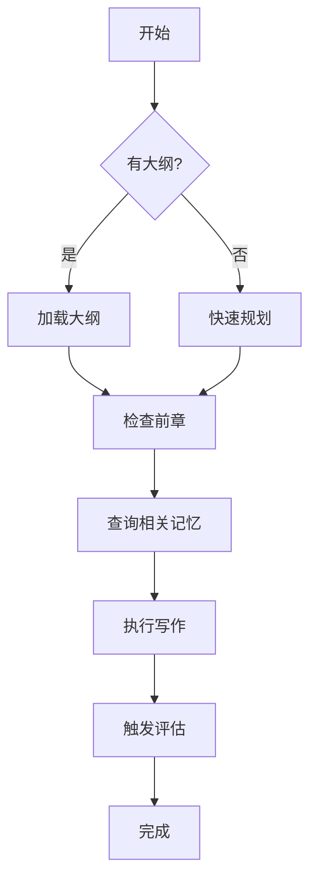
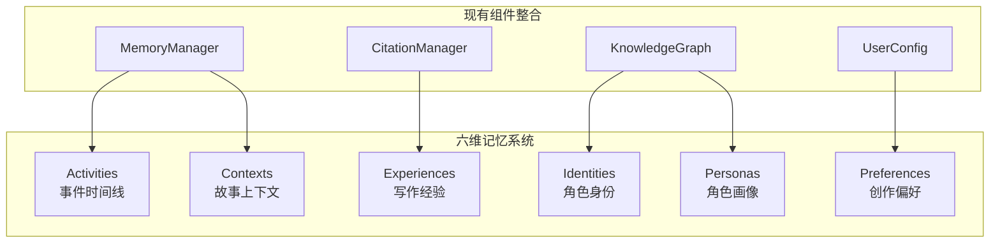

# AI 写作 Agent 系统 - 软件设计文档 (V6: Seven Tools Enhanced)

> **Version**: 6.0 (Enhanced with Seven AI Programming Tools Best Practices)
> **Date**: 2026-02-01
> **Status**: Draft
> **Reference**: Superpowers + Claude Code + LobeHub + Continue + Cline + Kilo Code + Roo Code

---

## 1. 概述 (Overview)

本设计文档在 V5 (Cherry + CCW Integration) 基础上，融入七大 AI 编程工具的最佳实践，打造业界领先的 AI 写作 Agent 平台。

### 1.1 新增集成目标

| 来源工具 | 集成特性 | 目标模块 |
|---------|---------|---------|
| **Superpowers** | 强制技能调用 + 三层优先级 | Skills System |
| **Claude Code** | 钩子系统 (6种生命周期钩子) | Hook System |
| **LobeHub** | 六维记忆系统 | Memory Layer |
| **Continue** | 上下文提供器 (@引用系统) | Context Providers |
| **Cline** | Plan + Act 双模式 | Commander Agent |
| **Cline** | 检查点系统 (Git-based) | Checkpoint Manager |
| **Roo Code** | 多模式系统增强 | Mode System |

### 1.2 增强后架构总览

```
┌─────────────────────────────────────────────────────────────────────────┐
│                          用户界面层 (UI Layer)                           │
│  CLI / Streamlit Web UI / IDE Plugin                                    │
├─────────────────────────────────────────────────────────────────────────┤
│                       上下文提供器 (Context Providers) [NEW]             │
│  @character  @scene  @memory  @style  @timeline  @foreshadow           │
├─────────────────────────────────────────────────────────────────────────┤
│                          钩子系统 (Hook System) [NEW]                    │
│  SessionStart / PreToolUse / PostToolUse / PreWrite / PostWrite / Stop │
├─────────────────────────────────────────────────────────────────────────┤
│                       领域适配层 (Domain Adapters)                       │
│  ┌──────────┐ ┌──────────┐ ┌──────────┐ ┌──────────────────┐           │
│  │ 小说创作 │ │ 代码开发 │ │ 知识管理 │ │ 自定义领域...    │           │
│  └──────────┘ └──────────┘ └──────────┘ └──────────────────┘           │
├─────────────────────────────────────────────────────────────────────────┤
│                       核心平台层 (Platform Core)                         │
│  ┌────────────┐ ┌────────────┐ ┌────────────┐ ┌─────────────┐          │
│  │ Agent      │ │ Memory     │ │ Workflow   │ │ Knowledge   │          │
│  │ Framework  │ │ Layer      │ │ Engine     │ │ Graph       │          │
│  │ (Plan/Act) │ │ (6维记忆)  │ │ (L1-L5)    │ │ (Kùzu)      │          │
│  └────────────┘ └────────────┘ └────────────┘ └─────────────┘          │
│  ┌────────────┐ ┌────────────┐ ┌────────────┐ ┌─────────────┐          │
│  │ Skills     │ │ Checkpoint │ │ Mode       │ │ MCP         │          │
│  │ System     │ │ Manager    │ │ System     │ │ Servers     │          │
│  │ (强制调用) │ │ (Git-based)│ │ (多模式)   │ │ (扩展工具)  │          │
│  └────────────┘ └────────────┘ └────────────┘ └─────────────┘          │
├─────────────────────────────────────────────────────────────────────────┤
│                       基础设施层 (Infrastructure)                        │
│  ┌──────────┐ ┌──────────┐ ┌──────────┐ ┌──────────────────┐           │
│  │ Kùzu DB  │ │ FastEmbed│ │ File I/O │ │ LLM Providers    │           │
│  └──────────┘ └──────────┘ └──────────┘ └──────────────────┘           │
└─────────────────────────────────────────────────────────────────────────┘
```

---

## 2. 新增模块详细设计

### 2.1 技能系统 (Skills System) [Superpowers]

#### 2.1.1 核心理念：强制调用规则

> **1% 规则**: 如果有哪怕 1% 的可能某个技能适用于当前任务，Agent **必须** 在任何响应或操作之前调用它。

#### 2.1.2 三层技能优先级

```python
# src/skills/skill_loader.py

class SkillPriority(Enum):
    PROJECT = 1   # 最高优先级: .niko/skills/
    USER = 2      # 用户级: ~/.niko/skills/
    BUILTIN = 3   # 内置: skills/

class SkillLoader:
    """技能加载器 - 支持三层优先级和强制调用"""
    
    SKILL_PATHS = [
        Path(".niko/skills"),           # 项目级 (最高)
        Path.home() / ".niko/skills",   # 用户级
        Path("skills"),                  # 内置 (最低)
    ]
    
    def discover_skills(self) -> List[Skill]:
        """扫描所有技能目录，按优先级合并"""
        skills = {}
        for priority, path in enumerate(reversed(self.SKILL_PATHS)):
            for skill_dir in path.glob("*/SKILL.md"):
                skill = self._parse_skill(skill_dir)
                skills[skill.name] = skill  # 高优先级覆盖低优先级
        return list(skills.values())
    
    def match_skill(self, task: str, threshold: float = 0.01) -> Optional[Skill]:
        """
        根据任务描述匹配技能
        threshold: 1% 规则阈值
        """
        skills = self.discover_skills()
        for skill in skills:
            relevance = self._calculate_relevance(task, skill)
            if relevance >= threshold:
                return skill
        return None
    
    def must_invoke(self, task: str) -> List[Skill]:
        """返回所有必须调用的技能 (>= 1% 相关性)"""
        return [s for s in self.discover_skills() 
                if self._calculate_relevance(task, s) >= 0.01]
```

#### 2.1.3 技能定义格式 (SKILL.md)

```yaml
---
name: chapter-writing
version: 1.0.0
description: 小说章节创作技能
tags: [novel, chapter, writing]
triggers:
  - 写章节
  - 创作下一章
  - 续写故事
context: main  # main=主线程, fork=子代理
model: claude-sonnet
allowed-tools:
  - Read
  - Write
  - KnowledgeQuery
  - MemorySearch
hooks:
  - PreWrite: check_outline
  - PostWrite: update_knowledge_graph
---

# 章节创作工作流

## 决策树



## 写作规范

### 风格要求
- 使用"翻译腔"长句式
- 多使用五感描写
- 保持狄更斯式幽默

### 检查清单
- [ ] 场景转换是否自然
- [ ] 对话是否符合角色性格
- [ ] 伏笔是否正确埋设
```

#### 2.1.4 内置写作技能包

| 技能名 | 文件 | 用途 | 触发词 |
|--------|------|------|--------|
| `brainstorming` | `skills/brainstorming/SKILL.md` | 头脑风暴、世界观设定 | 头脑风暴, 设定, 构思 |
| `chapter-writing` | `skills/chapter-writing/SKILL.md` | 章节创作 | 写章节, 续写 |
| `character-design` | `skills/character-design/SKILL.md` | 角色设计 | 设计角色, 人物 |
| `dialogue-polish` | `skills/dialogue-polish/SKILL.md` | 对话润色 | 润色对话, 修改对话 |
| `plot-structuring` | `skills/plot-structuring/SKILL.md` | 剧情结构 | 设计剧情, 故事线 |
| `foreshadowing` | `skills/foreshadowing/SKILL.md` | 伏笔管理 | 埋伏笔, 回收伏笔 |
| `style-consistency` | `skills/style-consistency/SKILL.md` | 风格一致性检查 | 检查风格 |

---

### 2.2 钩子系统 (Hook System) [Claude Code]

#### 2.2.1 钩子类型定义

```python
# src/hooks/hook_system.py

from enum import Enum
from typing import Callable, Dict, List, Any
from dataclasses import dataclass

class HookType(Enum):
    """钩子类型 - 参考 Claude Code 6种钩子"""
    SESSION_START = "SessionStart"      # 会话初始化
    PRE_TOOL_USE = "PreToolUse"         # 工具调用前
    POST_TOOL_USE = "PostToolUse"       # 工具执行后
    PRE_WRITE = "PreWrite"              # 写作前 [写作专用]
    POST_WRITE = "PostWrite"            # 写作后 [写作专用]
    STOP = "Stop"                       # 代理停止

@dataclass
class HookContext:
    """钩子上下文"""
    session_id: str
    agent_name: str
    task: str
    state: Dict[str, Any]
    additional_context: str = ""

@dataclass
class HookResult:
    """钩子执行结果"""
    success: bool
    modified_context: Dict[str, Any] = None
    injected_prompt: str = ""
    should_continue: bool = True

class HookSystem:
    """钩子系统 - 生命周期拦截与增强"""
    
    def __init__(self):
        self._hooks: Dict[HookType, List[Callable]] = {
            hook_type: [] for hook_type in HookType
        }
    
    def register(self, hook_type: HookType, handler: Callable[[HookContext], HookResult]):
        """注册钩子处理器"""
        self._hooks[hook_type].append(handler)
    
    def trigger(self, hook_type: HookType, context: HookContext) -> HookResult:
        """触发钩子，按注册顺序执行"""
        result = HookResult(success=True)
        for handler in self._hooks[hook_type]:
            handler_result = handler(context)
            if not handler_result.should_continue:
                return handler_result
            # 合并注入的内容
            if handler_result.injected_prompt:
                result.injected_prompt += handler_result.injected_prompt + "\n"
            if handler_result.modified_context:
                result.modified_context = {
                    **(result.modified_context or {}),
                    **handler_result.modified_context
                }
        return result
```

#### 2.2.2 写作场景钩子应用

```python
# src/hooks/writing_hooks.py

from .hook_system import HookSystem, HookType, HookContext, HookResult

def register_writing_hooks(hook_system: HookSystem):
    """注册写作相关钩子"""
    
    @hook_system.register(HookType.SESSION_START)
    def inject_writing_context(ctx: HookContext) -> HookResult:
        """会话开始时注入写作上下文"""
        # 加载角色设定、世界观、前情摘要
        character_settings = load_active_characters(ctx.session_id)
        worldview = load_worldview(ctx.session_id)
        previous_summary = load_previous_chapter_summary(ctx.session_id)
        
        injected = f"""
## 当前写作上下文

### 活跃角色
{character_settings}

### 世界观设定
{worldview}

### 前情摘要
{previous_summary}
"""
        return HookResult(success=True, injected_prompt=injected)
    
    @hook_system.register(HookType.PRE_WRITE)
    def check_scene_card(ctx: HookContext) -> HookResult:
        """写作前检查场景卡片完整性"""
        scene_card = ctx.state.get("scene_card")
        if not scene_card:
            return HookResult(
                success=False,
                should_continue=False,
                injected_prompt="⚠️ 缺少场景卡片，请先使用 Architect 规划场景"
            )
        
        # 检查伏笔状态
        foreshadows = check_pending_foreshadows(ctx.session_id)
        if foreshadows:
            return HookResult(
                success=True,
                injected_prompt=f"📌 待回收伏笔: {foreshadows}"
            )
        return HookResult(success=True)
    
    @hook_system.register(HookType.POST_WRITE)
    def auto_update_knowledge(ctx: HookContext) -> HookResult:
        """写作后自动更新知识图谱"""
        written_content = ctx.state.get("written_content")
        if written_content:
            # 触发知识蒸馏
            distill_and_update_graph(written_content, ctx.session_id)
            # 更新记忆
            add_to_memory(written_content, ctx.session_id)
        return HookResult(success=True)
```

---

### 2.3 六维记忆系统 (Six-Dimensional Memory) [LobeHub]

#### 2.3.1 记忆维度定义

```python
# src/memory/six_dimensional_memory.py

from enum import Enum
from dataclasses import dataclass
from typing import List, Dict, Any
from datetime import datetime

class MemoryDimension(Enum):
    """六维记忆 - 适配写作场景"""
    ACTIVITIES = "activities"      # 时间事件 - 章节事件、情节进展
    CONTEXTS = "contexts"          # 故事上下文 - 当前场景、目标、冲突
    EXPERIENCES = "experiences"    # 写作经验 - 用户偏好、反馈历史
    IDENTITIES = "identities"      # 角色身份 - 人物关系、社交网络
    PREFERENCES = "preferences"    # 创作偏好 - 常用词汇、禁忌设定
    PERSONAS = "personas"          # 角色画像 - 性格、动机、背景

@dataclass
class DimensionalMemory:
    """维度化记忆条目"""
    id: str
    dimension: MemoryDimension
    content: str
    metadata: Dict[str, Any]
    embedding: List[float]  # 384维向量
    created_at: datetime
    updated_at: datetime
    relevance_score: float = 0.0

class SixDimensionalMemoryStore:
    """六维记忆存储"""
    
    def __init__(self, db_path: str):
        self.db = KuzuDB(db_path)
        self._init_schema()
    
    def _init_schema(self):
        """初始化六维记忆图 Schema"""
        for dim in MemoryDimension:
            self.db.execute(f"""
                CREATE NODE TABLE IF NOT EXISTS {dim.value} (
                    id STRING PRIMARY KEY,
                    content STRING,
                    metadata STRING,  -- JSON
                    embedding FLOAT[384],
                    created_at TIMESTAMP,
                    updated_at TIMESTAMP
                )
            """)
        
        # 创建跨维度关系
        self.db.execute("""
            CREATE REL TABLE IF NOT EXISTS RELATES_TO (
                FROM activities TO identities,
                FROM contexts TO activities,
                FROM experiences TO preferences,
                FROM identities TO personas,
                relation_type STRING,
                strength FLOAT
            )
        """)
    
    def add(self, dimension: MemoryDimension, content: str, 
            metadata: Dict[str, Any] = None) -> str:
        """添加记忆到指定维度"""
        memory_id = generate_uuid()
        embedding = self.embedder.embed(content)
        
        self.db.execute(f"""
            CREATE (:{dimension.value} {{
                id: $id,
                content: $content,
                metadata: $metadata,
                embedding: $embedding,
                created_at: $now,
                updated_at: $now
            }})
        """, {
            "id": memory_id,
            "content": content,
            "metadata": json.dumps(metadata or {}),
            "embedding": embedding,
            "now": datetime.now()
        })
        return memory_id
    
    def search(self, query: str, dimensions: List[MemoryDimension] = None,
               top_k: int = 10) -> List[DimensionalMemory]:
        """跨维度语义搜索"""
        query_embedding = self.embedder.embed(query)
        dimensions = dimensions or list(MemoryDimension)
        
        results = []
        for dim in dimensions:
            dim_results = self.db.execute(f"""
                MATCH (m:{dim.value})
                WITH m, cosine_similarity(m.embedding, $query_emb) AS score
                WHERE score > 0.5
                ORDER BY score DESC
                LIMIT $top_k
                RETURN m, score
            """, {"query_emb": query_embedding, "top_k": top_k})
            results.extend(dim_results)
        
        # 按相关性排序
        results.sort(key=lambda x: x["score"], reverse=True)
        return results[:top_k]
    
    def get_character_context(self, character_name: str) -> Dict[str, Any]:
        """获取角色的完整上下文 (跨维度)"""
        return self.db.execute("""
            MATCH (p:personas)-[:RELATES_TO]-(i:identities)
            WHERE p.content CONTAINS $name
            MATCH (i)-[:RELATES_TO]-(a:activities)
            RETURN p, i, a
        """, {"name": character_name})
```

#### 2.3.2 维度与现有组件映射



---

### 2.4 上下文提供器 (Context Providers) [Continue]

#### 2.4.1 @引用语法系统

```python
# src/context/providers.py

import re
from typing import Dict, Any, Optional, List
from dataclasses import dataclass
from abc import ABC, abstractmethod

@dataclass
class ContextReference:
    """上下文引用"""
    provider: str      # 提供器名称
    target: str        # 引用目标
    params: Dict[str, str] = None

class ContextProvider(ABC):
    """上下文提供器基类"""
    
    @property
    @abstractmethod
    def name(self) -> str:
        """提供器名称 (用于 @ 引用)"""
        pass
    
    @abstractmethod
    def resolve(self, target: str, params: Dict[str, str] = None) -> str:
        """解析引用，返回上下文内容"""
        pass

class CharacterProvider(ContextProvider):
    """角色提供器: @character:张三"""
    
    name = "character"
    
    def __init__(self, memory_store: SixDimensionalMemoryStore):
        self.memory = memory_store
    
    def resolve(self, target: str, params: Dict = None) -> str:
        results = self.memory.search(
            query=target,
            dimensions=[MemoryDimension.PERSONAS, MemoryDimension.IDENTITIES],
            top_k=3
        )
        if not results:
            return f"[角色 '{target}' 未找到]"
        
        return "\n".join([
            f"### {target} 设定\n{r['content']}" 
            for r in results
        ])

class SceneProvider(ContextProvider):
    """场景提供器: @scene:古堡"""
    
    name = "scene"
    
    def resolve(self, target: str, params: Dict = None) -> str:
        # 从知识图谱查询场景
        scene = self.graph.query_scene(target)
        return f"### 场景: {target}\n{scene.description}" if scene else ""

class MemoryProvider(ContextProvider):
    """记忆提供器: @memory:关于雨天的描写"""
    
    name = "memory"
    
    def resolve(self, target: str, params: Dict = None) -> str:
        results = self.memory.search(query=target, top_k=5)
        return "\n---\n".join([r['content'] for r in results])

class TimelineProvider(ContextProvider):
    """时间线提供器: @timeline:第一卷"""
    
    name = "timeline"
    
    def resolve(self, target: str, params: Dict = None) -> str:
        events = self.memory.search(
            query=target,
            dimensions=[MemoryDimension.ACTIVITIES],
            top_k=20
        )
        return self._format_timeline(events)

class ForeshadowProvider(ContextProvider):
    """伏笔提供器: @foreshadow:未回收"""
    
    name = "foreshadow"
    
    def resolve(self, target: str, params: Dict = None) -> str:
        if target == "未回收" or target == "pending":
            foreshadows = self.graph.query_pending_foreshadows()
        else:
            foreshadows = self.graph.query_foreshadow(target)
        return self._format_foreshadows(foreshadows)

class StyleProvider(ContextProvider):
    """风格提供器: @style:翻译腔"""
    
    name = "style"
    
    def resolve(self, target: str, params: Dict = None) -> str:
        style_guide = self.load_style_guide(target)
        return f"### 风格指南: {target}\n{style_guide}"

# 提供器注册表
class ContextProviderRegistry:
    """上下文提供器注册表"""
    
    PROVIDERS = {
        "character": CharacterProvider,
        "scene": SceneProvider,
        "memory": MemoryProvider,
        "timeline": TimelineProvider,
        "foreshadow": ForeshadowProvider,
        "style": StyleProvider,
        "chapter": ChapterProvider,
        "worldview": WorldviewProvider,
    }
    
    # @引用解析正则
    REFERENCE_PATTERN = re.compile(r'@(\w+):([^\s]+)')
    
    def resolve_all(self, text: str) -> str:
        """解析文本中所有 @引用"""
        def replacer(match):
            provider_name = match.group(1)
            target = match.group(2)
            
            if provider_name in self.PROVIDERS:
                provider = self.PROVIDERS[provider_name]()
                return provider.resolve(target)
            return match.group(0)  # 保留原文
        
        return self.REFERENCE_PATTERN.sub(replacer, text)
```

#### 2.4.2 使用示例

```python
# 用户输入
user_input = """
写第三章，@character:张三 和 @character:李四 在 @scene:古堡 相遇。
参考 @memory:关于神秘事件的描写，注意 @foreshadow:未回收 的伏笔。
使用 @style:翻译腔 风格。
"""

# 系统自动解析后
resolved_input = context_registry.resolve_all(user_input)
# 结果:
"""
写第三章，
### 张三 设定
张三是一位30岁的侦探，性格沉稳，擅长推理...

### 李四 设定
李四是神秘组织的成员，真实身份不明...

### 场景: 古堡
位于山顶的哥特式城堡，常年笼罩在迷雾中...

参考相关记忆:
那是一个雷雨交加的夜晚，窗外闪电划破...
---
神秘的脚步声从走廊尽头传来...

📌 待回收伏笔:
- 第一章埋下的钥匙线索
- 第二章提到的神秘信件

### 风格指南: 翻译腔
- 使用长定语从句
- 多用"那位..."开头
- 保持维多利亚时代用语风格
"""
```

---

### 2.5 Plan + Act 双模式 (Commander Enhancement) [Cline]

#### 2.5.1 模式定义

```python
# src/agents/commander.py (增强版)

from enum import Enum
from dataclasses import dataclass
from typing import List, Optional

class CommanderMode(Enum):
    """Commander 工作模式"""
    PLAN = "plan"   # 计划模式: 规划但不执行
    ACT = "act"     # 执行模式: 按计划执行
    AUTO = "auto"   # 自动模式: 自动判断

@dataclass
class ExecutionPlan:
    """执行计划"""
    id: str
    goal: str
    steps: List['PlanStep']
    estimated_time: str
    risks: List[str]
    dependencies: List[str]
    approved: bool = False

@dataclass
class PlanStep:
    """计划步骤"""
    id: str
    description: str
    agent: str  # 执行的 Agent
    tools: List[str]
    checkpoint: bool = False  # 是否创建检查点

class EnhancedCommander(BaseAgent):
    """增强版 Commander - 支持 Plan/Act 模式"""
    
    def __init__(self, mode: CommanderMode = CommanderMode.AUTO):
        super().__init__()
        self.mode = mode
        self.current_plan: Optional[ExecutionPlan] = None
    
    def route(self, task: str) -> WorkflowLevel:
        """L1-L5 路由 (保持原有逻辑)"""
        # ... 原有实现
    
    def plan(self, task: str) -> ExecutionPlan:
        """
        计划模式：
        1. 收集信息（查询知识图谱、记忆）
        2. 分析任务复杂度
        3. 生成详细执行计划
        4. 等待用户审批
        """
        # 触发 SessionStart 钩子
        hook_result = self.hooks.trigger(HookType.SESSION_START, 
                                          HookContext(task=task))
        
        # 收集上下文
        context = self._gather_context(task)
        
        # 分析任务
        analysis = self._analyze_task(task, context)
        
        # 生成计划
        plan = self._generate_plan(task, analysis)
        
        self.current_plan = plan
        return plan
    
    def _gather_context(self, task: str) -> Dict[str, Any]:
        """收集任务相关上下文"""
        return {
            "memories": self.memory.search(task, top_k=10),
            "entities": self.graph.query_related(task),
            "previous_sessions": self.session_manager.list_related(task),
            "pending_foreshadows": self.graph.query_pending_foreshadows(),
        }
    
    def _generate_plan(self, task: str, analysis: Dict) -> ExecutionPlan:
        """生成执行计划"""
        prompt = self.construct_prompt(
            purpose="生成写作任务执行计划",
            task=task,
            mode="plan",
            context=analysis,
            expected="详细的分步执行计划",
            rules=[
                "每个步骤必须明确执行的 Agent",
                "复杂步骤需要创建检查点",
                "识别潜在风险和依赖"
            ]
        )
        
        response = self.llm.generate(prompt)
        return self._parse_plan(response)
    
    def act(self, plan: ExecutionPlan = None) -> Result:
        """
        执行模式：
        1. 按计划逐步执行
        2. 每步创建检查点
        3. 支持中断和回滚
        """
        plan = plan or self.current_plan
        if not plan:
            raise ValueError("No plan to execute")
        
        if not plan.approved:
            raise ValueError("Plan not approved")
        
        results = []
        for step in plan.steps:
            # 创建检查点
            if step.checkpoint:
                self.checkpoint_manager.create(step.id)
            
            # 执行步骤
            try:
                result = self._execute_step(step)
                results.append(result)
            except Exception as e:
                # 回滚到上一个检查点
                self.checkpoint_manager.rollback()
                raise
        
        return self._aggregate_results(results)
    
    def process(self, task: str) -> Result:
        """自动模式入口"""
        if self.mode == CommanderMode.PLAN:
            return self.plan(task)
        elif self.mode == CommanderMode.ACT:
            return self.act()
        else:  # AUTO
            level = self.route(task)
            if level in [WorkflowLevel.L4, WorkflowLevel.L5]:
                # 复杂任务使用 Plan 模式
                plan = self.plan(task)
                # 等待用户审批
                if self._wait_for_approval(plan):
                    return self.act(plan)
            else:
                # 简单任务直接执行
                return self._direct_execute(task, level)
```

---

### 2.6 检查点系统 (Checkpoint Manager) [Cline]

#### 2.6.1 检查点设计

```python
# src/workflow/checkpoint_manager.py

from dataclasses import dataclass
from typing import List, Dict, Any, Optional
from datetime import datetime
import subprocess
import json

@dataclass
class Checkpoint:
    """检查点"""
    id: str
    session_id: str
    step_id: str
    git_commit: str           # Git 提交 hash
    state_snapshot: Dict[str, Any]  # 状态快照
    created_at: datetime
    description: str

class CheckpointManager:
    """检查点管理器 - Git-based 状态恢复"""
    
    def __init__(self, workspace_path: str, db_path: str):
        self.workspace = Path(workspace_path)
        self.db = sqlite3.connect(db_path)
        self._init_db()
        self._init_git()
    
    def _init_git(self):
        """初始化 Git 仓库 (如果不存在)"""
        git_dir = self.workspace / ".git"
        if not git_dir.exists():
            subprocess.run(["git", "init"], cwd=self.workspace)
    
    def create(self, step_id: str, state: Dict[str, Any], 
               description: str = "") -> Checkpoint:
        """创建检查点"""
        checkpoint_id = generate_uuid()
        
        # 1. Git 提交当前状态
        subprocess.run(["git", "add", "-A"], cwd=self.workspace)
        commit_msg = f"checkpoint: {checkpoint_id} - {description}"
        result = subprocess.run(
            ["git", "commit", "-m", commit_msg, "--allow-empty"],
            cwd=self.workspace,
            capture_output=True
        )
        
        # 获取 commit hash
        git_commit = subprocess.run(
            ["git", "rev-parse", "HEAD"],
            cwd=self.workspace,
            capture_output=True,
            text=True
        ).stdout.strip()
        
        # 2. 保存状态快照
        checkpoint = Checkpoint(
            id=checkpoint_id,
            session_id=state.get("session_id"),
            step_id=step_id,
            git_commit=git_commit,
            state_snapshot=state,
            created_at=datetime.now(),
            description=description
        )
        
        self._save_checkpoint(checkpoint)
        return checkpoint
    
    def restore(self, checkpoint_id: str) -> Dict[str, Any]:
        """恢复到指定检查点"""
        checkpoint = self._load_checkpoint(checkpoint_id)
        
        # 1. Git 恢复文件状态
        subprocess.run(
            ["git", "checkout", checkpoint.git_commit, "--", "."],
            cwd=self.workspace
        )
        
        # 2. 返回状态快照
        return checkpoint.state_snapshot
    
    def rollback(self) -> Optional[Checkpoint]:
        """回滚到上一个检查点"""
        checkpoints = self.list_checkpoints(limit=2)
        if len(checkpoints) < 2:
            return None
        
        previous = checkpoints[1]
        self.restore(previous.id)
        return previous
    
    def list_checkpoints(self, session_id: str = None, 
                         limit: int = 10) -> List[Checkpoint]:
        """列出检查点"""
        query = "SELECT * FROM checkpoints"
        if session_id:
            query += f" WHERE session_id = '{session_id}'"
        query += f" ORDER BY created_at DESC LIMIT {limit}"
        
        return [self._row_to_checkpoint(row) 
                for row in self.db.execute(query)]
    
    def cleanup(self, keep_last: int = 10):
        """清理旧检查点"""
        checkpoints = self.list_checkpoints(limit=1000)
        to_delete = checkpoints[keep_last:]
        
        for cp in to_delete:
            self._delete_checkpoint(cp.id)
```

---

### 2.7 多模式系统 (Mode System) [Roo Code]

#### 2.7.1 写作模式定义

```python
# src/modes/mode_system.py

from enum import Enum
from dataclasses import dataclass
from typing import List, Dict, Any

class WritingMode(Enum):
    """写作模式"""
    DRAFT = "draft"           # 草稿模式: 快速生成，不追求完美
    POLISH = "polish"         # 润色模式: 细致修改，提升质量
    REVIEW = "review"         # 评审模式: 多维度评估
    OUTLINE = "outline"       # 大纲模式: 结构规划
    DIALOGUE = "dialogue"     # 对话模式: 专注对话写作
    DESCRIPTION = "description"  # 描写模式: 专注场景描写
    CUSTOM = "custom"         # 自定义模式

@dataclass
class ModeConfig:
    """模式配置"""
    name: str
    description: str
    allowed_tools: List[str]
    system_prompt_modifier: str
    temperature: float
    max_iterations: int

class ModeSystem:
    """写作模式系统"""
    
    DEFAULT_MODES: Dict[WritingMode, ModeConfig] = {
        WritingMode.DRAFT: ModeConfig(
            name="草稿模式",
            description="快速生成初稿，不过度追求质量",
            allowed_tools=["Write", "Read", "MemorySearch"],
            system_prompt_modifier="以快速产出为目标，允许粗糙的表达",
            temperature=0.8,
            max_iterations=1
        ),
        WritingMode.POLISH: ModeConfig(
            name="润色模式",
            description="细致修改现有内容，提升质量",
            allowed_tools=["Read", "Edit", "StyleCheck", "MemorySearch"],
            system_prompt_modifier="仔细审视每个词句，追求精确优美的表达",
            temperature=0.3,
            max_iterations=3
        ),
        WritingMode.REVIEW: ModeConfig(
            name="评审模式",
            description="多维度评估内容质量",
            allowed_tools=["Read", "Evaluate", "Compare"],
            system_prompt_modifier="作为严格的评审者，从多个维度分析",
            temperature=0.2,
            max_iterations=1
        ),
        WritingMode.DIALOGUE: ModeConfig(
            name="对话模式",
            description="专注于角色对话写作",
            allowed_tools=["Write", "Read", "CharacterQuery"],
            system_prompt_modifier="专注于对话的自然性和角色一致性",
            temperature=0.6,
            max_iterations=2
        ),
        WritingMode.DESCRIPTION: ModeConfig(
            name="描写模式",
            description="专注于场景和感官描写",
            allowed_tools=["Write", "Read", "SceneQuery", "MemorySearch"],
            system_prompt_modifier="运用五感描写，创造沉浸式体验",
            temperature=0.7,
            max_iterations=2
        ),
    }
    
    def __init__(self):
        self.current_mode: WritingMode = WritingMode.DRAFT
        self.custom_modes: Dict[str, ModeConfig] = {}
    
    def switch_mode(self, mode: WritingMode) -> ModeConfig:
        """切换模式"""
        self.current_mode = mode
        return self.get_config(mode)
    
    def get_config(self, mode: WritingMode = None) -> ModeConfig:
        """获取模式配置"""
        mode = mode or self.current_mode
        if mode == WritingMode.CUSTOM:
            return self.custom_modes.get("current")
        return self.DEFAULT_MODES.get(mode)
    
    def create_custom_mode(self, name: str, config: ModeConfig):
        """创建自定义模式"""
        self.custom_modes[name] = config
    
    def apply_mode_to_agent(self, agent: BaseAgent):
        """将当前模式应用到 Agent"""
        config = self.get_config()
        agent.set_temperature(config.temperature)
        agent.set_allowed_tools(config.allowed_tools)
        agent.add_system_prompt_modifier(config.system_prompt_modifier)
```

---

## 3. 集成架构图

```mermaid
graph TB
    subgraph "用户交互层"
        User[用户输入]
        UI[Streamlit UI]
    end
    
    subgraph "上下文解析层 [Continue]"
        CP[ContextProviderRegistry]
        CP --> Character[@character]
        CP --> Scene[@scene]
        CP --> Memory[@memory]
        CP --> Style[@style]
    end
    
    subgraph "钩子系统 [Claude Code]"
        HS[HookSystem]
        HS --> SS[SessionStart]
        HS --> PW[PreWrite]
        HS --> POW[PostWrite]
    end
    
    subgraph "技能系统 [Superpowers]"
        SL[SkillLoader]
        SL --> Skills[Skills 库]
        SL --> Match[1% 规则匹配]
    end
    
    subgraph "Commander [Cline Plan/Act]"
        CMD[EnhancedCommander]
        CMD --> Plan[Plan Mode]
        CMD --> Act[Act Mode]
    end
    
    subgraph "模式系统 [Roo Code]"
        MS[ModeSystem]
        MS --> Draft[Draft]
        MS --> Polish[Polish]
        MS --> Review[Review]
    end
    
    subgraph "记忆系统 [LobeHub]"
        SDM[SixDimensionalMemory]
        SDM --> Activities
        SDM --> Contexts
        SDM --> Experiences
        SDM --> Identities
        SDM --> Preferences
        SDM --> Personas
    end
    
    subgraph "检查点 [Cline]"
        CPM[CheckpointManager]
        CPM --> Git[Git Commits]
        CPM --> State[State Snapshots]
    end
    
    User --> UI
    UI --> CP
    CP --> HS
    HS --> SL
    SL --> CMD
    CMD --> MS
    MS --> SDM
    CMD --> CPM
```

---

## 4. 迁移路线

### 4.1 Phase 15: 七大工具特性集成 (Priority: P0) [NEW]

#### 15.1 技能系统 [Superpowers]
- [ ] `src/skills/skill_loader.py`
  - [ ] `SkillPriority` 三层优先级
  - [ ] `discover_skills()` 技能发现
  - [ ] `match_skill()` 1% 规则匹配
  - [ ] `must_invoke()` 强制调用列表
- [ ] `skills/brainstorming/SKILL.md` - 头脑风暴技能
- [ ] `skills/chapter-writing/SKILL.md` - 章节写作技能
- [ ] `skills/character-design/SKILL.md` - 角色设计技能
- [ ] `skills/dialogue-polish/SKILL.md` - 对话润色技能
- [ ] `skills/foreshadowing/SKILL.md` - 伏笔管理技能

#### 15.2 钩子系统 [Claude Code]
- [ ] `src/hooks/hook_system.py`
  - [ ] `HookType` 6种钩子类型
  - [ ] `HookSystem.register()` 钩子注册
  - [ ] `HookSystem.trigger()` 钩子触发
- [ ] `src/hooks/writing_hooks.py`
  - [ ] `inject_writing_context()` - SessionStart
  - [ ] `check_scene_card()` - PreWrite
  - [ ] `auto_update_knowledge()` - PostWrite

#### 15.3 上下文提供器 [Continue]
- [ ] `src/context/providers.py`
  - [ ] `ContextProvider` 基类
  - [ ] `CharacterProvider` - @character
  - [ ] `SceneProvider` - @scene
  - [ ] `MemoryProvider` - @memory
  - [ ] `TimelineProvider` - @timeline
  - [ ] `ForeshadowProvider` - @foreshadow
  - [ ] `StyleProvider` - @style
  - [ ] `ContextProviderRegistry` 注册表

#### 15.4 六维记忆 [LobeHub]
- [ ] `src/memory/six_dimensional_memory.py`
  - [ ] `MemoryDimension` 6维定义
  - [ ] `SixDimensionalMemoryStore` 存储
  - [ ] 跨维度关系图
  - [ ] 集成现有 MemoryManager

#### 15.5 Plan/Act 双模式 [Cline]
- [ ] `src/agents/commander.py` 增强
  - [ ] `CommanderMode` 模式枚举
  - [ ] `plan()` 计划模式
  - [ ] `act()` 执行模式
  - [ ] `_gather_context()` 上下文收集
  - [ ] `_generate_plan()` 计划生成

#### 15.6 检查点系统 [Cline]
- [ ] `src/workflow/checkpoint_manager.py`
  - [ ] `Checkpoint` 数据结构
  - [ ] `create()` 创建检查点
  - [ ] `restore()` 恢复检查点
  - [ ] `rollback()` 回滚
  - [ ] Git 集成

#### 15.7 多模式系统 [Roo Code]
- [ ] `src/modes/mode_system.py`
  - [ ] `WritingMode` 模式枚举
  - [ ] `ModeConfig` 配置
  - [ ] `ModeSystem` 模式管理
  - [ ] 自定义模式支持

---

## 5. 附录

### 5.1 七大工具特性对照表

| 特性 | 来源工具 | Niko-Studio 实现 | 优先级 |
|------|---------|-----------------|--------|
| 强制技能调用 | Superpowers | SkillLoader.must_invoke() | P0 |
| 三层技能优先级 | Superpowers | SkillPriority Enum | P0 |
| 生命周期钩子 | Claude Code | HookSystem | P0 |
| @引用语法 | Continue | ContextProviderRegistry | P0 |
| 六维记忆 | LobeHub | SixDimensionalMemoryStore | P1 |
| Plan/Act模式 | Cline | EnhancedCommander | P0 |
| 检查点系统 | Cline | CheckpointManager | P1 |
| 多写作模式 | Roo Code | ModeSystem | P1 |

### 5.2 技能目录结构

```
skills/
├── brainstorming/
│   ├── SKILL.md
│   └── scripts/
│       └── worldview_generator.py
├── chapter-writing/
│   ├── SKILL.md
│   └── scripts/
│       └── chapter_helper.py
├── character-design/
│   ├── SKILL.md
│   └── templates/
│       └── character_template.md
├── dialogue-polish/
│   └── SKILL.md
├── foreshadowing/
│   └── SKILL.md
├── plot-structuring/
│   └── SKILL.md
└── style-consistency/
    └── SKILL.md
```

---

*文档更新: 2026-02-01 - V6.0 Seven Tools Enhanced*
