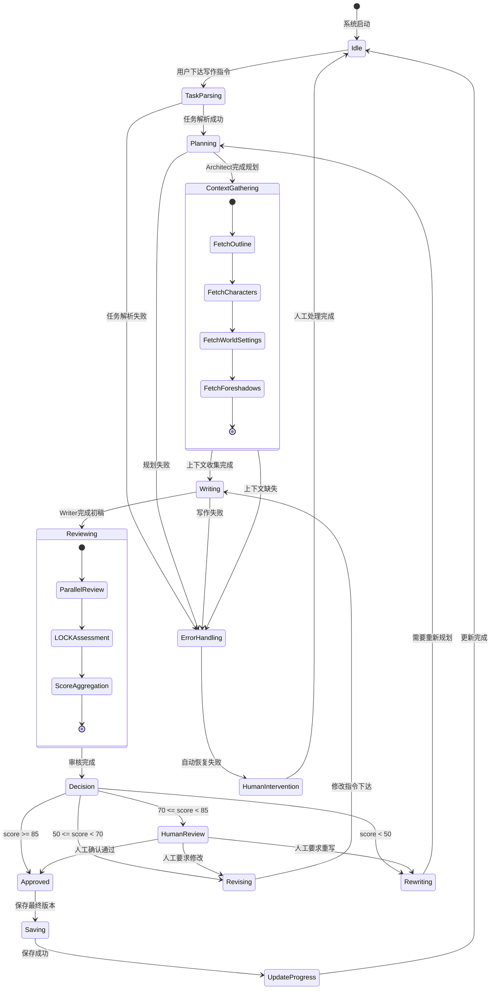
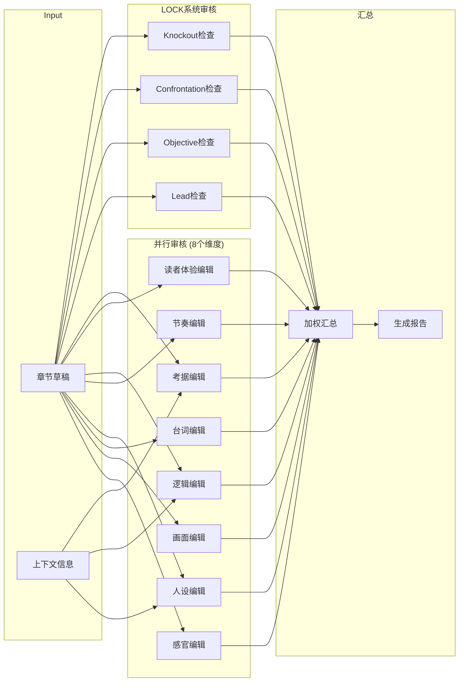
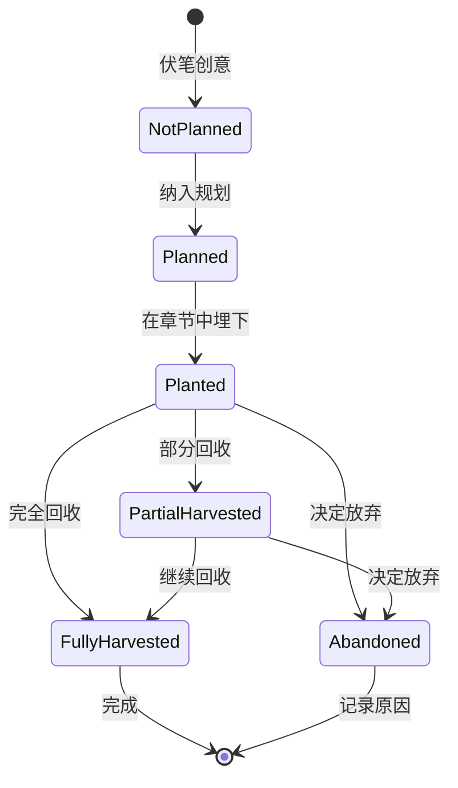

# 工作流编排 (Workflow Orchestration)

> **版本**: 2.0  
> **基于**: LangGraph State Machine Pattern  
> **状态**: 正式规范

---

## 一、概述

本文档定义写作Agent系统的工作流编排逻辑，包括：
- 核心工作流状态机
- Routing策略
- Human-in-the-Loop触发条件
- 错误恢复机制

---

## 二、核心工作流状态机

### 2.1 章节创建工作流 (Chapter Creation Workflow)



### 2.2 状态定义

```python
from enum import Enum
from pydantic import BaseModel
from typing import Optional, List

class WorkflowState(Enum):
    IDLE = "idle"
    TASK_PARSING = "task_parsing"
    PLANNING = "planning"
    CONTEXT_GATHERING = "context_gathering"
    WRITING = "writing"
    REVIEWING = "reviewing"
    DECISION = "decision"
    REVISING = "revising"
    REWRITING = "rewriting"
    HUMAN_REVIEW = "human_review"
    APPROVED = "approved"
    SAVING = "saving"
    ERROR_HANDLING = "error_handling"
    HUMAN_INTERVENTION = "human_intervention"

class ChapterWorkflowContext(BaseModel):
    """工作流上下文"""
    session_id: str
    chapter_num: int
    current_state: WorkflowState
    
    # 规划阶段产物
    scene_cards: Optional[List[dict]] = None
    lock_analysis: Optional[dict] = None
    
    # 上下文数据
    outline: Optional[str] = None
    characters: Optional[List[dict]] = None
    world_settings: Optional[dict] = None
    foreshadows: Optional[dict] = None
    
    # 写作阶段产物
    draft_version: int = 0
    current_draft: Optional[str] = None
    
    # 审核阶段产物
    review_result: Optional[dict] = None
    total_score: Optional[float] = None
    revision_count: int = 0
    
    # 错误信息
    errors: List[str] = []
```

---

## 三、Routing 策略

### 3.1 任务类型路由

```yaml
TaskRouting:
  write_chapter:
    description: 写新章节
    entry_state: TaskParsing
    required_agents: [Architect, Writer, Critic]
    context_agents: [Worldbuilding, Character, Plot]
    
  continue_chapter:
    description: 续写章节
    entry_state: Writing
    required_agents: [Writer, Critic]
    skip_planning: true
    
  rewrite_section:
    description: 改写段落
    entry_state: Writing
    required_agents: [Writer, Critic]
    mode: rewrite
    
  review_chapter:
    description: 仅审核
    entry_state: Reviewing
    required_agents: [Critic]
    
  query_info:
    description: 查询信息
    entry_state: ContextGathering
    required_agents: [Worldbuilding, Character, Plot]
    exit_after: true  # 查询后直接返回
```

### 3.2 决策路由规则

```python
def route_after_review(context: ChapterWorkflowContext) -> WorkflowState:
    """
    审核后的路由决策
    
    核心规则: 
    1. 总分必须达标
    2. LOCK的C(冲突)维度必须>=7才能自动通过
       (因为冲突是网文的生命线，权重40%)
    """
    score = context.total_score
    revision_count = context.revision_count
    
    # 提取LOCK各维度分数
    lock_result = context.review_result.get("lock_analysis", {})
    c_score = lock_result.get("C", {}).get("score", 0)
    
    # 检查是否有任一LOCK维度严重不足
    lock_critical_fail = any(
        lock_result.get(dim, {}).get("score", 0) <= 2 
        for dim in ["L", "O", "C", "K"]
    )
    
    # 决策逻辑
    if lock_critical_fail:
        # 任一LOCK维度<=2，必须重写
        return WorkflowState.REWRITING
    
    if score >= 80 and c_score >= 7:
        # 总分达标 且 冲突充分 -> 自动通过
        return WorkflowState.APPROVED
    
    if score >= 70:
        # 基本合格但需人工确认
        # (包括: 总分>=80但C<7的情况)
        return WorkflowState.HUMAN_REVIEW
    
    if score >= 50:
        # 需要修改
        if revision_count >= 3:
            # 连续3次修改仍未通过，需要人工介入
            return WorkflowState.HUMAN_INTERVENTION
        return WorkflowState.REVISING
    
    # 分数过低，需要重写
    if revision_count >= 2:
        # 已经重写过，需要人工重新规划
        return WorkflowState.HUMAN_INTERVENTION
    return WorkflowState.REWRITING


def prepare_revision_context(
    context: ChapterWorkflowContext, 
    critic_output: dict
) -> dict:
    """
    准备修改上下文 - 将Critic的反馈传递给Writer
    
    当 final_decision == "REVISE" 时调用
    """
    return {
        # 原始场景卡片(保持不变)
        "scene_card": context.scene_cards[0] if context.scene_cards else {},
        
        # 上一轮草稿
        "previous_draft": context.current_draft,
        
        # Critic的可执行反馈 (核心!)
        "actionable_feedback": critic_output.get("actionable_feedback", ""),
        
        # 具体修改指令
        "revision_instructions": critic_output.get("revision_instructions", []),
        
        # LOCK问题摘要
        "lock_issues": {
            dim: {
                "score": critic_output["lock_analysis"][dim]["score"],
                "improvement": critic_output["lock_analysis"][dim].get("improvement")
            }
            for dim in ["L", "O", "C", "K"]
            if critic_output["lock_analysis"][dim]["score"] < 7
        },
        
        # 修改版本号
        "revision_version": context.revision_count + 1
    }


def route_after_error(context: ChapterWorkflowContext, error_type: str) -> WorkflowState:
    """错误后的路由决策"""
    
    recoverable_errors = {
        "CONTEXT_MISSING": {
            "action": WorkflowState.HUMAN_INTERVENTION,
            "message": "缺少必要的上下文信息，需要人工补充"
        },
        "WRITE_FAILED": {
            "action": WorkflowState.WRITING,  # 重试
            "max_retries": 3
        },
        "REVIEW_FAILED": {
            "action": WorkflowState.REVIEWING,  # 重试
            "max_retries": 2
        },
        "TOOL_ERROR": {
            "action": WorkflowState.ERROR_HANDLING,
            "fallback": True
        }
    }
    
    error_config = recoverable_errors.get(error_type, {
        "action": WorkflowState.HUMAN_INTERVENTION
    })
    
    return error_config["action"]
```


---

## 四、Human-in-the-Loop 规范

### 4.1 触发条件

```yaml
HumanInterventionTriggers:

  强制介入 (MUST):
    - condition: "LOCK总分 < 50"
      reason: "故事存在根本性结构问题"
      action: "请用户确认是否重新规划故事架构"
      
    - condition: "连续3次修改未达标"
      reason: "可能存在需求理解偏差"
      action: "展示修改历史，请用户澄清期望"
      
    - condition: "检测到设定冲突"
      reason: "与已有世界观/角色设定矛盾"
      action: "展示冲突内容，请用户确认正确版本"
      
    - condition: "关键剧情决策点"
      reason: "故事走向的重大决策"
      action: "展示可选方向，请用户选择"

  建议介入 (SHOULD):
    - condition: "LOCK总分在70-85之间"
      reason: "质量基本合格但不够优秀"
      action: "展示审核报告，建议人工审阅"
      auto_proceed_timeout: 300  # 5分钟无响应则自动通过
      
    - condition: "新角色首次出场"
      reason: "确认角色设定是否符合预期"
      action: "展示角色表现，请确认"
      auto_proceed_timeout: 180
      
    - condition: "两扇门节点"
      reason: "故事关键转折点"
      action: "确认转折设计是否符合预期"

  自动通过 (AUTO):
    - condition: "LOCK总分 >= 85"
    - condition: "纯环境描写场景"
    - condition: "与主线无关的过渡场景"
```

### 4.2 介入界面规范

```yaml
HumanReviewInterface:
  展示内容:
    - 当前章节草稿(高亮修改部分)
    - 审核评分明细
    - 问题列表(按优先级排序)
    - 修改建议
    
  用户操作:
    - 通过: 批准当前版本
    - 修改: 提供修改指令
    - 重写: 要求从头重写
    - 取消: 放弃本次写作
    
  超时处理:
    default_timeout: 3600  # 1小时
    on_timeout: 
      if_score >= 70: auto_approve
      else: save_draft_and_pause
```

---

## 五、审稿工作流 (Review Workflow)

### 5.1 并行审核流程



### 5.2 审核结果格式

```yaml
ReviewReport:
  chapter_info:
    chapter_num: integer
    scene_id: string
    draft_version: integer
    wordcount: integer
    
  scores:
    total: float           # 0-100
    lock:
      L: float             # 0-10
      O: float             # 0-10
      C: float             # 0-10
      K: float             # 0-10
      subtotal: float      # 0-40
    style:
      sensory: float
      visual: float
      dialogue: float
      character: float
      rhythm: float
      subtotal: float      # 0-35
    logic:
      plot_logic: float
      reader_experience: float
      worldbuilding: float
      subtotal: float      # 0-25
      
  issues:
    critical:              # 必须修改
      - location: string   # 问题位置
        dimension: string  # 问题维度
        description: string
        suggestion: string
    major:                 # 强烈建议修改
      - ...
    minor:                 # 可选优化
      - ...
      
  decision:
    action: enum[APPROVED, HUMAN_REVIEW, REVISE, REWRITE]
    reason: string
    
  revision_instructions:   # 当需要修改时
    - target: string       # 修改目标
      instruction: string  # 具体指令
```

---

## 六、伏笔追踪工作流 (Foreshadow Tracking)

### 6.1 状态机



### 6.2 伏笔数据模型

```yaml
Foreshadow:
  id: string                    # 唯一标识
  description: string           # 伏笔描述
  category: enum[plot, character, worldbuilding, mystery]
  importance: enum[major, minor, subtle]
  
  planting:
    planned_chapter: integer    # 计划埋下章节
    actual_chapter: integer     # 实际埋下章节
    scene_id: string
    method: string              # 埋入方式
    visibility: enum[obvious, subtle, hidden]
    
  harvesting:
    planned_chapter: integer    # 计划回收章节
    actual_chapters: list[integer]  # 实际回收章节(可能多次)
    completion_percentage: float    # 回收完成度
    
  status: enum[not_planned, planned, planted, partial_harvested, fully_harvested, abandoned]
  
  notes: string                 # 备注
  related_foreshadows: list[string]  # 关联的其他伏笔
```

---

## 七、错误恢复机制

### 7.1 错误分类

```yaml
ErrorCategories:
  
  工具错误 (ToolError):
    examples:
      - Obsidian连接失败
      - 飞书API超时
      - RAG检索异常
    recovery:
      strategy: retry_with_backoff
      max_retries: 3
      fallback: use_cached_data
      
  上下文错误 (ContextError):
    examples:
      - 角色档案不存在
      - 章节大纲缺失
      - 世界设定不完整
    recovery:
      strategy: request_human_input
      message: "缺少{missing_item}，请补充后重试"
      
  生成错误 (GenerationError):
    examples:
      - LLM返回格式错误
      - 内容不符合规范
      - 生成超时
    recovery:
      strategy: retry_with_different_prompt
      max_retries: 2
      fallback: human_intervention
      
  逻辑错误 (LogicError):
    examples:
      - 检测到剧情矛盾
      - 时间线冲突
      - 角色行为不一致
    recovery:
      strategy: immediate_human_intervention
      message: "检测到逻辑冲突，需要人工确认"
```

### 7.2 检查点与恢复

```yaml
Checkpointing:
  save_points:
    - after: PLANNING
      data: [scene_cards, lock_analysis]
      
    - after: CONTEXT_GATHERING
      data: [outline, characters, world_settings, foreshadows]
      
    - after: WRITING
      data: [current_draft, draft_version]
      
    - after: REVIEWING
      data: [review_result, total_score]
      
  recovery:
    on_restart:
      1. 读取最近的检查点
      2. 验证检查点数据完整性
      3. 从对应状态恢复
      4. 通知用户恢复状态
```

---

## 八、版本历史

| 版本 | 日期 | 变更说明 |
|------|------|----------|
| 1.0 | 2026-01-24 | 初始版本(简单流程图) |
| 2.0 | 2026-01-25 | 完整状态机定义，增加路由规则和错误恢复 |

---

*文档结束*
